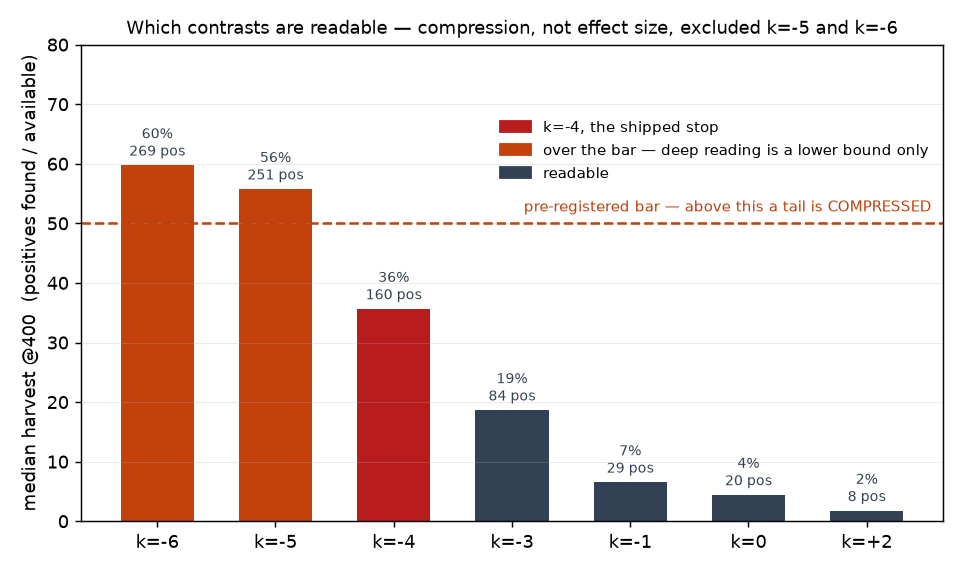
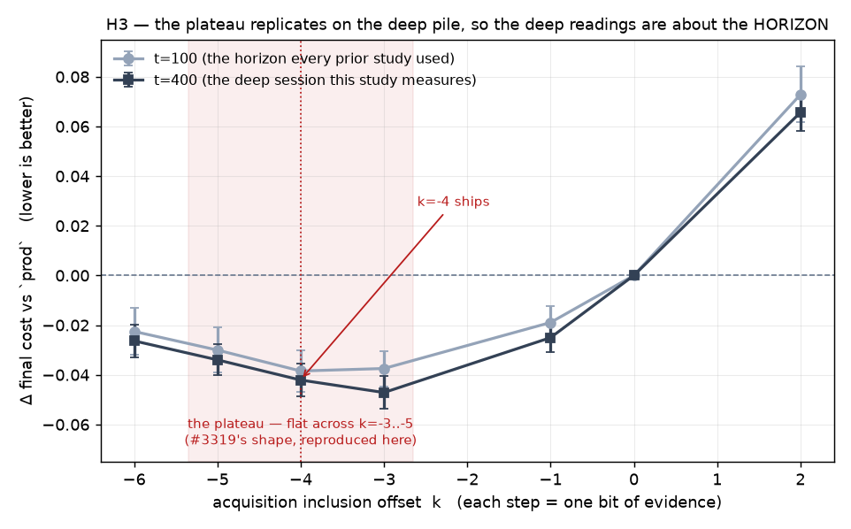
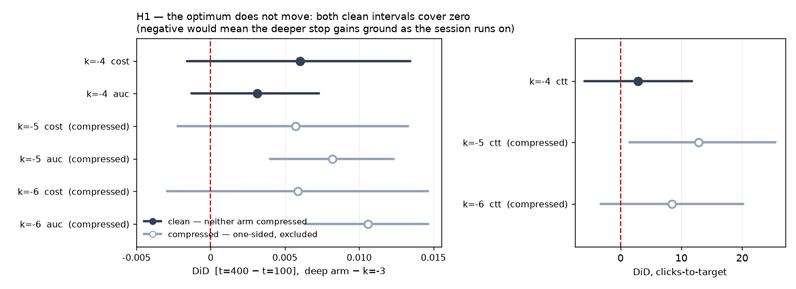
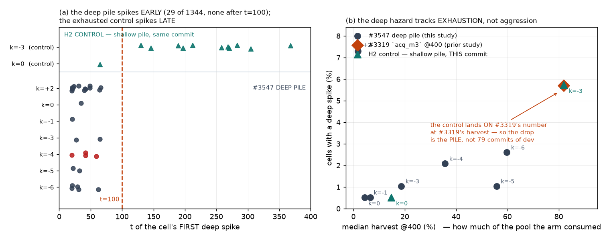
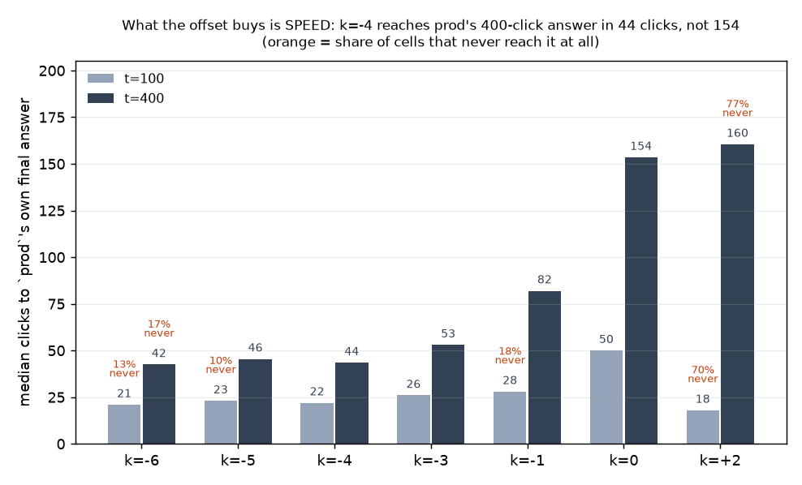

# #3547 — does the acquisition offset's optimum move deeper through a session?

**COMPLETE.** Two waves, **1728 cells, 0 failures, 0 header-only cells**: the
7-arm deep grid on `vg_scale_deep` (1344 cells) and the H2 control on
`vg_scale_any` (384).

Issue #3547 · branch `claude/acq-deep-3547` · base dev `6a0168f7e` · worktree
`/exp/sgreenberg/projects/vts-acq-3547` · study `/expscratch/sgreenberg/acq-3547`
· control `/expscratch/sgreenberg/acq-3547-ctrl`.
Pre-registered plan: [`PLAN_3547.md`](PLAN_3547.md) — written before any arm cell
existed, and every decision rule below is the one it committed to. Full tables:
[`GENERATED_TABLES_3547.md`](GENERATED_TABLES_3547.md).

---

## Summary

1. **The optimum does NOT move through a session.** On the only contrast where
   neither side is compressed (`-4` against `-3`), the difference-in-differences
   between a 100-click and a 400-click session is null on all three endpoints:
   cost **+0.006** [−0.002, +0.013], AUC **+0.003** [−0.001, +0.007],
   clicks-to-target **+2.8** [−5.9, +12]. **The knob is a constant, not a
   schedule** — which is the fork #3547 named, answered rather than deferred.
   The likelihood-ratio prediction (that `k*` deepens as the unvoted pool's
   prevalence falls) is not borne out, and neither is #2910's opposite reading.
2. **#3319's deep guardrail is an artefact of its own ceiling — now
   demonstrated, not inferred.** A control re-ran the *shallow* pile at 400
   clicks **on this commit**: `-3` reproduced #3319's hazard exactly — 82%
   harvest, **5.7%** of cells spiking, **all 11 of them after t=100** (median
   t=258). On the deep pile the same arm at the same aggression spikes in
   **1.0%** of cells and **zero of 1344 cells anywhere in the grid spike after
   t=100**. Same code, same arm, same horizon: only the pile changed. The hazard
   tracks **exhaustion**, not aggression. **H2b confirmed.**
3. **The plateau replicated**, so the deep readings are about the horizon and
   not about the dataset. Δcost against `prod` at t=100: `-1` −0.019, `-3`
   −0.038, `-4` −0.039, `-5` −0.030, `-6` −0.023 — flat across `-3`..`-5`,
   #3319's shape. The falsification arm behaved (`+2`, **−11** positives).
4. **The shipped `-4` is vindicated at depth, and what it buys is still speed.**
   It reaches `prod`'s own 400-click answer in **44** clicks against `prod`'s
   **154** — 3.5×, matching #3319's 3.2× — now in an environment where its tail
   is *not* compressed (36% harvest, no cell above 80%).
5. **Compression, not effect size, decided what was readable** — and the grid
   was sized wrong for it. `-5` and `-6` cleared the pre-registered 50% harvest
   bar and were excluded as one-sided. 900 positives per class was a *supply*
   bound checked against a *horizon* bound; neither is an *aggression* bound,
   and aggression is what sets harvest. **Size a deep grid from its deepest
   arm** (#3611).

---

## What the question was, and why an argmin cannot answer it

`inclusion_cost_weights` makes the acquisition offset a log₂ likelihood-ratio
threshold: include *x* iff `f_pos(x)/f_neg(x) > 2^−k`, so each step of `k` is one
bit of evidence (#3319 established this and it is the frame used throughout).
The selector ranks the **unvoted** pool, whose prevalence *falls* as positives
are harvested. If `k*` is the point where the evidence ratio balances the cost
ratio, that falling prevalence should push `k*` more negative as a session runs
on — the optimum would be a *schedule*, and shipping one number would be leaving
value on the table. #2910's intuition predicts the opposite: the offset's benefit
is concentrated where positives are scarce, and deep voting ends the scarcity.

#3319 could not separate the two, for a reason that also rules out the obvious
analysis: **`final_cost` is flat across three bits of this plateau**, so an
argmin over it reports a "move" from sampling error alone. The pre-registered
answer is a difference-in-differences, paired within the cell on both axes:

> `DiD = [m(deep, 400) − m(deep, 100)] − [m(shallow, 400) − m(shallow, 100)]`

Negative means the deeper arm gains ground as the session runs on.

**Both horizons come off one wave.** `max_steps` reaches the simulation as a loop
bound and nothing inside the loop reads it (`voting_iterations.py:1633`), so a
400-step trajectory is a strict *extension* of the 100-step one. This was
confirmed empirically before the study relied on it, against #3319's two
independent waves — 6336 cells per arm, identical at t=100 on cost, `n_good`,
thresholds and `acq_pool_percentile` (`check_prefix_3547.py`). So t=100 and
t=400 here are the same trajectory, paired within the cell, rather than two runs
compared through their summaries. #3319 paid for two waves to get this.

---

## The instrument, before any result is read

### The pile

`vg_scale_deep` is `vg_scale_any`'s construction designated **band-free** and 3×
deeper: 900 positives per class against 11,700 negatives, with **prevalence held
at 0.071429 exactly** — derived rather than approximated, and asserted at build
time. Holding prevalence fixed is the point: "more positives" alone would change
the selector's problem, and only "more positives *at fixed prevalence*" changes
the horizon and nothing else.

The scarcity that capped #3319 was **the band split, not Visual Genome**.
`vg_scale_any` collapses `class@band` after designation, so it inherits the
thinnest band (`bus@small` = 138). Band-free, the binding class (`stop sign`)
supplies 1006 and the median is 1952. `on_request: True` keeps the pile out of
the default sweep.

### Compression — the criterion that decides which contrasts are readable



An arm that has consumed most of its positives is no longer being compared over
the same opportunity as the control: its late gains are capped by the pool, not
by the knob. The plan pre-registered the bar — **a median harvest above 50% and
that arm's deep readings are reported as compressed** — and two arms cleared it:

| arm | k | median positives @400 | median harvest | cells >50% | cells >80% |
|---|---:|---:|---:|---:|---:|
| `prod` | 0 | 20 | 4.4% | 0% | 0% |
| `acq_m1` | −1 | 30 | 6.6% | 0% | 0% |
| `acq_m3` | −3 | 84 | 19% | 17% | 0% |
| `acq_m4` | −4 | 160 | 36% | 42% | 0% |
| `acq_m5` | −5 | 251 | **56%** | 58% | 0% |
| `acq_m6` | −6 | 269 | **60%** | 66% | 0% |
| `acq_p2` | +2 | 8 | 1.8% | 0% | 0% |

**Compression is one-sided, and that is what makes the exclusion principled
rather than convenient.** A capped tail biases a DiD toward "no move" or
"shallower" — never toward "deeper". So a compressed contrast can *corroborate*
a "deeper" finding and can never produce one, and it can never be the evidence
for "shallower". This matters below, because the compressed arms are exactly the
ones that lean "shallower".

### The amendment, made mid-run

Made at 09:00 EDT on 2026-09-03, **before any verdict was read**, and recorded in
the plan: the pile is sized for `-4`, not for `-6`. 900 positives per class was
chosen as a **supply** bound (what all twelve classes could actually furnish),
checked against a **horizon** bound (preflight 16b). Neither of those is an
**aggression** bound — and aggression is what sets harvest. `-5` and `-6` harvest
56% and 60%, over the bar, which is why their contrasts are excluded. The
reusable form of the mistake: **size a deep grid from its deepest arm, not from
its shipped one.** Filed as #3611.

---

## 1. H3 — the plateau replicates, so the anchor holds

Reported first, and H1 was to be withheld if it failed: if the t=100 frontier
did not reproduce #3319's shape, the pile change did more than add depth and
every deep reading here would be about the dataset rather than the horizon.



| arm | k | Δ cost vs `prod` @100 [95% CI] | Δ cost @400 | Δ positives @400 | Δ AP @400 |
|---|---:|---|---|---:|---:|
| `acq_m1` | −1 | −0.019 [−0.025, −0.012] | −0.025 | +12 | +0.044 |
| `acq_m3` | −3 | −0.038 [−0.045, −0.030] | −0.047 | +103 | +0.100 |
| `acq_m4` | −4 | −0.039 [−0.047, −0.030] | −0.042 | +161 | +0.107 |
| `acq_m5` | −5 | −0.030 [−0.039, −0.021] | −0.034 | +197 | +0.105 |
| `acq_m6` | −6 | −0.023 [−0.032, −0.013] | −0.026 | +219 | +0.107 |
| `acq_p2` | +2 | +0.073 [+0.062, +0.084] | +0.066 | **−11** | −0.076 |

Flat across `-3`..`-5` with `prod` and `+2` resolvably worse — #3319's shape.
**The anchor holds, so H1 and H2 are readable.**

**The falsification arm behaved.** `acq_p2` (k=+2) costs **−11** positives
[−12, −11] over 192 pairs. Sampling *against* the evidence degrades the run, so
the lever is a lever. #3319's deep wave omitted this arm and its analyzer
withheld the verdict for exactly that reason; it is not omitted here.

---

## 2. H1 — the optimum does not move



| deep arm | k | metric | DiD [95% CI] | pairs | tail | reading |
|---|---:|---|---|---:|---|---|
| `acq_m4` | −4 | cost | **+0.006** [−0.002, +0.013] | 192 | clean | no move |
| `acq_m4` | −4 | auc | **+0.003** [−0.001, +0.007] | 192 | clean | no move |
| `acq_m4` | −4 | ctt | **+2.8** [−5.9, +12] | 159 | clean | no move |
| `acq_m5` | −5 | cost | +0.006 [−0.002, +0.013] | 192 | *compressed* | no move |
| `acq_m5` | −5 | auc | +0.008 [+0.004, +0.012] | 192 | *compressed* | shallower ✗ |
| `acq_m5` | −5 | ctt | +13 [+1.5, +26] | 157 | *compressed* | shallower ✗ |
| `acq_m6` | −6 | cost | +0.006 [−0.003, +0.015] | 192 | *compressed* | no move |
| `acq_m6` | −6 | auc | +0.011 [+0.006, +0.015] | 192 | *compressed* | shallower ✗ |
| `acq_m6` | −6 | ctt | +8.4 [−3.3, +20] | 143 | *compressed* | no move |

**H1 is NOT SUPPORTED and NOT FALSIFIED: the optimum does not move on the range
this grid covers.** That retires the question rather than deferring it — the
pre-registered plan says so explicitly, and it is worth being clear that a null
here is an answer, not a failure to measure. The grid had the power to see a
move (see *Power* below); there is no move to see.

**The three "shallower" readings are all compressed, and are not evidence.**
They sit on `-5` and `-6`, whose tails are capped at 56% and 60% harvest. As
argued above, compression pushes a DiD toward exactly this sign. Reading them as
a real result would be reading the pool's ceiling as the knob's behaviour — the
same error this study exists to correct in #3319.

### What this means for the shipped constant

`ACQUISITION_INCLUSION_OFFSET` is a single number, and this says a single number
is the right *shape* of answer. No schedule, no session-length dependence, no
re-tuning as a labelling session runs long. That is a negative result about a
feature nobody has to build now.

---

## 3. H2 — the deep guardrail is exhaustion, and #3319's number is its own ceiling

#3319 measured `-3`'s deep-spike incidence rising 0.5% → **5.7% (p=0.006)**
between 100 and 400 clicks, on a pile where that arm had consumed **82%** of its
positives, and recorded it as an unresolved hazard because it was non-monotone
(`-4` at 2.1%). #2790 had traced deep spikes to positive **starvation**. Two
explanations; the deep pile separates them.

* **H2a, aggression** — sampling at 8:1 evidence genuinely costs guardrail at
  depth. Predicts incidence stays near 5% on the deep pile.
* **H2b, exhaustion** — an arm that has consumed 82% of its positives is fitting
  a threshold on a pool that has almost none left. Predicts incidence falls to
  the shallow-wave level once harvest drops.



On the deep pile, incidence collapses — and, checked directly rather than
assumed, **not one cell in 1344 acquires its first deep spike after t=100**:

| arm | k | spikes @100 | spikes @400 | cells w/ spike | first spike >100 | median harvest |
|---|---:|---:|---:|---:|---:|---:|
| `prod` | 0 | 0.5% | 0.5% | 1 | 0 | 4.4% |
| `acq_m1` | −1 | 0.5% | 0.5% | 1 | 0 | 6.6% |
| `acq_m3` | −3 | 1.0% | 1.0% | 2 | 0 | 19% |
| `acq_m4` | −4 | 2.1% | 2.1% | 4 | 0 | 36% |
| `acq_m5` | −5 | 1.0% | 1.0% | 2 | 0 | 56% |
| `acq_m6` | −6 | 2.6% | 2.6% | 5 | 0 | 60% |
| `acq_p2` | +2 | 7.3% | 7.3% | 14 | 0 | 1.8% |

An incidence identical at both horizons is *equally consistent with a masking
bug*, so it was not reported on inspection: `spike_timing_3547.py` asks the raw
trajectories when each cell's **first** spike lands. Every one falls in
t ∈ [21, 56]. The two horizons agree because nothing happens between them.

### The control — the confound this study could not otherwise close

H2 is a cross-study comparison, and **two** things differ between #3319's deep
wave and this one: the pile *and* 79 commits of dev, including #3414, which
touched the very cost the inclusion knob prices. Attributing the drop to
exhaustion requires holding the code fixed and moving only the pile. So
`/expscratch/sgreenberg/acq-3547-ctrl` re-ran the **shallow** pile
(`vg_scale_any`) at 400 clicks **on this commit**, `prod` and `-3`, 192 cells
each. Arrays 613686 + 613711, analyze 613712.

| | harvest @400 | spikes @100 | spikes @400 | cells | first ≤100 | first >100 | median first-spike t |
|---|---:|---:|---:|---:|---:|---:|---:|
| control `prod` | 15% | 0.5% | 0.5% | 1 | 1 | 0 | 65 |
| control `acq_m3` | **82%** | 0.0% | **5.7%** | 11 | **0** | **11** | **258** |
| deep `acq_m3` | 19% | 1.0% | 1.0% | 2 | 2 | 0 | 46 |

**The control reproduces #3319 exactly** — 82% harvest, 5.7% incidence — on a
commit 79 changes later. Dev drift is ruled out. And the spikes it reproduces
are genuinely *late*: all eleven first-spikes land after t=100, at a median of
t=258, which is precisely the regime the deep pile has none of. Within the
control, the arm that is *not* exhausted (`prod`, 15% harvest) shows no late
spikes at all.

**H2b is confirmed. #3319's headline deep hazard is an artefact of its own
ceiling** — which is worth knowing before anyone tunes a guardrail against it.

### What a spike actually looks like

An incidence rate says how often the guardrail fired; it does not say what firing
looked like. From the control's late spikes (`spike_examples_3547.py`):

```
=== boat / seed 5 -- first spike at t=197, excess 0.27
        t     cost   oracle   excess   n_good
      195     0.22     0.11     0.10       88
      196     0.18     0.11     0.07       88
      197     0.38     0.11     0.27       88  <-- spike
      198     0.16     0.11     0.05       88
      199     0.32     0.11     0.22       88
```

**`n_good` is frozen at 88 across the whole window.** The arm has stopped finding
anything; the threshold is oscillating (0.22 → 0.18 → 0.38 → 0.16 → 0.32) on a
pool it has drained. That is exhaustion, visible in the raw rows.

Compare `dog / seed 7`, where the spike at t=258 *persists* (0.50, 0.50, 0.51
against an oracle 0.27) while `n_good` still creeps 94 → 98 — a threshold that
has latched, not a transient.

### Two starvations, not one

The one arm with a clearly elevated rate on the deep pile is **`acq_p2` at
7.3%** — the *conservative* arm, at the *lowest* harvest in the grid (1.8%).
That looks like a contradiction of the exhaustion story until you look at the
rows:

```
=== book / seed 3 -- first spike at t=22, excess 0.28
        t     cost   oracle   excess   n_good
       20     0.65     0.52     0.14        3
       21     0.70     0.52     0.19        3
       22     0.68     0.40     0.28        4  <-- spike
       23     0.56     0.40     0.15        4
       24     0.67     0.41     0.26        4
```

`n_good` is **3**. `acq_p2` finds a median of 8 positives in a whole 400-click
session, so its threshold is being fit on almost nothing — from the *other*
end. The unifying mechanism is #2790's: **a deep spike is what a threshold does
when it is fit with too few positives.** There are two ways to get there, and
they land at opposite ends of the session:

* **early starvation** — you have not found them *yet* (`acq_p2`, first-spike
  quartiles **21 / 36 / 47**, `n_good` ≈ 3);
* **late starvation** — you have run *out* (control `-3`, first-spike quartiles
  **193 / 258 / 276**, every one after t=100, `n_good` ≈ 88 and flat).

Harvest *fraction* is therefore the wrong axis on its own; what the fit sees is
the **absolute** count of positives available to it. The deep pile's arms sit
between the two failure modes, which is why they spike least.

---

## 4. What the offset buys at depth: speed



Clicks for each arm to reach the final cost `prod` ends *that cell's* session
with — #3319's construction, and the endpoint that separated the plateau's edges
when `final_cost` could not:

| arm | k | median CTT @100 | never reached | median CTT @400 | never reached |
|---|---:|---:|---:|---:|---:|
| `prod` | 0 | 50 | 0% | 154 | 0% |
| `acq_m1` | −1 | 28 | 18% | 82 | 7% |
| `acq_m3` | −3 | 26 | 7% | 53 | 3% |
| `acq_m4` | −4 | **22** | 9% | **44** | 7% |
| `acq_m5` | −5 | 23 | 10% | 46 | 9% |
| `acq_m6` | −6 | 21 | 13% | 43 | 17% |
| `acq_p2` | +2 | 18 | **70%** | 161 | **77%** |

**`-4` reaches `prod`'s 400-click answer in 44 clicks against 154 — 3.5×**,
against #3319's 3.2× measured where the tail *was* compressed. The ratio survives
removing the ceiling, which is the check that matters: a speed advantage measured
against a compressed control could have been the control's ceiling rather than
the arm's speed.

`prod` reaches its own target in 100% of cells by construction, so a miss rate
elsewhere is a real outcome and is reported beside every median. `acq_p2`'s
apparent 18-click median at t=100 is meaningless — **70% of its cells never reach
the target at all**, so the median describes the lucky 30%.

---

## Power, honestly

**On H1** the grid is adequate and the null is informative. The clean DiD's CI
half-width on cost is ±0.008, against a plateau whose full depth (`prod` to the
floor) is 0.039 — so a move worth a fifth of the plateau would have been visible.
On clicks-to-target the CI is ±9 clicks against a `prod`-to-`-4` gap of 110
clicks.

**On H2's per-arm ranking the grid is NOT adequate, and the table must not be
read that way.** At a 0.5% baseline, 192 cells expects ~1 event; `acq_m4`'s 2.1%
is 4 cells and `acq_m6`'s 2.6% is 5. Those differences are noise, and this is
exactly why #3319 recorded a hazard rather than evidence. What the design *can*
resolve is H2's contrast, which is large and now doubly anchored: **5.7% against
1.0% is 11 events against 2**, with a control that reproduces the 11 on demand
and a first-spike-timing split (11 late vs 0 late) that is categorical rather
than marginal.

**On `acq_p2`'s 7.3%**, 14 of 192 cells, the arm is separated from the rest of
the grid, and the literal rows show the mechanism directly.

---

## Errors and traps this study paid for

* **`analyze_acq.py:218` computes `positives_100` as the trajectory's LAST row,
  not t=100** (while `positives_50` filters correctly). Invisible at a 100-click
  horizon and wrong on every deep wave — **#3319's headline "Δ positives@100 =
  +90.1" is really t=400.** Filed as **#3602**.
* **The chained `REPORT_acq.md` silently covered 5 of 7 arms**, dropping
  `acq_m5` and `acq_m6` from its default arm table — #3319's scope trap,
  recurring. `frontier_3547.py` is the study's own analyzer and covers all
  seven; the chained report should not be read as the verdict.
* **An identical incidence at two horizons is equally consistent with a masking
  bug.** It was checked (`spike_timing_3547.py`), not asserted.
* **A `||` fallback to `git commit -C ORIG_HEAD` silently reuses the previous
  commit's message.** One commit here landed with a stale message and needed
  `--amend` to repair. Never write that fallback.
* Preflight refuses a launch with uncommitted tracked changes — commit *before*
  launching. `git commit` also fails rc=1 on ruff/ruff-format and on
  `end-of-file-fixer`; read the commit's own rc.
* **Run long analyses under `sbatch` or `nohup`, not a foreground ssh.** A killed
  watcher takes the ssh with it, and 20 minutes of pandas on a login node is bad
  citizenship besides.

---

## What this changes

1. **The offset stays one number.** No schedule, no session-length dependence.
   `-4` is vindicated at depth on the endpoint that matters (speed, 3.5×) in an
   environment where the measurement is not capped.
2. **The deep guardrail is not a reason to hold `-3`/`-4` back.** #3319's 5.7%
   is a property of a pile that ran out, and is reproduced at will by exhausting
   a pile. Tuning the offset against that number would be tuning against the
   fixture.
3. **Deep spikes have one mechanism and two entry points** — too few positives
   yet, or none left. A guardrail that watches the *absolute* positive count
   available to the fit would catch both; harvest fraction alone catches only
   one.
4. **`vg_scale_deep` is on the shelf** (`on_request: True`, merged in #3584) for
   any future question about a long session, with prevalence pinned at 0.071429
   and harvest headroom for `-4`.

## Follow-ups filed

* **#3602** — `analyze_acq.py` `positives_100` reads the last row, not t=100.
* **#3611** — size a deep grid from its deepest arm; 900 was a supply bound
  checked against a horizon bound, and neither bounds aggression.

## Reproducing this

```bash
# tables + the CSVs the figures read
python scripts/experiments/calibration/frontier_3547.py \
  --base /expscratch/$USER/acq-3547 \
  --csv  /expscratch/$USER/acq-3547/analysis/frontier_csv \
  --markdown docs/experiments/2026-08-07-acquisition-inclusion/GENERATED_TABLES_3547.md

# first-spike timing (the H2 masking-bug check), main study and control
python scripts/experiments/calibration/spike_timing_3547.py \
  --csv /expscratch/$USER/acq-3547/analysis/frontier_csv
python scripts/experiments/calibration/spike_timing_3547.py \
  --base /expscratch/$USER/acq-3547-ctrl/bin --arms prod,acq_m3 \
  --csv  /expscratch/$USER/acq-3547-ctrl/analysis/frontier_csv

# the literal spike rows quoted above
python scripts/experiments/calibration/spike_examples_3547.py \
  --base /expscratch/$USER/acq-3547-ctrl/bin --arm acq_m3 --after 100

# the five figures
python scripts/experiments/calibration/figures_3547.py \
  --csv  /expscratch/$USER/acq-3547/analysis/frontier_csv \
  --ctrl /expscratch/$USER/acq-3547-ctrl/analysis/frontier_csv \
  --out  docs/experiments/2026-08-07-acquisition-inclusion/figures
```

Harvest per arm, for sizing the next deep grid:
`python scripts/experiments/calibration/harvest_3547.py --base <study>/bin`.
