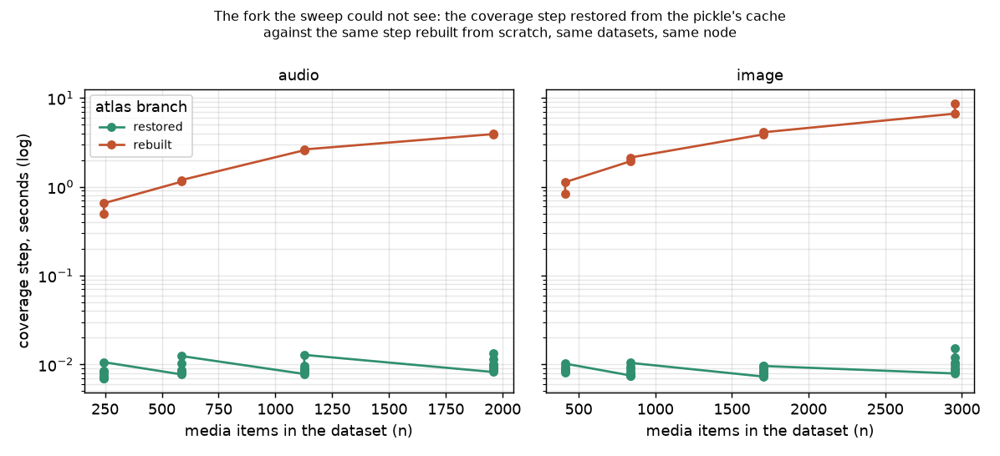
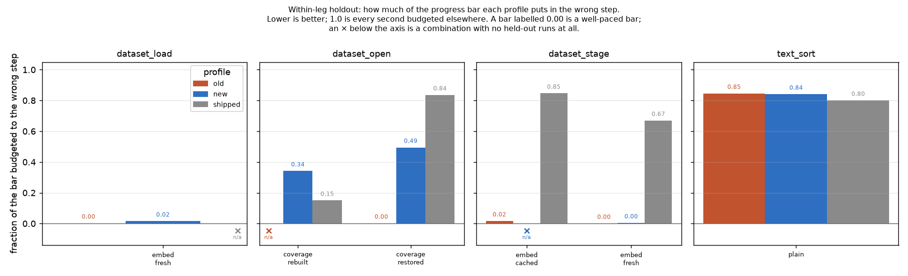

# Does the corrected tuning driver produce a usable profile? (#3521)

**Complete 2026-09-03.** Sweep SLURM 609828 on `rack7n06`
(Tesla V100-SXM2-32GB-LS, Xeon E5-2698 v4, 8 threads, `cuml_active=True`,
profile cell key `cuda+cuml`) — the same node and device key #3345 measured on.
Analysis 612126 on a GPU node. Rows, profiles and figures in
`/expscratch/sgreenberg/drive-3521/`. Pre-registration: [PREREG.md](PREREG.md).
Code: [`scripts/experiments/drive_cold/`](../../../scripts/experiments/drive_cold/).

---

## 1. Summary

**The issue is real, its remedy was aimed at the wrong mechanism for half of
what it lists, and one of its four instances is misdiagnosed outright.**

| # | instance from the issue | verdict |
|---|---|---|
| 1 | `dataset_load`·`load` — 54.9 s then `0.000` × 3 | already fixed by #3520 / PR #3548 |
| 2 | `text_sort`·`load_model` — 15.4 s then `0.0` × 47 | already fixed by #3520 / PR #3548 |
| 3 | `dataset_open`·`coverage` — restored on all 16 opens | **confirmed**, and worse than the issue claims |
| 4 | `dataset_stage`·`embed` — `0.000`–`0.002` s | **misdiagnosed**: the cache is innocent (§5) |
| 5 | *(not in the issue)* `--reps 2` pools a real embed with a pkl read | **confirmed** (§3) |

The headline number: a profile fitted the way dev's driver produces one puts
**0.94** of a dataset-open's progress bar in the wrong step when the atlas is
rebuilt — worse than shipping **no profile at all** (0.15). That is the failure
the issue predicted, measured.

The fix is not free, and the study is what shows the price. `new` prices the
rebuild (0.34) but then mis-paces the *restore* (0.49) where `old` was perfect
(0.00). No single set of coefficients is right for both branches, because
**the profile format has no branch axis** — which is now a filed follow-up
(§7), and is the real ceiling on this line of work.

On the embed fork, where the branch can simply be *arranged*, the fix is an
unambiguous win with no compensating loss: bar error **0.35 → 0.00** for
`dataset_stage` and **0.09 → 0.01** for `dataset_load`.

---

## 2. The fork, measured

*The coverage step of a dataset open, against dataset size, on a log axis. Green
is the atlas restored from the cache inside the dataset's own pickle; red is the
same step rebuilt from scratch. Same datasets, same node, same code. Read the
gap, not the levels: the restored branch is flat in `n` — it is a
deserialisation — while the rebuilt branch scales, which is exactly why a sweep
that only ever restores has no slope to fit. This figure does not license any
claim about sizes past 2954 items; see the extrapolation caveat below.*

| n (image) | restored | rebuilt | ratio |
|---:|---:|---:|---:|
| 412 | 0.0090 s | 0.98 s | ~110× |
| 838 | 0.0090 s | 2.0 s | ~230× |
| 1704 | 0.0095 s | 4.0 s | ~420× |
| 2954 | 0.011 s | 7.7 s | ~700× |

Two things follow, and the second is a correction to the tree.

**The measurements were never noise.** Restores repeat to within 0.001 s and
rebuilds to within 15 %. Both branches are cleanly measurable. What was missing
was any record of *which one ran* — which is why establishing the above from
#3345's rows took twenty minutes of archaeology, and why the same question is
now one column in the JSONL.

**`tasks.py` calls the rebuild "a minutes-long hierarchical-k-means", and at
every size anybody has swept it is under nine seconds.** Fitted from the
rebuilds, the coverage step is `0.0026 s/item` (r² 0.95), so the "minutes"
language becomes true only near `COVERAGE_ATLAS_AUTO_THRESHOLD`:

| n | predicted rebuild |
|---:|---:|
| 2954 (largest measured) | 7.8 s |
| 10 000 | 26 s |
| 50 000 (the auto-build threshold) | 131 s ≈ 2.2 min |

The last two rows are **extrapolations from a fit whose largest point is 2954**,
carried three sig figs only to show the arithmetic; hierarchical k-means is not
guaranteed linear over a 17× extrapolation, and nothing here measured it. The
honest statement is that the shipped comment is right in *direction* at every
size and right in *magnitude* only at the threshold.

---

## 3. H1 and H2 — the default `--reps 2` fits a slope through zeros

`dataset_load`·`embed`, image tiers, seconds per rep:

| n | OLD (`--no-cold-embed`) | NEW (`--cold-embed`) |
|---:|---|---|
| 412 | **6.20**, 0.00 | 5.87, 5.74 |
| 838 | **11.67**, 0.00 | 11.51, 11.41 |
| 1704 | **23.51**, 0.00 | 23.16, 23.19 |
| 2954 | **40.41**, 0.00 | 40.42, 40.86 |

**H1 holds.** At the driver's own default, half of every cell's rows are zeros:
rep 1 embeds and writes the pkl, rep 2 reads it. #3345 escaped this only by
passing `--reps 1`, which no documentation tells anyone to do.

**H2 holds.** With the cache cleared per rep, every rep embeds and the pairs
agree to ~2 %. The branch marker confirms it independently: the OLD leg's second
reps carry `branch: cached`, the NEW leg's carry `branch: fresh`.

A side effect worth recording, because it is the sort of thing that is invisible
without the contrast: clearing the cache also repaired `dataset_stage`·`serialize`,
whose OLD fit was `a=7.2, r²=0.03` — dominated by one 22 s first-rep outlier —
against `a=0.31, b=0.0039, r²=0.997` in the NEW leg.

And the encoder-residency fix works: the cached rows carry **no** `cold_model`
field at all, so a run that read a pkl no longer claims the ledger key that the
next run — the one that really pays the load — needs in order to be written cold.

---

## 4. H3 and H4 — what each profile does to a progress bar

*Within-leg holdout — half of each leg's own reps fit the profile, the other half
score it. Height is the fraction of the progress bar budgeted to the wrong step;
lower is better. Every bar is labelled because a well-paced bar scores 0.00 and
would otherwise be indistinguishable from an absent one; an × below the axis is
a combination with no held-out runs at all. Fits here stand on half the rows, so
read the ranking, not the third digit. This figure says nothing about how often
each branch occurs in production — that frequency is exactly what §6 says nobody
has measured.*

Cross-leg (each leg held out against the other), the two decisive rows:

| arm | task | branch | runs | bar error | step error |
|---|---|---|---:|---:|---:|
| **old** | dataset_open | **coverage=rebuilt** | 16 | **0.94** | 0.99 |
| old | dataset_open | coverage=restored | 32 | 0.00 | 0.20 |
| new | dataset_open | coverage=restored | 32 | 0.62 | 0.13 |
| shipped | dataset_open | coverage=rebuilt | 16 | 0.15 | 0.73 |
| shipped | dataset_open | coverage=restored | 64 | 0.84 | 0.81 |

**H3 holds, and by more than expected.** The profile dev's driver produces is
not merely imprecise about a rebuild — at **0.94** it is close to the worst
value the metric can take, and it is six times worse than shipping nothing
(0.15). A user watching that bar sees it reach ~100 % and sit there for the
entire rebuild, which is precisely the failure the shipped weighting comment
says it was written to prevent.

**H4 holds.** Fitted from the restores alone the coverage step is
`a=0.0079, b=9.9e-08, r²=0.03` — a flat 8 ms with no signal. Fitted from the
driven rebuilds it is `a=0.0, b=0.0026, r²=0.95`. The `--cold-atlas` branch is
what turns an unfittable step into a line.

**The refutation condition fired on one arm, and it is the honest headline.**
`new` is not better everywhere: on `coverage=restored` it scores 0.49–0.62
against `old`'s 0.00, because it now budgets the bar for a rebuild that a
restore does not perform. Trading a 0.94 for a 0.49 is a good trade on its own
terms — and it is still a trade, not a fix.

---

## 5. Instance 4 of the issue is misdiagnosed: the cache is innocent

The issue attributes `dataset_stage`·`embed` reading `0.000`–`0.002` s to
ordering — "`dataset_stage` runs *after* `dataset_load`, which had just cached
every vector". The sweep clears that cache and the step still reads zero.

`dataset_stage`, image tiers, seconds:

| n | branch | acquire | embed | serialize |
|---:|---|---:|---:|---:|
| 838 | `cached` (OLD) | 0.32 | **0.000** | 3.93 |
| 838 | `fresh` (NEW) | **11.2** | **0.000** | 3.59 |
| 2954 | `cached` (OLD) | 0.41 | **0.002** | 12.0 |
| 2954 | `fresh` (NEW) | **40.3** | **0.002** | 11.6 |

Clearing the cache moved 11–40 s of real embedding into the run — a 40× change
in total cost — and `embed` did not move at all. The cause is not the cache: for
a demo source, `load_demo_dataset` embeds *inside* `importer.run()`, which the
staging flow reports as the **acquire** step; by the time `embed_missing` runs
under step 2 there is nothing left to embed. `dataset_stage`·`embed` has never
measured embedding and cannot, on any branch.

The fitted coefficients say the same thing twice: NEW's `acquire` is
`b=0.0136 s/item, r² 0.9995` — a textbook embed curve wearing the wrong step's
name — while `embed` is `b=7.2e-07`.

This does not undo the fix. The branch marker is what made the mislabel legible
in one look instead of by archaeology, and `--cold-embed` is what put the real
work into the run so that the misplacement could be seen at all. But the step
boundary is a separate defect and is filed as one (§7). It is also why `new`
scores 0.00 on `dataset_stage`·`embed=fresh`: the profile correctly predicts the
shape the code actually produces, which happens to be a shape with a dead step
in it.

---

## 6. Limits

- **The legs ran sequentially, so the model load is confounded.**
  `dataset_load`·`load` measured 36.3 s cold in the OLD leg and 10.2 s cold in
  the NEW one — the weights were in the page cache the second time. This affects
  that step only; the embed times are near-identical across legs (11.67 vs 11.51,
  23.51 vs 23.16, 40.41 vs 40.42), which is good evidence the machine was
  otherwise stable. No conclusion here rests on the model-load figures, which
  are #3520's subject and not this study's.
- **`text_sort` is not resolved by anything.** All three arms score 0.80–0.85
  bar error on it. Its steps are sub-second and none of the profiles pace them.
  That is not a finding about this change — `shipped` is as bad — but it is an
  open gap, filed in §7.
- **Two reps per cell.** Reps agree to ~2 % on the embed and ~15 % on the atlas
  rebuild, but nothing here supports a third significant digit, and the
  within-leg holdout fits stand on one rep per cell.
- **How often each branch occurs in production is unmeasured.** This study
  prices both branches; it does not weight them. Whether `old`'s 0.00-on-restore
  or `new`'s 0.34-on-rebuild is the better deployment depends on a ratio nobody
  has counted, which is the strongest argument for the branch-aware lookup in §7
  rather than for either profile.
- **Rollups remain much weaker than exact cells**, as #3522 found: the NEW leg's
  `(device, *, *)` `dataset_open` cell fits at r² 0.49 against 0.97 exact. The
  refusal added by PR #3545 withheld one step in each leg.

---

## 7. Follow-ups

Filed as issues, not left here:

- **#3593** — `dataset_stage`·`embed` never measures embedding; the demo
  importer embeds inside the acquire step (§5).
- **#3594** — the profile format has no branch axis, so no single cell can pace
  both a restored and a rebuilt atlas; the dataset-open route knows which branch
  it will take before it starts (§4).
- **#3595** — `tasks.py`'s "minutes-long" rebuild comment is off by two orders
  of magnitude below ~3000 items; replace the prose with the measured rate (§2).
- **#3596** — no profile paces `text_sort`; all three arms sit at 0.80–0.85 bar
  error (§6).
