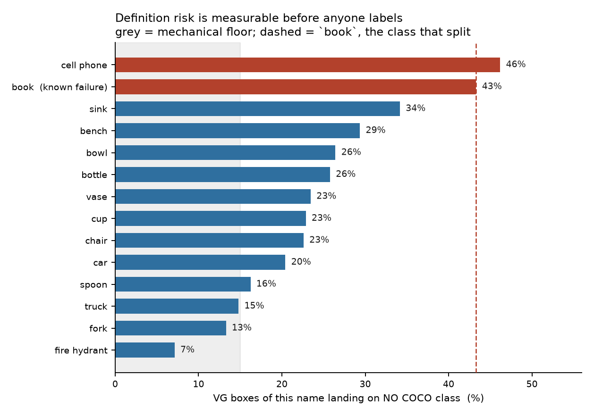
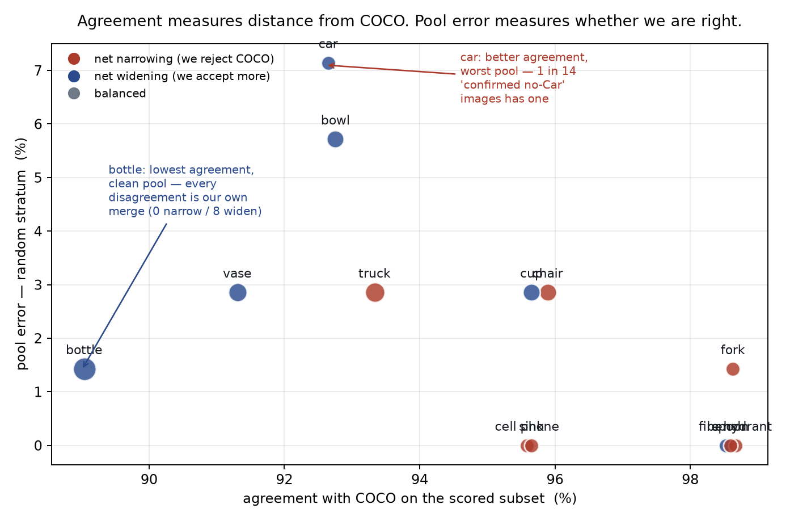
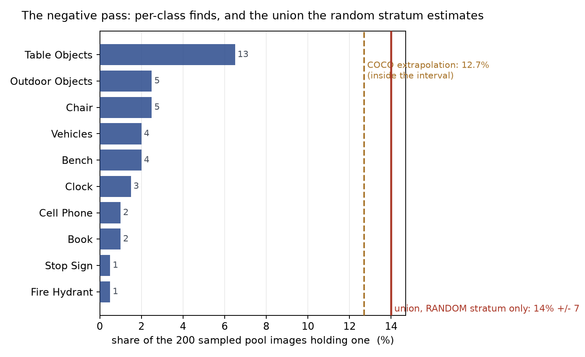

# Expanding `vg_scale`'s class list — what VG will actually support (#3588)

**2026-09-03.** Issue #3588 asks for the class list to sample *context
exclusivity* on purpose instead of by accident. This is the measurement pass
that decides which classes can serve, plus the review material for the ones that
can: 13 slates, 13 datasets, 13 empty detectors and an
[annotation guide](ANNOTATION_GUIDE.md).

**Nothing about the class list has been changed** *by this report*.
`SCALE_CLASSES` is untouched here and `vg_scale` is not rebuilt. What is added is
the candidate list, the rules they would be reviewed under, and the tooling
behind them. All thirteen were promoted into *C* on 2026-09-06 — see
[`../2026-09-06-vg-scale-promotion-3588/REPORT.md`](../2026-09-06-vg-scale-promotion-3588/REPORT.md),
which is also where the VG-name audit this report did not run lives.

**Update, 2026-09-06.** The review ran. One reviewer produced **5,904
judgements** over four days — 3,900 across the thirteen candidate slates and
2,000 in a negative pass covering all twenty-five classes. All thirteen
candidates clear the bar. The negative pass puts union contamination of the
shared pool at **14% ± 7**, which *confirms* the extrapolation #3635 rests on
rather than overturning it. Six issues came out of the review.

## Three results, in order of how much they change the plan

### 1. The issue's own proposal does not survive the gate the issue specifies

Step 0 of #3588 is right that the measured shortlist, not the proposal, is
ground truth — and run against it, most of the proposal fails:

| proposed | binding failure |
|---|---|
| `airplane` (and `plane`, `jet`) | 85 / 81 / 21 images in the **small** band (floor 100) |
| `train`, `zebra`, `elephant`, `giraffe` | 34 / 27 / 20 / **14** small-band images |
| `cat`, `suitcase` | 44 / 54 small-band |
| `handbag`, `purse` | 21 / 89 **large**-band |
| `potted plant` | 1 small-band image in all of VG |
| `motorcycle` | measured **alias** of `bike` (box IoU 0.38) |
| `surfboard`, `snowboard`, `skateboard` | measured **alias** of `board` (0.45 / 0.50 / 0.52) |
| `traffic light` | 58 large-band **and** head noun `light` already barred by `scale_study_exclusion` |
| `cell phone` | 98 large-band under that spelling — but the VG name `phone` clears it |

The issue predicted the binding band correctly for large objects ("the binding
band is `small`") and then predicted the supply would be fine ("distant vehicles
are common"). For `truck` it is; for `train` and `airplane` it is not.

### 2. The easy end of the context axis cannot be widened — and that is structural


Every scene-exclusive class the issue wanted fails on the **small** band
specifically, and by a wide margin: `giraffe` has 14 small-band images against
1,279 large, `train` 34 against 2,730. That is not a sampling accident. **A
class that owns its scene is photographed filling the frame** — which is close
to what "scene-exclusive" means — so context exclusivity and small-band supply
are anti-correlated in VG.

So the achievable expansion is asymmetric: it adds same-scene partners and
widens the *hard* end, and it cannot widen the easy end at all. The two
scene-exclusive anchors the study has (`kite`, `boat`) stay the only two. Any
design that needs a wider easy end needs a different image source, not a
different query — filed as **#3603**.

### 3. Definition risk is measurable before anyone labels, and `book` proves it

This is the part that answers "we screwed up with magazines vs books."

`book` split because COCO has no magazine class, so COCO's annotators put
magazines in `book` while the human pass applied the narrower English reading —
21 verdicts on one definition, 49 on another, with every structural check
passing. **That split was visible in the data the whole time.** On the ~51k
images that are both VG and COCO, both vocabularies annotate the same pixels, so
asking *which VG names land on a COCO class's boxes* enumerates the boundary
cases before a reviewer meets one. `coco_folds.py` does that. Run against
`book` it prints `magazine` (79 boxes) and `magazines` (30).

The reverse direction gives a **risk score**: the share of VG boxes of a name
that land on *no* COCO class, on images COCO annotated exhaustively. COCO is
exhaustive over these 80 classes, so a high share means the VG name covers
objects COCO does not have.



`book`, the class that actually broke, scores **43%** — which is what calibrates
the column. Exactly one candidate scores worse:

- **`cell phone` at 46%.** VG's `phone` boxes land on a COCO `cell phone` only
  54% of the time. The other 46% are landlines, desk phones and payphones,
  which COCO has no class for. This is the same failure as `book`, one class
  earlier, and it is why the dataset is named `cell phone not landlines`.
- **`cup` carries the largest fold-in measured anywhere**: 1,136 VG `glass`
  boxes — 14% of every COCO `cup` box — are COCO cups. That is ten times the
  size of the `magazine` fold-in. A reviewer applying narrow English to `cup`
  would repeat the `book` failure at ten times the scale.
- **`bowl` folds in `plate` (212) and `dish` (146)**, because COCO has no
  `plate` class. `plate` is separately barred here as polysemous (dinner plate
  / licence plate), which is precisely why it lives inside `bowl`.
- **`fire hydrant` is the cleanest class measured** (7% unmatched, 81% of COCO
  boxes carrying a VG box) — and it only works merged, since the `hydrant`
  spelling is 266 of its 835 COCO boxes.

Every rule in the annotation guide is one of these measurements, and the rule
travels in the **dataset name**, because a reviewer cannot see a manifest while
voting and an unstated convention is what caused this in the first place.

## A cost the issue did not price: the shared negative pool does not survive

The shared pool was drawn as "holds none of the **current twelve**". It is
therefore not a negative pool for a candidate — an image can sit in it and hold
a car. Measured against the 4,200-image pool:

| class | evicted | | class | evicted |
|---|---:|---|---|---:|
| `car` | 331 (7.9%) | | `bench` | 155 (3.7%) |
| `chair` | 284 (6.8%) | | `cell phone` | 152 (3.6%) |
| `bottle` | 184 (4.4%) | | `sink` | 123 (2.9%) |
| `bowl` | 182 (4.3%) | | `vase` | 86 (2.1%) |
| `cup` | 178 (4.2%) | | `spoon` | 81 (1.9%) |
| `truck` | 155 (3.7%) | | `fork` | 71 (1.7%) |
| | | | `fire hydrant` | 67 (1.6%) |

**The union is 1,430 — 34% of the pool.** Survivors: 2,770, against
`SCALE_N_NEG` = 3,900. The 300 spares exist to absorb exactly this and are an
order of magnitude short.

So adding all thirteen forces ~1,430 **fresh** negatives into the pickle, and a
negative that is not already in it has to be embedded — i.e. a full `vg_scale`
rebuild, dragging `vg_scale_any` and `vg_scale_deep` with it, and orphaning the
part of the negative review pinned to the evicted images. The issue priced
compute per class (+8% of the grid) and did not price this at all.

Where it breaks is sharp:

```
+fire hydrant  survivors 4133      +truck        survivors 3526
+fork          survivors 4062      +bench        survivors 3398
+spoon         survivors 4001      +cup          survivors 3299
+vase          survivors 3917  <-- last one above SCALE_N_NEG (3900)
+sink          survivors 3806      ... +car      survivors 2770
```

**Four classes can be added without redrawing the negative pool. The fifth
cannot.** That is the decision this expansion actually turns on, and it is a
choice between a cheap 4-class addition and a rebuild — not, as the issue
framed it, a smooth +8% per class. Filed as **#3604**.

## What is built and ready

13 slates × 300 images = **3,900 images**, at #3156's proportions (200 ranked
negatives, 70 random, 30 boxed positives), each imported as a VTSearch dataset
with an empty detector of the same name, in `/exp/sgreenberg/projects/VTSearch/data`.

| dataset / detector name | class | small | medium | large |
|---|---|---:|---:|---:|
| `truck incl vans not SUVs` | truck | 455 | 1535 | 1359 |
| `car incl SUVs and minivans` | car | 1297 | 2922 | 1511 |
| `fork incl plastic` | fork | 256 | 1275 | 355 |
| `spoon incl plastic not spatulas` | spoon | 365 | 908 | 197 |
| `cup incl mugs and glasses not stemware` | cup | 969 | 1775 | 491 |
| `bowl incl plates and dishes` | bowl | 456 | 1460 | 911 |
| `bottle incl jars` | bottle | 1125 | 1762 | 375 |
| `vase incl pots and planters` | vase | 515 | 701 | 408 |
| `bench not chairs` | bench | 487 | 1457 | 1681 |
| `chair incl stools not couches` | chair | 323 | 2953 | 1798 |
| `sink basin not counter` | sink | 374 | 1647 | 556 |
| `cell phone not landlines` | cell phone | 1767 | 1307 | 257 |
| `fire hydrant not standpipes` | fire hydrant | 351 | 520 | 532 |

Supply is per band, after COCO anchoring and after the alias merges, so it is
what a build would actually have. Every class clears the 100-per-band floor with
margin; the thinnest is `spoon@large` at 197.

Vote Good (drag a box) / Bad, export with `server_json_file`, then
`ingest_slate.py --export <file> --slates /expscratch/sgreenberg/classes-3588/slates`.

## Two things that cost time, recorded

- **A positive and a negative collided in seven of the thirteen slates.** The
  same image was drawn as a ranked negative *and* as a boxed positive, and the
  boxed render silently overwrote the bare one — one file on disk, two
  contradictory manifest rows, and `ingest_slate.load_manifests` keys on
  `(image_id, class, detector)`, so one row would have won silently. The cause
  is the finding above: the shared pool is not a negative pool for a candidate.
  The builder now excludes any image holding the class before drawing, and
  *reports the count*, which is where the 1,430 number came from. **A defect
  and a measurement were the same fact.**
- **The positives loop rebound `pool`**, the name holding the shared negative
  pool, so every class after the first drew its negatives from the previous
  class's last band. It failed loudly (`KeyError`) only because the two id
  spaces are disjoint; had they overlapped it would have produced a full,
  plausible, wrong slate for twelve of thirteen classes.

## The review ran: 5,904 judgements

### Verdict: all thirteen can join

Every candidate was reviewed at 300 images — 30 pre-boxed COCO positives, 200
top-ranked negatives, 70 uniform negatives — with about a fifth of each slate
carrying an exhaustive COCO answer that scores the reviewer rather than
correcting the data.

| class | agreement | pool error | boundary | narrow / widen | reading |
|---|---|---|---|---|---|
| `fire hydrant` | 99% | 0.0% | 4.5% | 1 / 0 | cleanest measured |
| `fork` | 99% | 1.4% | 5.0% | 1 / 0 | |
| `spoon` | 99% | 0.0% | 5.5% | 1 / 0 | |
| `bench` | 99% | 0.0% | 5.0% | 0 / 1 | |
| `chair` | 96% | 2.9% | 12% | 3 / 0 | cars and saddles ruled out |
| `cup` | 96% | 2.9% | 14% | 0 / 3 | stemware merged in |
| `sink` | 96% | 0.0% | 11% | 2 / 1 | |
| `cell phone` | 96% | 0.0% | 4.5% | 2 / 1 | |
| `truck` | 93% | 2.9% | 20% | **5 / 0** | a pure narrowing |
| `bowl` | 93% | 5.7% | 19% | 1 / 4 | plates and food containers merged in |
| `car` | 93% | **7.1%** | **23%** | 2 / 3 | the contaminated one |
| `vase` | 91% | 2.9% | 14% | 1 / 5 | pots and planters merged in |
| `bottle` | **89%** | 1.4% | 21% | **0 / 8** | a pure widening |

### Agreement is not the quality ranking, and reading it as one inverts the answer



The two axes are close to independent, and the **narrow / widen** column says
why. A disagreement where COCO said *present* and the reviewer said *absent* is
us **narrowing** a class on purpose; the reverse is us **widening** it. Both
lower agreement while doing exactly what was intended.

`bottle` is last on agreement at 89%, and **all eight of its disagreements are
us accepting something COCO did not call a bottle** — the jar, shaker and jug
merge working. Its pool error is 1.4%: the class is clean. `car` scores better
at 93% and is the one with a real problem, at **7.1% pool error** — roughly one
in fourteen images we would have filed as a confirmed no-Car has one.

> **Agreement measures how far we moved from COCO. Pool error measures whether
> we are right. Only the second is a quality bar.**

`truck` at 5 narrow / 0 widen is the cleanest signature in the table: every
scored disagreement is us rejecting a COCO truck, exactly as the
detached-trailer and plant-machinery rulings predict. A narrowing that shows up
as a one-directional column is a narrowing that did what it said.

### What the definitions became

Four classes were deliberately widened and are no longer COCO's class of the
same name:

| class | now includes | cost |
|---|---|---|
| `cup` | mugs, glasses **and stemware** | a *union* of two COCO classes — reference derivable, free |
| `bowl` | plates, pots, dog bowls, disposable and paper containers | union, free |
| `bottle` | jars (120 boxes), shakers (21), jugs (28), squeeze tubes | union, free |
| `vase` | pots and planters made as such | narrowing on the other side — a built-in sidewalk planter is out |

Merging stemware into `cup` was initially refused as unavailable and that was
wrong: `wine glass` is itself exhaustively annotated, so the reference for a
union is derivable and the scored subset survives. **The merge doubled cup's
discoveries** (13 → 27) while its positive rejections fell from 30% to 7%.

The narrowings are priced honestly. Excluding towed things and plant machinery
from `Truck` costs the 63 `trailer`, 35 `cart`, 24 `tractor`, 2 `forklift` and 2
`crane` boxes COCO does call trucks — about 100 boxes, the same order as the
vase narrowing.

### The negative pass: the pool is 14% ± 7 contaminated, and the extrapolation holds



The thirteen slates each measured one class against its own negatives. The
negative pass asked about the **pool** itself: an image sits in it because no VG
name on it matches a class, and this study's whole finding is that a missing
name is not an absent object.

200 images from the corrected pool, all twenty-five classes, five scene-grouped
passes over one sample.

**The estimate has to come from the random stratum alone**, and getting this
wrong is easy: half the sample is the boundary stratum, chosen by text rank to
be suspicious, so a rate over all 200 estimates nothing.

| stratum | holds one of the 25 | |
|---|---|---|
| **random** | **14 / 100 = 14%** | **the estimate** |
| boundary | 19 / 100 = 19% | ranked, biased by design |
| all 200 | 33 / 200 = 16.5% | not an estimate of anything |

> **Union contamination of the shared negative pool: 14% ± 7 (95% CI, n=100).**

**This confirms #3635 rather than overturning it.** `pool_contamination.py`
measures per-class contamination on the COCO overlap with COCO held back as the
answer key, then extrapolates to the off-COCO half — an extrapolation its own
docstring flags as *"assumes the two halves have the same prevalence"*. Applied
to this frame it predicts **12.7%**, which sits comfortably inside the
interval. **The assumption had never been tested against a human on the half it
extrapolates to; it survives.**

The two halves of the sample came out at 22% (COCO-scored, n=92) and 12%
(off-COCO, n=108). That looks like a large gap and is **1.8σ** — not a
difference this sample can establish, and pointing the opposite way from the
worry, so it argues against the off-COCO half being dirtier rather than for it.

Per class the rate is 0.5–2.5%, and that is the figure that bears on a
single-class evaluation — 20 to 100 wrong negatives out of 3,900. The 14% is the
rate for "holds any of the twenty-five", and it prices a different ambition: a
pool provably clean of everything is about 86% the size of the current one.

**Two perfect passes.** `Vehicles` and `Outdoor Objects` each scored **100%**
against COCO on 92 scored rows — zero misses, zero false alarms. Both were
semantically tight four-class groups.

### A miss rate against COCO overstates reviewer error

`Bench` scored 96%, and all four disagreements ran one way. Their box sizes say
most are not misses:

| image | largest bench box | band |
|---|---|---|
| `2396098` | **99.61% of frame** | **OVERSIZE** |
| `2388314` | 55% | large |
| `2315792` | 39% | large |
| `2382828` | 3.0% | medium |

The first is excluded by our own rule — *a box covering >80% of the image is not
a region, it is the image* — so it cannot be a miss against a benchmark that
never bands it. Two more fill 39% and 55% of the frame, which nobody overlooks;
the likely cause is the Bench definition, which rules a concrete seating ledge
out where COCO appears to box one. Only the 3.0% box is a plausible ordinary
miss.

> **Report a miss rate with the box sizes attached, or a deliberate narrowing
> reads as reviewer error.**

### Errors worth naming

- **A fold-out rate is not a positive-precision rate.** `glass` was admitted to
  `cup` on 62% fold-out and it was the wrong statistic: fold-out is measured only
  on the COCO-annotated half while positives are drawn from all of VG. Cup then
  rejected 9 of 30 pre-boxed positives — 30%, against 0–17% everywhere else.
  `glass` is now barred as ambiguous, and removing it from the alias tuple first
  suppressed **zero** pairs, because a name that is never *read* is invisible to
  `lift_ambiguous`.
- **One polysemous word sinks sixteen good ones.** `vessel` folds in across
  bowl, cup, vase and bottle and means something different in each.
- **A boxing rule has to be split by stratum.** "Box the single biggest one" was
  written without distinguishing pre-boxed positives from discoveries; 13
  positives were redrawn across 4 classes and **6 changed band**, two of them
  leaving `small` (#3616).
- **Literal boundary cases the reviewer hit**, all now in the guide: a train
  cow-catcher boxed as a fork; green-and-white *bike crossing* signs boxed as
  Bike; a toddler's pink Cinderella toy phone; a paper hotdog tray, which is a
  Bowl on the second reading; a jar of cut flowers, which stays a Bottle.

## Follow-ups

- **#3603** — the easy end of the context axis needs a source where
  scene-exclusive objects appear small; VG cannot supply it.
- **#3604** — decide between the 4-class addition that keeps the negative pool
  and the rebuild that does not, and price the rebuild.
- **#3605** — `bicycle` is built from the VG name `bicycle` alone, but `bike`
  accounts for 638 of COCO's 3,683 bicycle boxes against `bicycle`'s 775. On
  the non-COCO half the current class is missing roughly half its positives.

Raised by the review itself, in the order they were found:

- **#3665** — deleting a detector out-of-process is silently undone when the
  running app writes its cached registry back; a bulk delete through the API
  loses a surviving entry the other way.
- **#3666** — **pool error for the shipped twelve has never been measured.** The
  negative pass now covers them, but their positives have had no review and
  their definitions no guide. Adding thirteen reviewed classes to twelve
  unreviewed ones would give the benchmark two tiers of label quality, and any
  cross-class result would be confounded by which tier a class sits in.
- **#3667** — **`vg_scale` never scores a class against images holding a
  *different* class.** `evaluable_categories` is `cats if cats else …`, so an
  image that is a positive for any class is scorable only in its own cells:
  **41.9%** of the pile is dropped from every class's evaluation. Positives are
  images containing a labelled object and negatives contain none of twelve
  common classes, so a detector can score well by learning *"is this a scene
  with stuff in it"*. About 1,850 hard negatives per class have an exact COCO
  answer already — a 42–45% gain at no labelling cost.
- **#3668** — a fully provable benchmark is not reachable at the current
  designation: 20 of 36 shipped cells and 17 of 39 candidate cells fall short of
  300 COCO-anchored positives (`dog@small` 114, `spoon@large` 106). The non-COCO
  half stays, so its error rate is load-bearing — which is what made the
  negative pass worth running.
- **#3669** — slate import re-embeds images whose vectors are already in the
  pile pickle, once per slate, at ~1.2 s/image on whatever device the caller
  happens to have.
- **#3670** — **1% prevalence is available.** 18,986 images outside the pile
  are COCO-confirmed to hold none of the twenty-five; matching the positives'
  57/43 COCO split needs 5,700 new images embedded and no human labelling.
