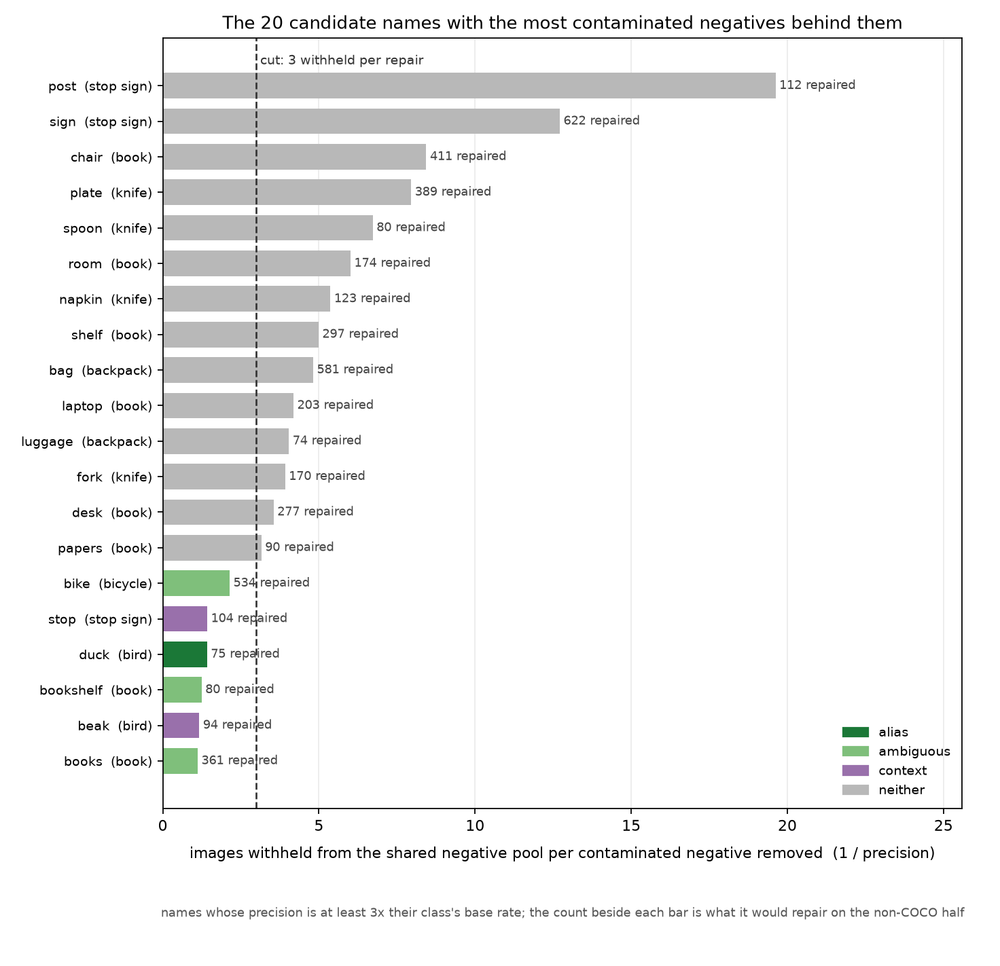
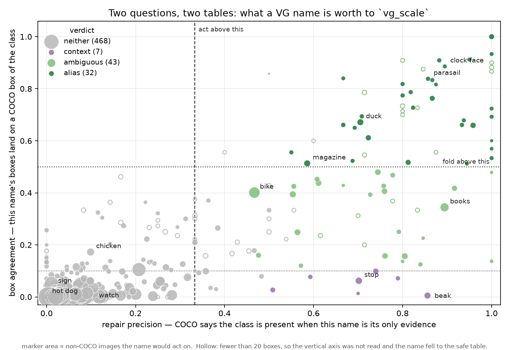
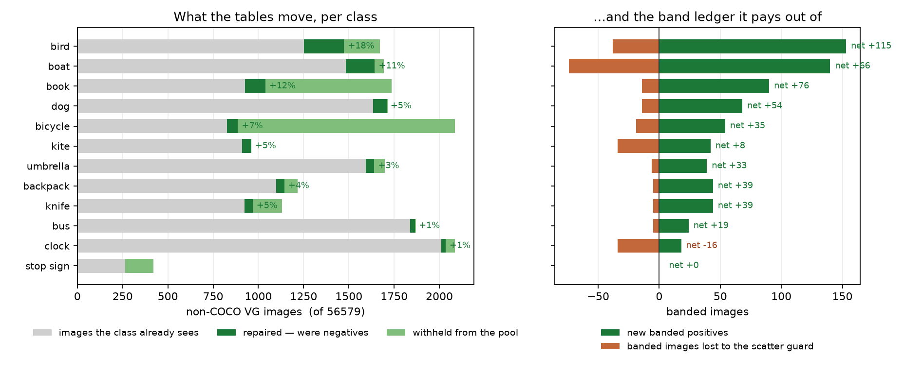

# What the other eleven `vg_scale` classes' VG names are worth (#3618)

**2026-09-04.** #3605 found that `vg_scale` built `bicycle` from the VG spelling
`bicycle` alone, while `bike` carried 638 of COCO's 3,683 `bicycle` boxes.
#3617 fixed the mechanism, declared that one class, and wrote down that the
other eleven had never been looked at. This is that measurement, for all twelve,
and it fills both tables.

`SCALE_CLASSES` is untouched and **nothing is rebuilt**. What changes is what a
rebuild would contain — which is why #3618 asked for this before the next one,
and why #3604's pending rebuild should carry it.

---

## Five results, in the order they change the plan

### 1. The measurement the issue specifies cannot make the decision on its own

#3618 says to read `coco_folds.py`'s **fold-in** column and act on any VG name
reaching a material share. Fold-in is a *box* test: does a VG box named *n* land
on a COCO box of class *c* at IoU ≥ 0.5? Run against the twelve it produces a
clean ranking, and the two entries at opposite ends of it show why a ranking is
not a decision:

| name | class | fold-in | the box test says | what is actually true |
|---|---|---|---|---|
| `sign` | `stop sign` | **473 boxes, 46.6%** — the largest fold-in column anywhere in *C* | the strongest candidate in the study | a VG `sign` box is a stop sign **7.9%** of the time |
| `grandfather clock` | `clock` | 0 of 6 boxes, 0.0% | not a clock | COCO finds a clock on all three images where it is the class's only evidence — the VG box is the cabinet, COCO's is the dial |

Both errors have one cause: **fold-in is conditioned the wrong way round.** A
high share says *stop signs are usually annotated `sign`*, which is a fact about
stop signs and not about signs. And any box test fails whenever two vocabularies
frame the same object differently, which is most of what free text does.

So this study adds the image-level test the negative pool actually needs
(`name_evidence.py`). Over the VG∩COCO overlap, take the images where VG has a
box named *n* and **no** box named *c* — precisely the state that becomes a
false negative on the other half — and ask COCO whether *c* is present:

> **repair precision** — of the images where this name is the class's only
> evidence, the share where the class is really there.

It is measured on the half with an exhaustive reference and applied to the half
without one, which is the trade `anchor_to_coco` already makes.

### 2. Read as a price, precision decides the table in one number

`1 / precision` is **how many images leave the shared negative pool per
contaminated negative removed** — because a name acts on every image carrying
it, and only the precision-weighted share of those was a wrong negative.

`sign` costs **12.7** images per repair; `wheel` 15.4, `awning` 23.5, `truck`
(as a `bus` candidate) 24.3. `bike` costs 2.1, `books` 1.1, `duck` 1.4, `beak`
1.2. The cut used here is **three withheld per repair** (precision ≥ 1/3), taken
on the **Wilson lower bound** so that a name measured on five images cannot
outrank one measured on two thousand — `dove` is 5 of 5 and `bike` is 508 of
1,088, and the raw rates would say the first is twice the second.

### 3. The largest column in the study is the one you must not act on

`stop sign` is the class in the worst shape of the twelve: **18.7%** self-match,
the lowest, and **496** VG images under its own name against a `sign` head-noun
family spanning 155 names and 19,148 images. Every route out is refuted by its
own numbers:

| candidate | VG images | precision | lower bound | box | verdict |
|---|---|---|---|---|---|
| `sign` | 15,042 | 7.9% | 0.07 | 4% | **neither** — 12.7 withheld per repair |
| `signs` | 926 | 9.0% | 0.07 | 4% | neither |
| `street sign` | 778 | 8.0% | 0.05 | 0% | neither |
| `red sign` | 150 | 23% | 0.14 | 22% | neither |
| `stop` | 332 | **70%** | 0.62 | 6% | **context** — the lettering, not the sign |
| `octagon` | 27 | **80%** | 0.49 | 73% | **ambiguous** — only 15 boxes, too few to fold |

The 37 adjudicable images behind the *rest* of that family pool to **0 of 37**,
so there is nothing behind them either. `stop sign` therefore gains **no
positives at all** from this study: 157 images leave its negative pool and not
one becomes a positive. Its missing positives are real, and no name reaches
them — that is a human pass or a different source (**#3635**).

### 4. The alias test cannot see a spelling split, and says so plainly

#3618 asks that an alias reading be confirmed with `scan_name_overlap.py` (box
IoU both ways) rather than on a fold-in count. Run over 157 candidate names it
returns **1,740** class-vs-candidate pairs and calls **11** of them aliases:

| verdict | pairs |
|---|---|
| untestable — never co-annotated | 846 |
| thin — under 10 co-annotated images | 601 |
| distinct | 210 |
| mixed | 72 |
| **alias** | **11** |

That is not a shortage of aliases; it is the test being asked a question this
data cannot answer. **An annotator who writes `back pack` does not also write
`backpack` on the same image**, so the pair never co-occurs and there is no
geometry to compare. And where a singular and its plural *do* co-occur they are
deliberately *different* boxes — the annotator drew one book and then the pile:

| pair | co-images | a on b | b on a | verdict |
|---|---|---|---|---|
| `backpack` / `backpacks` | 10 | **0.000** | **0.000** | distinct |
| `book` / `books` | 329 | 0.035 | 0.061 | mixed |
| `bird` / `birds` | 246 | 0.044 | 0.109 | mixed |
| `clock` / `clock face` | 286 | **0.562** | **0.701** | **alias** |

The last row is the case the test is for — two names genuinely on one box — and
it is the best-supported fold in the study: **89%** box agreement over 184
boxes, where the only higher scores (`butter knife` 100%, `blue umbrella` 93%)
rest on 32 and 30. So the box-overlap test
keeps its job, which is that case and refuting a lookalike (it is how `bus`
survived matching 80 images annotated `bush`, and how #3588 refuted
`motorcycle`/`bike` and the whole `board` family). It is not the instrument for
*this* question.

### 5. The cheap fix does not exist, and the head-noun shortcut is a trap

Two ways to avoid hand-curated tables, both refuted by measurement:

**Read VG's synonym list instead.** `vg_boxes_by_name` matches an object's
*primary* name, and its docstring warns that VG "names an object with a list of
synonyms". In this release of VG that list is never longer than one: **all
2,516,939 objects carry exactly one name**, and of the **18,897** objects named
by an entry in either table below, **zero** carry the class name further down
their own `names`. There is no synonym to read.

**Fold anything sharing the class's head noun.** Enumerating head-noun families
(`vg_name_families.py`) is the only way to find a spelling that COCO's half
barely sees — `umbrella` has 33 of them on 738 images — but it is a list of
names to *measure*, never a list to fold. `dog` is the proof: the largest member
of its family is **`hot dog`, 405 VG images**, four times `dogs`, and a COCO
class in its own right. Adjudicated, it scores **0 of 181**. `gravy boat`,
`angry bird`, `stuffed dog`, `no dog` and `crane` (308 images, 2% — the machine,
not the bird) fail the same way.

---

## The rule, and the two tables it fills

Three cuts, each of them a number this study measures. 626 candidate names were
scored; 32 fold, 50 are withheld, 468 are refuted and 76 are unmeasurable.

| cut | question | outcome |
|---|---|---|
| repair precision (Wilson lower bound) ≥ 1/3 | is the class there when this name is the only evidence? | below: **neither** |
| box agreement ≥ 0.5 over ≥ 20 boxes | is *this box* the object? | above: **`SCALE_VG_NAMES`** — folded, and banded |
| box agreement < 0.1 | is this the object at all? | below: **context** — a part or a container |

Everything that clears precision and fails the box test lands in
`SCALE_VG_AMBIGUOUS`, which is the safe side: a wrong ambiguous costs a few pool
images, a wrong alias injects a mis-banded positive (#3616). The box floor of
20 is deliberately higher than the 5-image floor on precision, because folding a
name claims that *every* box under it is the object, and five boxes cannot carry
that claim.

**The ambiguous table now holds three kinds of name**, and they share a
treatment because they share an answer — *this image cannot be a negative, and
this box cannot be a positive*:

| kind | example | why it cannot be folded |
|---|---|---|
| a spelling that may denote something else | `bike` — 47% precision, and a measured alias of `motorcycle` | it is a motorcycle about half the time |
| a **collective** | `books` — 89% precision, 34% box | the box is a pile, and a band is a claim about one object's size |
| a **part or container** | `beak` 86%, `bookshelf` 81%, `knife block` 79%, `stop` 70% | the class is there; this box is not it |

Only **7** names are of the third kind, so the worry that a scene word would
strip a whole scene type out of the shared pool — which every class pays for,
not just its own — did not materialise. Priced both ways: leaving them out
withholds 2,384 images, putting them in withholds **2,664**, and the repaired
count is 860 either way. 280 images out of 56,579 is not a reason to leave a
measured negative in the pool.

### What the tables say

| class | `SCALE_VG_NAMES` (folded) | `SCALE_VG_AMBIGUOUS` (withheld) |
|---|---|---|
| `backpack` | `back pack` | `black backpack` `black bag` `bookbag` `duffle bag` |
| `bicycle` | `bicycles` | `bicyclist` `bike` `bike tire` `bikes` `tricycle` |
| `bird` | `duck` `goose` `ostrich` `owl` `parrot` `pigeon` `seagull` `swan` | `beak` `birds` `dove` `ducks` `feather` `feathers` `geese` `peacock` `seagulls` |
| `boat` | `boats` `canoe` `kayak` `raft` `sailboats` `ship` | `barge` `bouy` `sail boat` `sailboat` |
| `book` | `magazine` | `binder` `book case` `book shelf` `bookcase` `books` `bookshelf` `dvd` `dvds` `games` `library` `magazines` `notebook` |
| `bus` | `buses` `school bus` | `blue bus` |
| `clock` | `clock face` `clocks` | `alarm clock` `numeral` `roman numerals` |
| `dog` | `black dog` `brown dog` `dogs` `puppy` | `bulldog` `poodle` |
| `kite` | `kites` `parachute` `parasail` | — |
| `knife` | `butter knife` | `butterknife` `knife block` `knives` `silverware` |
| `stop sign` | — | `octagon` `stop` |
| `umbrella` | `blue umbrella` `parasol` `red umbrella` | `an umbrella` `black umbrella` `pink umbrella` `umbrellas` |

Two entries sit on a cut and a reader should know it: `owl` (lower bound
**0.34** against a cut of 0.33) and `sailboat` (box agreement **0.47** against
0.50, which is why the plural `sailboats` folds and the singular does not).
`magazine` folding into `book` is not a new judgment — it is COCO's reading, and
the reading `SCALE_CLASS_RULES["book"]` already ships as *"book incl magazines"*.

---

## What the tables do, and what they cost

On the **56,579** non-COCO VG images, where VG's silence is the only evidence of
absence, the twelve classes could see 14,762 images between them. The tables
**repair 860** — images that were negatives for their own class — and **withhold
2,664** (4.7% of that half; 1,198 of them are `bike`, already shipped by #3617).

Measured against COCO on the overlap, folding lifts each class's box coverage:

| class | own | +alias | | class | own | +alias |
|---|---|---|---|---|---|---|
| `bird` | 32.1% | **39.1%** | | `backpack` | 20.9% | 22.1% |
| `boat` | 30.9% | **36.2%** | | `bicycle` | 21.0% | 22.7% |
| `kite` | 34.5% | **38.1%** | | `bus` | 63.4% | 65.2% |
| `dog` | 74.8% | **79.2%** | | `knife` | 28.2% | 29.2% |
| `clock` | 56.6% | 59.4% | | `book` | 10.4% | 11.3% |
| `umbrella` | 35.2% | 36.4% | | `stop sign` | 18.7% | 18.7% |

### The fold has a bill, and one class does not cover it

`canonicalise` merges an alias's boxes into the class's, so `band_for` reads its
band off a *larger* union — and `vg_scale`'s scatter guard (union > 1.5 × the
largest single box) then throws the image out of every band. Across the twelve,
of **11,857** currently banded images:

| | images |
|---|---|
| band unchanged | 11,586 |
| band **moved** | **23** (0.2%) |
| **lost** to the scatter guard | **248** (2.1%) |
| new banded positives from repaired images | **+716** |

The moved column is the #3616 hazard and it is negligible. The lost column is
not a defect — it is the guard doing its job on new information, since an image
with a clock *and* a second clock at another size was never a sound single-band
positive — but it is a real subtraction from positives supply, and for **`clock`
it exceeds the gain: +18 banded, −34 lost, net −16.** Every other class is net
positive; `bird` is +115 and `book` +76. The overall ledger is **+468** banded
images.

---

## What is left on the table

**76 candidate names could not be adjudicated at all** — fewer than five images
where the name is the class's only evidence. They carry **312** non-COCO images
between them and pool to **58%** precision; setting aside `stop sign`'s dead
`sign` family (0 of 37, 90 images) the other eleven classes' 222 images pool to
**74%**. So there are roughly **160 more images of real repair** behind names
like `yacht`, `rowboat`, `beach umbrella`, `ferry` and `white dog` — names
English calls obviously the class, and the data cannot confirm one at a time. Pooling them by construction — every
`<colour> <class>` compound as one hypothesis — is the measurable way to reach
them, and is filed as **#3636**.

Three limits of the method itself, stated rather than hidden:

- **Precision transfers from the COCO half to the non-COCO half by assumption.**
  It is the same assumption `anchor_to_coco` makes and it is not tested here.
- **COCO is the adjudicator, so COCO's own definitions are inherited** —
  including that a wristwatch is (mostly) not a `clock` (`watch`: 10.5%
  precision over 970 images) and that a magazine is a `book`.
- **The cut at 1/3 is a judgment.** The measurements are the per-name prices in
  `measurements/evidence.json`; moving the cut to 1/5 or 1/2 re-runs in two minutes with
  `--min-precision`.

---

## Follow-ups

| issue | what it is |
|---|---|
| **#3635** | `stop sign` cannot be repaired by any name: 496 VG images, 18.7% self-match, and its 19,148-image `sign` family refuted at 7.9%. Needs a human pass or a different source. |
| **#3636** | Adjudicate head-noun compounds as one hypothesis, to reach the ~160 repaired images behind the 76 names that are individually unmeasurable. |
| **#3637** | A fold can un-band an image the class already saw, via the scatter guard — 248 across the twelve, and `clock` nets −16. **Answered:** keep it scattered — [`2026-09-05-band-fold-3637/`](../2026-09-05-band-fold-3637/REPORT.md). |
| **#3604** | Already open, and this is now part of its price: a rebuild is what makes any of the above real. |

---

## Provenance

Run on the HLTCOE GRID, 2026-09-04, against the VG∩COCO overlap of **51,411**
image pairs (87 skipped on aspect drift) and the **56,579** VG images COCO does
not annotate. Artifacts in `/expscratch/sgreenberg/names-3618/`; the JSONs the
figures and the shipped tables are drawn from are committed in
[`measurements/`](measurements/), so `python figures.py` re-plots with nothing
from the cluster.

| script | what it answers |
|---|---|
| [`coco_folds.py`](../../../scripts/experiments/pile/coco_folds.py) | which VG names land on a class's COCO boxes (fold-in / fold-out) — the search, added by #3606 |
| [`vg_name_families.py`](../../../scripts/experiments/pile/vg_name_families.py) | every VG name sharing a class's head noun, with its supply — the half of the search fold-in cannot see |
| [`name_evidence.py`](../../../scripts/experiments/pile/name_evidence.py) | repair precision, box agreement, and the derived verdict per name |
| [`name_coverage.py`](../../../scripts/experiments/pile/name_coverage.py) | what a proposed table buys and costs: coverage, repaired, withheld, band ledger |
| [`scan_name_overlap.py`](../../../scripts/experiments/pile/scan_name_overlap.py) | box overlap between two names — the confirmation #3618 asks for, and result 4 above |
| [`figures.py`](figures.py) | the three figures, from `measurements/` |
