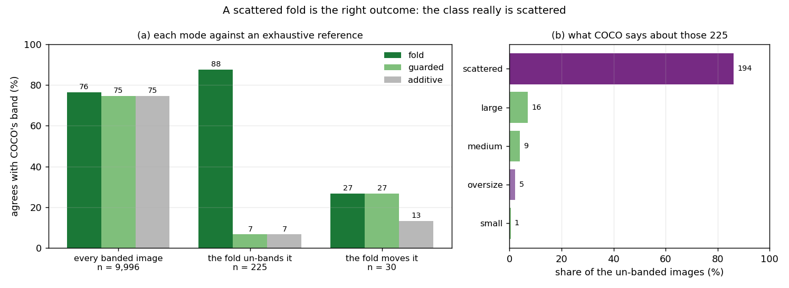
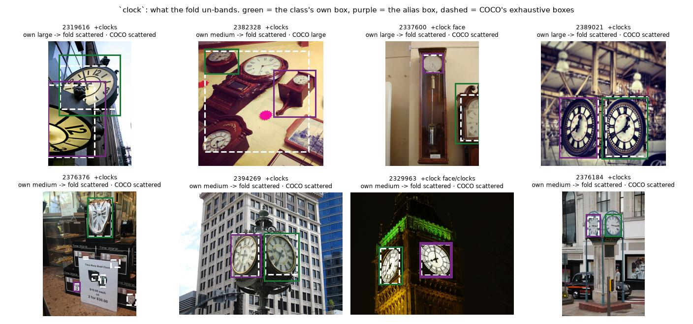
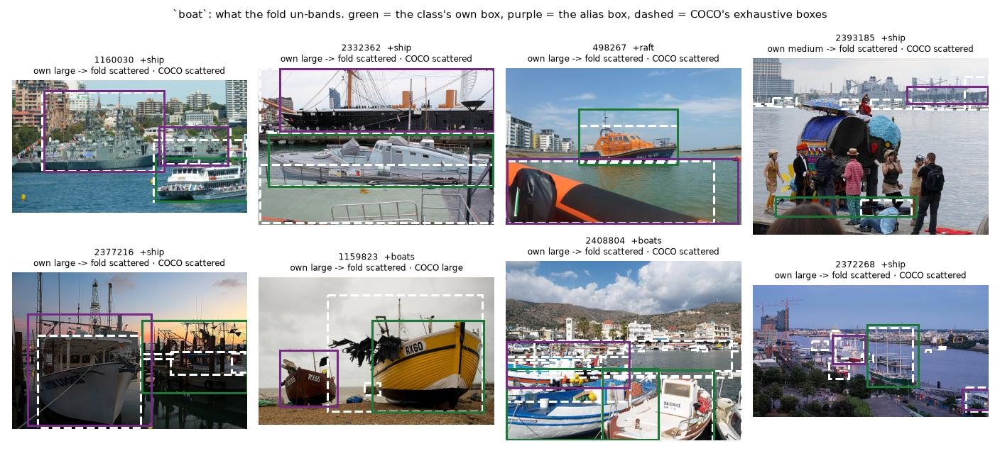
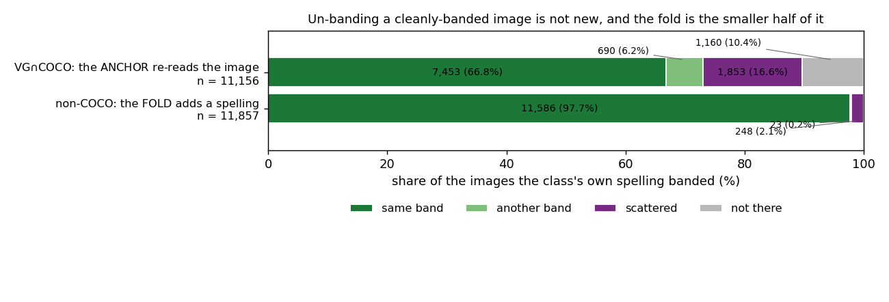
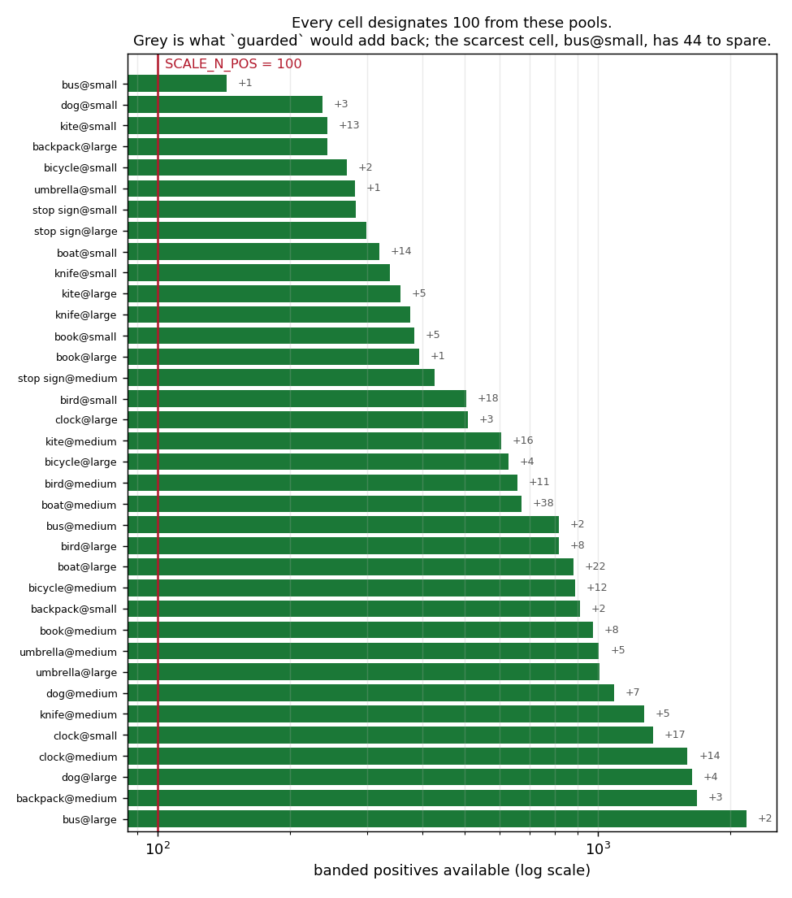
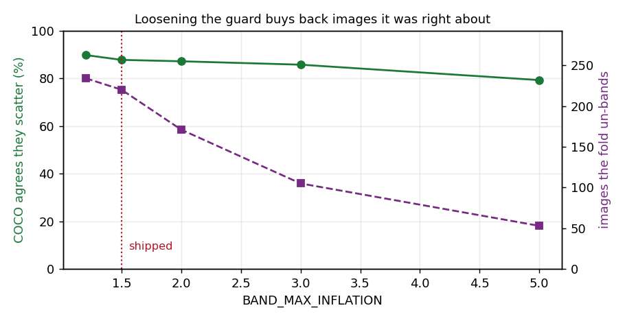

# Is a scattered fold the right outcome? (#3637)

**2026-09-05.** `pilebuild.loaders.vg_scale.canonicalise` merges an alias
spelling's boxes into the class's, and `band_for` reads the band off the union of
all of them. `vg_scale`'s scatter guard rejects a union more than
`BAND_MAX_INFLATION` (1.5) times the largest single box — so folding a second
spelling can take an image the class **already banded** out of every band. #3618
counted them without deciding them: **248** across the twelve classes, and
`clock` nets **−16** (+18 banded, −34 lost).

#3637 put two readings against each other. *Keep it scattered* — the guard is
doing its job on information the builder previously did not have. Or *keep the
class's own band* — the class name's box is the evidence the cell was designated
on, and an alias box merely elsewhere in the frame should only ever **add**.
This is the measurement that decides between them, plus the reporting the issue
asks for either way.

`SCALE_CLASSES` is untouched and **nothing is rebuilt**. What changes is what a
rebuild would contain, and what the build says while it does it.

---

## The answer in one line

**Keep it scattered.** On the half of VG where an exhaustive reference exists,
the fold's verdict is right **88%** of the time and the alternative's is right
**6.7%**, and the images it removes are ones the class really is scattered
across.
The `clock` ledger is correct and it costs nothing: the scarcest of the 36 cells
still has 44 more candidates than the 100 seats it fills.

---

## How a question with no ground truth got one

VG is annotated in free text and is not exhaustive, so on the non-COCO half —
where the 248 live — there is nothing to check a band against. **48% of VG's
images are COCO images, and COCO annotates *C* exhaustively**, so on that half
`band_for` over COCO's own boxes is the band the builder would choose knowing
everything. That is the reference.

It is available precisely because the fold is *irrelevant* there:
`anchor_to_coco` replaces VG's labels with COCO's wholesale, so a fold on an
anchored image is discarded in the next pass. The overlap can therefore be asked
what the fold *would* have decided and what is *actually* true, on the same
image, with no effect on anything built.

Three arms, one definition — `FOLD_MODES` in `vg_scale.py`, selected by
`pile_config.SCALE_FOLD_MODE`:

| mode | what it does when the class already has a box of its own |
|---|---|
| **`fold`** | merge unconditionally; the scatter guard judges the union (the shipped reading) |
| **`guarded`** | merge, but keep the class's own boxes when the merge would push a cleanly-banded image out of every band |
| **`additive`** | merge only where the class has no box at all, so a fold can add an image but never re-describe one |

The supply half of the study runs the builder's own `canonicalise` under each
mode, so it cannot drift from what a rebuild would do. The truth half re-derives
the same three verdicts from `band_for` over the same two box sets, because
"what band would this image have had" is a question about boxes and there is no
`labels` dict to mutate — one function, `mode_bands`, and it is three lines.

Scored over **51,411** overlap images (87 skipped on aspect drift), restricted to
the **9,996** image-class pairs where the class's own spelling bands the image
*and* COCO confirms the class is there. Where COCO says the class is absent the
VG box is a false positive and its band is not a question about banding; that is
#3618's subject, not this one.

The modes differ on exactly **255** of the 9,996 — **225** where the fold leaves
every band (the 248-shaped population) and **30** where it moves the image to
another band (#3616's hazard). Everywhere else all three agree by construction.

---

## 1. The fold is right, and it is not close



*Panel (a): each mode's band against COCO's, over all 9,996 pairs and over the
two subsets where the modes actually disagree. Panel (b): on the 225 the fold
un-bands, what COCO's exhaustive boxes say. The panels are counts of exact band
agreement — a mode is "right" only when it names the band COCO's own boxes name,
and `scattered`/`oversize` count as a band-less answer that the fold can also get
right. This is the COCO half; it licenses nothing about **which** images
off-COCO are scattered, only about the rule.*

| mode | all 9,996 | the 225 it un-bands | the 30 it moves |
|---|---|---|---|
| **`fold`** | **7,639 (76%)** | **197 (88%)** | 8 (27%) |
| `guarded` | 7,457 (75%) | 15 (6.7%) | 8 (27%) |
| `additive` | 7,453 (75%) | 15 (6.7%) | 4 (13%) |

Paired on the same images: `fold` and `guarded` disagree on 212 pairs and `fold`
is right on **197** of them, `guarded` on 15. On the disputed subset that is
**+81 ± 3.6** percentage points; over the whole 9,996 it is **+1.8 ± 0.14** pp
(McNemar χ² = 156, and the sign never reverses on any subset measured here).

The reason is panel (b). Of the 225 images the fold takes out of every band,
COCO's exhaustive boxes say the class is **genuinely scattered on 194** of them,
and too large to be a region on 5 more — **199 of 225, 88%, are not a
single-band positive under anyone's rule.** Only **15** of the 225 have COCO
agreeing with the class's own band, which is the entire case for `guarded`, and
11 more land in a band that is neither.

**So the second reading's premise is the part that fails.** "The class name's box
is the evidence the cell was designated on" is true; "and the alias box is merely
elsewhere in the frame" is not. The alias box is usually a *second instance of
the same class*, which is exactly what the scatter guard exists to refuse.

`clock` is the class the issue names, and it is the cleanest case in the table:
of its 29 un-banded images on the overlap, COCO calls **28 scattered** and one a
`large`. The −16 is the guard being right sixteen more times than the fold's
repairs were worth to that class, not a defect.

### The images themselves



*The eight widest of `clock`'s un-banded images, largest union first. Green is
the class's own box, purple is the box the alias spelling adds, dashed white is
COCO's exhaustive annotation. Every caption reads `own <band> → fold <verdict> ·
COCO <verdict>`. Sorted by union area, so these are the clearest cases, not a
random sample — the marginal ones sit near the 1.5 threshold by construction.*

The sheet is more specific than the issue's phrasing, and the specificity is the
point. `clock`'s recurring shape is not "a clock and an unrelated second clock
somewhere else": it is a **twin-faced street clock** (2394269, 2376184, 2329963),
where VG names one face `clock` and the other `clocks`, and the union spans the
whole fixture with the two dials at its ends. That is the case most likely to
feel like one object — and **COCO annotates each face as a separate `clock`, so
its own boxes trip the same guard.** The dataset's rule and its reference agree
that a fixture is not an instance. 2337600 is the other recurring shape and it is
unambiguous: a grandfather clock whose `clock face` box is the dial, beside a
second clock entirely.



*`boat` is the largest contributor — 63 of the 225, 55 of them scattered under
COCO — and its shape is the plain one: a harbour or a quayside with a `boat` and
a `ship` at opposite edges (1160030, a warship and a ferry; 2332362; 2372268),
which no drag-box describes. 1159823 is one of the 26 the fold gets wrong: two
beached boats that COCO does band, `large`.*

### The 30 moves are still #3616's problem, and neither reading fixes them

On the images where the fold moves an image from one band to another, **every
mode is mostly wrong** — `fold` and `guarded` are right 8 of 30, `additive` 4 of
30 — because COCO says 17 of those 30 are *scattered* too, and a mode that has to
name a band cannot answer "none". They are 0.2% of the non-COCO ledger and 0.3%
of the overlap population, which is why this is a note and not a finding. The
sign still favours the fold.

---

## 2. Un-banding a reviewed image is not new: the build has always done it, eight times as often



*Both bars are "images the class's own VG spelling puts in a band", and both show
what a second, better-informed source then says. The top bar is what
`anchor_to_coco` already does on the COCO half; the bottom is what the fold does
on the other half (#3618's ledger, read from that study's `name-coverage.json`).
The bars are not paired — they are different images and different evidence — so
read the **rates**, not a difference.*

On the 11,156 overlap images the class's own spelling bands, replacing VG's
labels with COCO's:

| | images | share |
|---|---|---|
| keeps the band | 7,453 | 67% |
| moves it to another band | 690 | 6.2% |
| **un-bands it** (scattered or oversize) | **1,853** | **17%** |
| finds the class isn't there at all | 1,160 | 10% |

The fold un-bands **2.1%** of the non-COCO half. `anchor_to_coco` un-bands
**17%** of the COCO half, on evidence of exactly the same kind — a second source
naming instances the class's own spelling missed — and it has done so in silence
since #3156. Adopting `guarded` would make the two halves of one dataset disagree
about what a positive is: the anchored half would keep taking the exhaustive
answer while the un-anchored half was protected from it. **That, and not the
ledger, is the structural argument.**

---

## 3. The ledger is real and it never binds



*Positive supply per cell under `fold`, log scale, with what `guarded` would add
back beside each bar. The red line is `SCALE_N_POS`: every cell designates 100
images from its pool. A cell's bar is its **candidate** count, not its content —
the study never rebuilt anything.*

Running the real build passes under each mode, to `designate_cells` and no
further:

| mode | cells under `SCALE_N_POS` | boxes folded | images contested | designations dropped vs the shipped roster | of those, reviewed |
|---|---|---|---|---|---|
| `fold` | **0 of 36** | 2,559 | 248 | 42 of 3,600 | **0** |
| `guarded` | 0 of 36 | 2,196 | 248 | 3 | 0 |
| `additive` | 0 of 36 | 1,206 | 248 | 0 | 0 |

Two things follow, and they are what turn a −16 into a non-event:

- **The scarcest cell is `bus@small` at 144 candidates for 100 seats.** `clock`'s
  three cells hold 1,338 / 1,602 / 507. Losing 34 images from a class with 3,447
  candidates changes what any cell contains only through the hash rank, not
  through scarcity.
- **No mode drops a reviewed image**, and here is the denominator that number is
  worthless without: **130 of the 3,600 designations carry a human verdict for
  their own class**, across 18 of the 36 cells (`backpack@medium` 25,
  `bird@large` 19, `bicycle@small` 12). None of them is among the 42 the fold
  retires. **Read this as consistent-with rather than proof:** 130 in 3,600 is
  3.6%, so a blind draw of 42 would be expected to take ~1.5 reviewed seats and
  taking none is unremarkable on its own. What makes it structural is
  `designate_cells`, which ranks reviewed images ahead of unreviewed ones for a
  seat — so a reviewed image can only be lost by becoming **ineligible**, i.e.
  by being one of the 248 the fold un-bands. That is the failure #3616 and #3614
  circled, it remains possible, and this rebuild has **zero instances of it**.

`contested` is **248** under every mode and matches #3618's count name for name
(`clock` 34, `boat` 74, `bird` 38, `kite` 34, `bicycle` 19, `book` 14, `dog` 14,
`umbrella` 6, `backpack`/`bus`/`knife` 5). Two scripts sharing no code arrived at
the same number, which is the self-check that licenses the rest of the table.

---

## 4. The guard's own threshold is in the right place



*The scatter guard's cut swept from 1.2 to 5.0. Purple (right axis) is how many
images the fold un-bands at that cut; green (left axis) is how often COCO agrees
they are scattered. Both are measured on the COCO overlap; the left axis is a
precision, not a recall, so this figure says nothing about scatters the guard
misses.*

| `BAND_MAX_INFLATION` | images un-banded | COCO agrees they scatter |
|---|---|---|
| 1.2 | 234 | 90% |
| **1.5 (shipped)** | **220** | **88%** |
| 2.0 | 171 | 87% |
| 3.0 | 105 | 86% |
| 5.0 | 53 | 79% |

Loosening the guard does not trade a few wrong exclusions for many right ones —
it gives back images the guard was **right** about, and its precision *falls*
while it does so. There is no cut in this range that is better than 1.5 by this
measure, so the shipped value stands and #3637 has no threshold change in it.

(220, not 225: five of the un-banded images leave via the `OVERSIZE` cut rather
than the scatter guard — a folded union larger than `MAX_VOTED_AREA` is the
image, not a region.)

---

## What changed in the build

Nothing about the fold's *behaviour*: `fold` was already the shipped reading and
it stays the default. What changed is that the price is now printed and the modes
exist to be re-measured.

- **`canonicalise` returns `(folded, contested)`** and takes `box_dims` and a
  `mode`. `contested` is the per-class count of images the fold un-bands, and it
  goes on the same log line as the boxes folded — the number whose absence is the
  whole of #3637. Under `guarded`/`additive` the same number reads as what the
  mode rescues, and the log line says which verb applies.
- **The fold now runs *after* `anchor_to_coco`**, in `vg_scale` and in
  `vg_scale_deep` alike. This is a no-op on what gets built — verified, not
  asserted: `band_fold.py` carries `dev`'s pass order as a fourth supply arm and
  it designates **identical ids in all 36 cells**. It is what makes `contested`
  exact, and it fixed a second thing nobody had noticed: the old order reported
  **5,142** boxes folded where the build actually keeps **2,559**. *Half of every
  fold the log has ever reported landed on an image COCO overwrote in the next
  pass.*
- **`guarded` without `box_dims` raises** rather than silently behaving as
  `fold`. A mode whose entire decision is a measurement it cannot take is not a
  mode.
- `pile_config.SCALE_FOLD_MODE` selects the arm, defaulting to `fold`, and
  `tests_lib/meta/test_pile_vg_scale.py` pins each mode's behaviour on the
  scatter case plus the invariant that matters most: **every mode still adds an
  image the class cannot see**, since the repair is the point of the table.

---

## Limits, stated

- **The verdict transfers from the COCO half to the non-COCO half by
  assumption.** It is the same assumption `anchor_to_coco` and #3618 make, and it
  is not tested here. What makes it easier to accept than usual is that the
  quantity being carried over is a *geometric rule* — "a union 1.5× its largest
  member is a scatter" — rather than a rate that could plausibly differ between
  the two populations.
- **COCO is the adjudicator, so COCO's definitions are inherited**, including
  that a magazine is a `book` and (mostly) that a wristwatch is not a `clock`.
- **`fold`'s 76% overall agreement is not a quality score for the dataset.** The
  remaining 24% is dominated by the 17% of images COCO un-bands and the 10% it
  finds empty — both of which the build already repairs on that half by
  anchoring. It is the *paired difference between arms* that this study rests on,
  not the level.
- **The 30 moved images are unresolved by any arm here**, and #3616 is where that
  belongs.

## Follow-ups

| issue | what it is |
|---|---|
| **#3659** | The bigger half of the same defect: `anchor_to_coco` un-bands **17%** of the images VG's own spelling banded and reports none of it, while `canonicalise` now reports its 2.1%. Numbers already measured here; what is owed is a counter and a log line. |
| **#3616** | Already open, and the 30 moved images belong to it rather than here. Its measurement is [commented on the issue](https://github.com/samggreenberg/VTSearch/issues/3616): every rule is mostly wrong there because COCO says 17 of the 30 have no honest band at all. |
| **#3604** | Already open. A rebuild is what makes any of this real, and it now carries a `contested` line per class. |

## Reproducing

```bash
# on the GRID, where VG's and COCO's sources are
(cd scripts/experiments/pile && source ./pile_env.sh &&
 python band_fold.py --out /tmp/band-fold.json --examples-out /tmp/unbanded.json &&
 python band_fold.py --examples /tmp/unbanded.json --sheet clock --sheet-out /tmp/clock-unbanded.jpg)

# anywhere, from the JSONs committed beside this report
python docs/experiments/2026-09-05-band-fold-3637/figures.py
```

Both phases are one ~2-minute CPU job (`--mem=96G --partition=cpu`) over VG's
350 MB `objects.json` and COCO's 470 MB `instances_train2017.json`; no GPU, and
nothing is written to the pile.

## Provenance

| | |
|---|---|
| measurement | [`scripts/experiments/pile/band_fold.py`](../../../scripts/experiments/pile/band_fold.py) |
| figures | [`figures.py`](figures.py), from [`measurements/band-fold.json`](measurements/band-fold.json) and #3618's `name-coverage.json` |
| numbers | `measurements/band-fold.json`, `measurements/unbanded.json` (all 225 rows, with their boxes and all three verdicts) |
| worktree | `/exp/sgreenberg/projects/vts-fold-3637`, artifacts `/expscratch/sgreenberg/fold-3637/` |
| follows from | [#3618](../2026-09-04-vg-name-coverage/REPORT.md), "The fold has a bill" |
