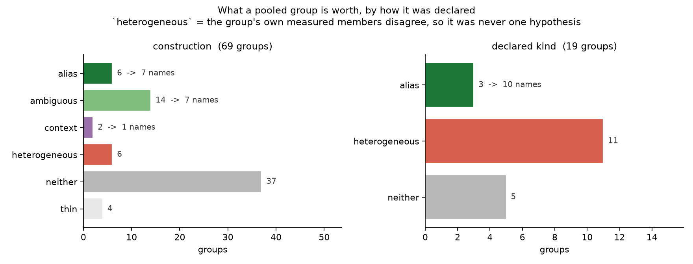
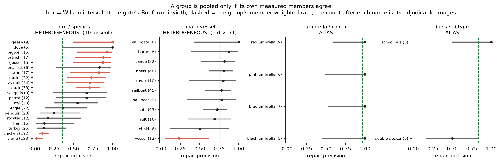
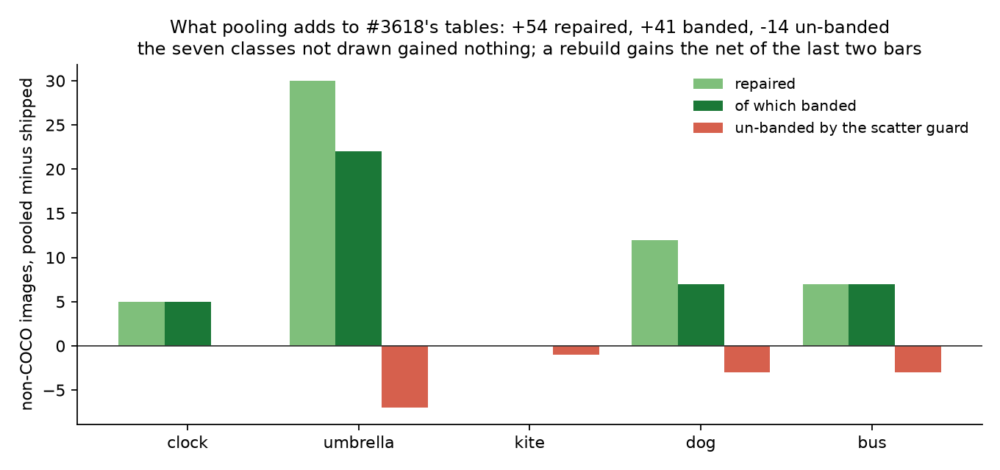

# Pooling VG names by construction, and what it is actually worth (#3636)

**2026-09-05.** #3618 adjudicated each of 626 candidate VG names on its own,
against a floor of five images where the name is its class's only evidence.
**76 fell below the floor** and were recorded `unmeasured` — neither acted on
nor refuted — carrying **312** non-COCO images between them. #3636 proposed
pooling them: `blue umbrella`, `red umbrella`, `green umbrella`, `orange
umbrella` and `yellow umbrella` are one hypothesis five times over, and one
hypothesis is testable at the sample size of the whole family.

It works, and it is worth **a third of what the issue estimated**. The tables
gain **54 repaired images** and **27 net banded positives**, against the
issue's "roughly 160 more images of real repair". The gap is the finding: the
issue's 160 came from pooling *all 76 names at once*, and most of those names
do not belong in one pool. This study says which do, and why.

`SCALE_CLASSES` is untouched and **nothing is rebuilt**. What changes is what a
rebuild would contain.

---

## Five results, in the order they change the plan

### 1. A group has to earn the right to be pooled, and most groups do not

Pooling is one careless step from the mechanical head-noun fold #3618 refuted,
where `hot dog` (405 VG images, **0 of 181** really a dog) rides into
`SCALE_VG_NAMES` behind `puppy`. Three things separate them here, and the third
is the one that does the work:

- the group is **counted over images**, so an image carrying `red umbrella` and
  `blue umbrella` is one adjudicable image, not two;
- **an individual measurement always wins** — only a name below the five-image
  floor inherits, so `bike` stays ambiguous and `crane` stays refuted whatever
  their groups say;
- a group is pooled at all only if **its own measured members agree**. Over the
  members that clear the floor, no member's Wilson interval may exclude the
  group's member-weighted rate, at a Bonferroni-adjusted level so a ten-member
  group is not condemned by multiplicity. A group that fails is scored
  `heterogeneous` and yields nothing.

That gate is what a group fitted to its own answer cannot pass, which is why
every candidate meeting a group's criterion is listed in the config — winners
and losers alike. `crane` (the machine) is in `bird`/`species` and `jet ski` is
in `boat`/`vessel` because a group whose losers were quietly left out is not a
measurement.

**88 groups, and how they were declared decides their fate.** A *construction*
is a declared vocabulary applied to every class — a colour word, a size word, a
determiner, a numeral, a respelling, a plural. A *declared kind* is a
class-specific judgment written down with its criterion: "a VG name denoting a
kind of watercraft". Constructions fail homogeneity **6 times in 69 (9%)**;
declared kinds fail **11 times in 19 (58%)**.

### 2. The two families the issue named are exactly the ones that fail

#3636 named eleven spellings as the value on the table. Five of them now have a
verdict and six still do not:

| name | settled by | | name | why not |
|---|---|---|---|---|
| `beach umbrella` | `umbrella`/`subtype` → alias | | `yacht` `ferry` `cruise ship` `rowboat` | `boat`/`vessel` is heterogeneous |
| `green umbrella` | `umbrella`/`colour` → alias | | `grandfather clock` | `clock`/`subtype` is heterogeneous |
| `white dog` | `dog`/`colour` → alias | | `black kite` | `kite`/`colour` is thin: 4 adjudicable images |
| `pigeons` | `plural:pigeon` → ambiguous | | | |
| `dove` | already settled by #3618 | | | |

The split is not arbitrary. Everything settled is a **construction or a family
that survived its gate**; everything left is a **hyponym** — the whole name is
different, so no vocabulary groups it — and reaching those needs a hand-declared
kind, which is what this study added and what mostly did not survive.

`bird`/`species` pools 24 names to 33% and **10 of its 20 measured members
dissent**. The spread is not noise, it is two populations: `geese` 1.00, `dove`
1.00, `pigeon` 0.93, `goose` 0.88, `swan` 0.82, `duck` 0.71 against `chicken`
0.05 over 192 images and `crane` 0.02 over 123. The low cluster is the food and
machine senses of a bird word. "A VG bird-species name denotes a bird" is
simply false in VG, and the gate says so rather than averaging over it.

`umbrella`/`colour` and `bus`/`subtype` are what a group looks like when it *is*
one hypothesis: every interval covers the pooled rate, and the four spellings
nobody could measure alone inherit.

### 3. One polysemous word can cost a whole family, and the gate localises it

`boat`/`vessel` is refuted by **exactly one member**:

| member | sole | rate | | member | sole | rate |
|---|---|---|---|---|---|---|
| `boats` | 48 | 0.81 | | `sailboat` | 45 | 0.78 |
| `ship` | 65 | 0.72 | | `canoe` | 22 | 0.82 |
| `raft` | 16 | 0.69 | | `kayak` | 10 | 0.80 |
| `yacht` | 4 | 1.00 | | `ferry` | 3 | 1.00 |
| **`vessel`** | **13** | **0.23** | | `cruise ship` | 4 | 1.00 |

Sixteen names between 0.69 and 1.00, and `vessel` at 0.23 — a container or a
blood vessel, not a boat. Drop it and the survivors pool to **78%** (Wilson
lower bound 0.73) over 250 adjudicable images, which folds comfortably.

**That is a diagnostic, not a verdict, and it is deliberately not acted on
here.** The criteria were written down before the run precisely so the result
would mean something; re-declaring a group after seeing which member sank it is
how a study fits its own answer. Across the 17 heterogeneous groups, **94
non-COCO images** sit behind surviving unmeasured members. The five carrying the
most, with the members whose disagreement sank each group:

| group | dissenters | survivors pool to | unmeasured behind it | images |
|---|---|---|---|---|
| `boat`/`vessel` | `vessel` | 78% (lower 0.73) | `yacht` `ferry` `cruise ship` `rowboat` `motorboat` `row boat` | 16 |
| `book`/`part` | `page` | 4% | `pages` `book cover` | 11 |
| `stop sign`/`colour` | `red sign` | 5% | `brown sign` | 9 |
| `clock`/`subtype` | `digital clock` | 59% (lower 0.43) | `grandfather clock` | 7 |
| `knife`/`subtype` | `butter knife` `cutter` | 90% (lower 0.60) | `cake server` | 8 |

Four of the five failed on **exactly one** member, and those four carry 43 of
the 94. But only `boat`/`vessel` and `clock`/`subtype` pool high enough to
change anything — about **23 images** — because the other three stay refuted
with or without their dissenter. Filed as **#3662**.

### 4. A plural belongs with its own singular, not with its family

The most productive construction is the least interesting-sounding one. Grouped
**per singular form** rather than per class — `pigeon`/`pigeons` is a
hypothesis, `pigeons`/`ducks` is not — it settles four names no other route
reaches:

| group | sole | rate | verdict | grants |
|---|---|---|---|---|
| `plural:pigeon` | 18 | 94% | ambiguous | `pigeons` |
| `plural:bus` | 10 | 80% | ambiguous | `busses` |
| `plural:clock face` | 19 | 89% | ambiguous | `clock faces` |
| `plural:numeral` | 10 | 70% | context | `numerals` |

It is **never foldable**, and that is the shipped rule rather than caution:
`books`, `birds`, `umbrellas`, `knives`, `ducks`, `geese` and `seagulls` are all
in `SCALE_VG_AMBIGUOUS` because the box is a pile and a band is a claim about
one object's size. The plurals #3618 *did* fold — `boats`, `clocks`, `dogs`,
`kites` — each earned it on their own measured box agreement, which they keep.
`buses` keeps its alias; `busses`, which has no measurement of its own,
inherits withheld.

This matters beyond the four names. Without it `pigeons` would have inherited
`alias` from `bird`/`species` and contradicted the shipped treatment of
`ducks`, `geese` and `seagulls` — three of its own siblings.

### 5. The `sign` family is dead pooled too, which was the last thing it could have been

#3636 set aside `stop sign`'s 90 images as its known-dead residue and hoped for
the other 222. The pooled tests confirm the setting-aside and extend it: the
ten `<what it says> sign` compounds (`arrow sign`, `dollar sign`, `handicapped
sign`, `one way sign`, …) pool to **7%** over 327 adjudicable images, and the
eight `<colour> sign` compounds to **9%** over 281. Both are far under the 1/3
cut — 14 images withheld per contaminated negative retired. `stop sign` gains
nothing here either, and #3635's verdict stands: it needs a human pass, not a
name.

---

## The ledger

**25 names inherited a verdict** — 17 `alias`, 7 `ambiguous`, 1 `context` —
carrying 91 non-COCO images. Scored against the same 56,579 non-COCO images
#3618 used:

| | #3618 | pooled | change |
|---|---|---|---|
| repaired negatives | 860 | **914** | **+54** |
| withheld negatives | 2,664 | 2,682 | +18 |
| repaired **and banded** | 716 | **757** | **+41** |
| un-banded by the scatter guard | 248 | 262 | +14 |
| net banded ledger | +468 | **+495** | **+27** |
| overlap box coverage | 34.7% | 34.8% | +0.1pp |

Four classes account for all of it: `umbrella` +30 repaired, `dog` +12, `bus`
+7, `clock` +5. Seven classes gain nothing, and `stop sign` gains nothing by
construction. Overlap box coverage barely moves because the names added are
rare *by definition* — they are the ones too rare to measure alone.

The scatter-guard cost is the #3637 hazard and behaves as that study predicted:
**+14** images un-banded against **+41** gained, a 2.9:1 trade in favour. Four
of the five classes that move are net positive on the delta — `umbrella` +15,
`dog` +4, `bus` +4, `clock` +5 — and **`kite` is net −1**: `para sail` repairs
no non-COCO image at all (its supply is on the COCO half) and un-bands one, so
folding it is a small loss taken for a correct table. In absolute terms `clock`
remains the only class whose fold is net negative overall, and pooling improves
it: **−16** under #3618's tables, **−11** here.

### What the tables gained

| class | `SCALE_VG_NAMES` (folded) | `SCALE_VG_AMBIGUOUS` (withheld) |
|---|---|---|
| `bird` | — | `black bird` `pigeons` `white bird` |
| `book` | — | `black book` `white book` |
| `bus` | `city bus` `double-decker bus` `passenger bus` `tour bus` | `busses` |
| `clock` | `clockface` | `clock faces` `numerals` |
| `dog` | `dalmation` `lab` `white dog` | — |
| `kite` | `para sail` | — |
| `umbrella` | `beach umbrella` `closed umbrella` `green umbrella` `open umbrella` `orange umbrella` `patio umbrella` `white umbrella` `yellow umbrella` | — |

**Every change is an addition.** Pooling never reversed a shipped decision,
which is the "an individual measurement always wins" rule doing its job: a name
#3618 measured keeps its own verdict in both directions, so nothing that folds
today stops folding and nothing withheld today is promoted.

`dalmation` is VG's spelling, kept verbatim because correcting it would break
the lookup.

---

## Limits, stated rather than hidden

- **The gate is a test, so it has power.** With `sole` in the hundreds the
  Wilson intervals are tight enough that a real 3-point spread fires
  heterogeneity — `paper` at 0.091 against `papers` at 0.317 is a true
  disagreement, but `wheel` at 0.065 against `wheels` at 0.032 is a smaller one
  that only a large sample can see. The gate errs toward refusing to pool, and
  that is the direction the ambiguous table already prefers.
- **An inherited `alias` claims every box under that name is the object**, and
  the box-agreement cut was cleared *pooled*. A member's own boxes veto the
  fold only when they are significantly worse than the group's; a member with
  four boxes has too wide an interval to veto anything. The exposure is small
  (17 names, 60 images) and lands in bands, which is what #3616 is about.
- **Precision still transfers from the COCO half to the non-COCO half by
  assumption**, exactly as in #3618 and in `anchor_to_coco`. Untested here.
- **COCO remains the adjudicator**, so its definitions are inherited — a
  wristwatch is mostly not a `clock`, and a magazine is a `book`.
- **7 of the 76 names are unreachable by any declared group**: `stuffed dog`
  (a toy, correctly excluded by "a dog breed or life stage"), `octopus` (an
  octopus-shaped kite), and five single-member constructions (`small boat`,
  `silver knife`, `two dogs`, `two signs`, `bicycle tire`). They carry 24
  images between them.

---

## Follow-ups

| issue | what it is |
|---|---|
| **#3662** | A single polysemous member sinks an otherwise uniform group — `vessel` in `boat`/`vessel` (16 survivors at 0.69–1.00, one at 0.23), `digital clock` in `clock`/`subtype`. Worth ~23 images, and needs a criterion pre-registered before the re-run. |
| **#3663** | The `typing` construction (`an X`, `X.`, `X's`) was declared and never tested: #3618's curated candidate list holds only one such name per class, so every typing group fell below the two-member floor. The spellings exist in VG — `umbrella.`, `umbrella's`, `umberella`, `unbrella` — and were dropped when the family list was curated. |
| **#3604** | Already open. A rebuild is what makes any of this real, and this is now part of its price. |

---

## Provenance

Run on the HLTCOE GRID, 2026-09-05, against the same VG∩COCO overlap as #3618 —
**51,411** image pairs, 87 skipped on aspect drift — and the same **56,579**
non-COCO VG images, from the identical 626-name candidate list
(`measurements/cands.json` is #3618's `cands.json`, copied). Artifacts in
`/expscratch/sgreenberg/pooled-3636/`; the JSONs the figures and the shipped
tables are drawn from are committed in [`measurements/`](measurements/), so
`python figures.py` re-plots with nothing from the cluster. Two CPU cells,
under a minute each.

| script | what it answers |
|---|---|
| [`name_evidence.py`](../../../scripts/experiments/pile/name_evidence.py) | `--pooled`: the group's repair precision and box agreement, the homogeneity gate, and which names inherit |
| [`name_coverage.py`](../../../scripts/experiments/pile/name_coverage.py) | what a proposed table buys and costs: coverage, repaired, withheld, band ledger |
| [`pile_config.py`](../../../scripts/experiments/pile/pile_config.py) | `SCALE_VG_CONSTRUCTIONS` and `SCALE_VG_GROUPS` — the grouping itself, declared beside the tables it fills |
| [`figures.py`](figures.py) | the three figures, from `measurements/` |
