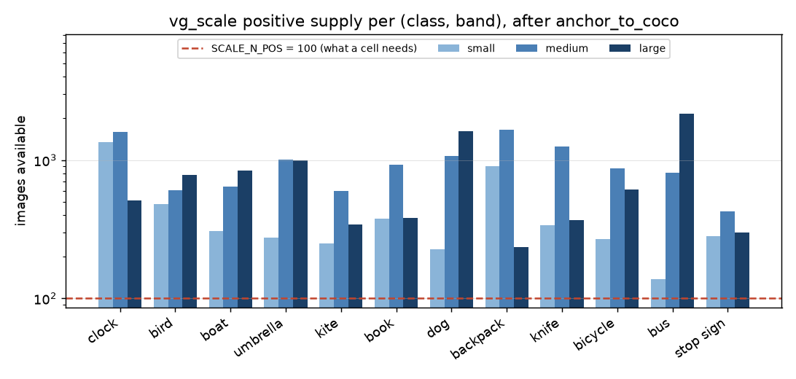
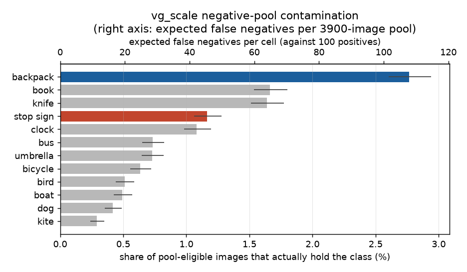
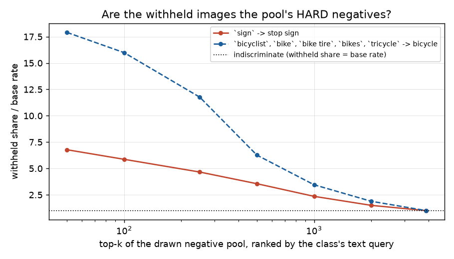

# `stop sign` is not the broken class — the pool measure that would have said so had never been run (#3635)

**2026-09-05.** Branch `claude/stop-sign-3635`, worktree
`/exp/sgreenberg/projects/vts-stopsign-3635`, artifacts
`/expscratch/sgreenberg/stopsign-3635/`. Nothing rebuilt; `pile_config` untouched.

## The answer, first

#3635 asks which of three things to do about `stop sign`: pay for a human pass
over its 19,148-image `sign` family, restrict the class to the COCO half, or drop
it from `SCALE_CLASSES` before #3604's rebuild. **None of the three.** Two of
them answer a supply problem the class does not have, and the third buys a repair
that would make the class easier to score than it deserves to be.

| the issue says | measured |
|---|---|
| 496 VG images — "the smallest supply of the twelve by a factor of three" | after `anchor_to_coco`, supply is **282 / 426 / 298** per band against `SCALE_N_POS` = **100**. The class clears its own design by 2.8x. |
| "its pool is smaller and differently distributed from the other eleven" (option 2) | the pool is **shared and identical** for all twelve; nothing about `stop sign` makes it different |
| "chosen for supply that measurement now says is half illusory" (option 3) | the illusory half is on the COCO overlap, which is exactly where `anchor_to_coco` replaces VG's reading with COCO's **for free** |
| `sign` is unaffordable at 12.7 images withheld per repair | true, and it prices **pool membership**, which is 18x over-subscribed. The real objection to `sign` is different and stronger — §4 |

What is actually true is narrower and was never measured: on the ~52% of VG that
COCO does not annotate, some stop signs sit in the shared negative pool. **1.17%
of pool-eligible images hold a stop sign.** That is real, it is worth fixing, and
it is **fourth of twelve** — `backpack` is at 2.77%, more than twice as bad, and
nobody has proposed dropping `backpack`.

**Recommendation: keep `stop sign`, do not list `sign`, and extend the
negative-pool review that is already running and has already found 21 of them.**

---

## 1. Supply is not the problem, and `anchor_to_coco` is why

`measure_supply.py` runs the loader's own front half — read, anchor, correct,
band — and reports what each cell can actually draw from:



*Log axis. Every bar of every class clears `SCALE_N_POS` (dashed) — the figure's
job is to show that the floor is not close, not to compare classes, and the log
scale flattens differences that a linear one would exaggerate. It does **not**
license a claim about how deep the pile could go: that needs the band-free union
(table above), because one image can serve only one band.*

| class | small | medium | large | union | | class | small | medium | large | union |
|---|---:|---:|---:|---:|---|---|---:|---:|---:|---:|
| clock | 1347 | 1600 | 508 | 3455 | | dog | 227 | 1072 | 1611 | 2910 |
| bus | 138 | 811 | 2170 | 3119 | | backpack | 905 | 1659 | 234 | 2798 |
| umbrella | 275 | 1001 | 992 | 2268 | | knife | 336 | 1248 | 368 | 1952 |
| bird | 480 | 605 | 782 | 1867 | | boat | 306 | 643 | 844 | 1793 |
| bicycle | 267 | 871 | 614 | 1752 | | book | 377 | 921 | 379 | 1677 |
| kite | 249 | 595 | 342 | 1186 | | **stop sign** | **282** | **426** | **298** | **1006** |

> **Caveat, and it does not touch the verdict.** `measure_supply.py` reads with
> `set(SCALE_CLASSES)` and skips `canonicalise` / `lift_ambiguous`, so this table
> is the *pre-#3638* reading: it understates every class with an alias entry.
> `stop sign` has none, so its row is exact — and every other row can only go up,
> which widens the gap rather than narrowing it. Filed as **#3656**.

A cell needs `SCALE_N_POS` = 100. **`stop sign`'s thinnest band holds 282.** It is
the smallest of the twelve on the band-free union (1,006 against a median of
1,952) and it is nowhere near binding: it first drops out at `N_POS` >= 1,200,
where it leaves alongside `kite`.

The issue's "496 VG images" is VG's **name** count, and that is the wrong
denominator for a class whose labels are COCO's. `anchor_to_coco` replaces VG's
annotation wholesale on the 51,444-image overlap, so on that half the 18.7%
self-match costs nothing at all — the positives come from COCO's 1,016 boxes, not
from whether a VG annotator typed `stop sign`. The self-match rate is a fact
about the **other** half, and on that half it is a statement about negatives.

So options 2 and 3 are answers to a question the data does not ask. Restricting
the class to the COCO half would trade a working 1,006-image supply for a
smaller one, and dropping the class would spend a real class to fix a shortfall
that is not there.

## 2. Pool contamination, measured for the first time

`name_evidence.py` asks a question *conditioned on a name*: given a `sign` box
and no `stop sign` box, is a stop sign there? (7.9%.) That prices one row of the
ambiguous table. It cannot say whether the pool is in trouble, because the pool
is not drawn by name — it is drawn from the images VG names **nothing** on, and a
name-conditioned rate never looks at them.

`pool_contamination.py` (new, in `scripts/experiments/pile/`) asks the
unconditioned question, which is the one the construction rests on:

> of the images that would enter the shared negative pool on VG's evidence
> alone, what share actually hold class *c*?

The method is the overlap as a stand-in for the other half. Every overlap image
is `exhaustive` in the real build, so the ambiguous pass never fires there and
COCO is simply believed. Here the loader's own passes are run with
`exhaustive=set()` — *as if the image were off-COCO* — and COCO is held back as
the answer key. That is the same trade `anchor_to_coco` and `name_evidence.py`
already make: measure on the half with a reference, apply to the half without.



*Bars are Wilson 95% intervals on the overlap sample; the top axis rescales the
same quantity to the 3,900-image pool a cell actually draws. Read the **order**,
not the gaps: the rates are measured on the COCO half and applied to the other,
so they assume the two halves have the same prevalence. `stop sign` (red) is
fourth; `backpack` (blue) is the class this figure indicts.*

| class | contamination | 95% CI | expected false negatives per 3,900-image pool |
|---|---:|---|---:|
| backpack | **2.77%** | [2.60, 2.94] | **112** |
| book | 1.66% | [1.54, 1.80] | 65 |
| knife | 1.64% | [1.51, 1.77] | 62 |
| **stop sign** | **1.17%** | [1.06, 1.28] | **46** |
| clock | 1.08% | [0.98, 1.19] | 43 |
| bus | 0.73% | [0.65, 0.82] | 29 |
| umbrella | 0.73% | [0.65, 0.82] | 28 |
| bicycle | 0.63% | [0.56, 0.72] | 25 |
| bird | 0.51% | [0.44, 0.59] | 20 |
| boat | 0.49% | [0.43, 0.57] | 19 |
| dog | 0.42% | [0.36, 0.49] | 16 |
| kite | 0.29% | [0.24, 0.35] | 11 |

Two readings, and the second is the one that settles #3635:

- **The defect is real and general.** Against 100 positives per cell, a pool
  carrying 46 hidden ones is not a rounding error. `coco_anchor.py` measured the
  same defect over VG's *labelled* images at 1.35% and built the whole
  anchor pass to repair it; this is the same size of problem on the half the
  anchor cannot reach.
- **`stop sign` is not where it is worst.** It is fourth. `backpack` is at more
  than twice the rate and its expected 112 hidden positives exceed the 100
  labelled ones per cell — the condition `coco_anchor.py` singled out as its
  worst case, still true and now measured on the other half. Any rule that
  condemns `stop sign` at 1.17% condemns three other classes first.

## 3. The price was right; the reason given for it was not

#3618 refused `sign` at **12.7 images withheld per contaminated negative
removed**, and it defended that number as pressure on a shared pool. That
defence does not hold. The pool is nowhere near scarce:

```
clean (pool-eligible) images        77,119
images the pool actually draws       4,200   (SCALE_N_NEG 3,900 + 300 spares)
                                    ------
surplus                              18.4x
```

Listing `sign` withholds 9,525 of the 77,119 — 12.3% — and leaves **67,594**
against a draw of 4,200, still 16x more than the pool needs. Priced as
membership, `sign` was always affordable, and so is almost anything else.

What *is* scarce is not membership but **stability**: `draw_negatives` prefers
the roster, because re-drawing orphans human review that cannot be regenerated
(three rebuilds retired 577 of 743 reviewed images before anyone noticed —
`scripts/experiments/lessons/`). That is the constraint #3604 runs into, and it
is not the one `1 / precision` measures.

The cut is still right. §4 is why.

## 4. What the withheld images are — and the control that decides it

Adding `sign` works, in the narrow sense:


*Left: contamination is a rate over pool-eligible images, so the three bars are
comparable. Right: the dotted line is the 4,200 images the pool actually draws —
the panel's point is the distance to it, not the height of the bars. Neither
panel says anything about **which** images leave; that is §4, and it is what
decides the question.*

| proposal | stop sign contamination | withheld, global rule | withheld, per-class rule |
|---|---|---:|---:|
| shipped (no `sign`) | 1.17% | — | — |
| `+ sign` | **0.22%** | 9,525 (all 12 classes pay) | 10,137 (only `stop sign` pays) |
| `+ all 155 * sign` names | 0.17% | 10,436 | 11,096 |

`sign` alone carries the whole effect — 81% of the contamination removed — and
the other 154 names add 0.05 points, which agrees with #3618's finding that the
rest of the family pools to 0 of 37.

The obvious objection is that `sign`'s 7.9% precision means twelve of every
thirteen withheld images are true negatives, each containing an object of the
class's immediate *superordinate* category — the very images a stop-sign
detector exists to be discriminated from. `withheld_difficulty.py` (new) tests
that: rank the drawn negative pool by the class's own text query — the tower
`make_audit_slate.py` uses for its `boundary` stratum — and see where the
withheld images sit. **`bicycle`/`bike` runs as a positive control**, being the
entry at the other end of the precision range (47%) that everyone agrees is
right.



*Each series is normalised by its own base rate (12.1% for `sign`, 1.6% for the
`bike` family), so the two are comparable in shape but **not** in how much they
withhold — that is the whole confound the ratio in the table removes. A higher
curve means the name takes more of the pool's hardest negatives. Read this
figure as refuting an argument, not making one: `bike`, the entry everyone
agrees is correct, sits above `sign` everywhere, so concentration alone cannot
condemn a name.*

| top-k of the pool | `sign` -> stop sign | `bike` family -> bicycle |
|---|---|---|
| base rate in the 3,900 pool | 12.1% | 1.6% |
| top-50 withheld share | 82.0% (**6.8x**) | 28.0% (**17.9x**) |
| top-250 | 56.4% (4.7x) | 18.4% (11.8x) |
| median percentile rank, withheld | 16% | **3%** |
| median percentile rank, retained | 53% | 51% |

**The control refutes the objection as stated.** Both names withhold the hard
end, and `bike` does it *more* sharply — 17.9x lift against `sign`'s 6.8x, and a
median rank of 3% against 16%. "It removes hard negatives" cannot be what
condemns a name, because the best entry in the shipped table removes them
hardest.

What separates them is **how many good hard negatives are destroyed per
contaminant retired** — which is `(1 - p) / p`, the price minus one. Measured in
one unit, the drawn 3,900-image pool, with `bike`'s counterfactual taken by
removing it from the shipped table (`pool_contamination.py --drop bicycle:bike`)
rather than derived from its precision:

| entry | class | withheld of 3,900 | contamination | contaminants retired | good hard negatives destroyed | ratio |
|---|---|---:|---|---:|---:|---:|
| `bike` + 4 | bicycle | 61 (1.6%) | 1.41% -> 0.63% | 30 | 31 | **1.0 : 1** |
| `sign` | stop sign | 472 (12.1%) | 1.17% -> 0.22% | 37 | 435 | **11.8 : 1** |

The two routes to that ratio agree: measured, 31/30 and 435/37; predicted from
precision alone, `1/0.47 - 1 = 1.1` and `1/0.079 - 1 = 11.7`.

> `pool_contamination.py`'s own `price` column reads higher (5.3 for `bike`,
> 27.7 for `sign`) because it divides *whole-VG* images withheld by removals
> measured on the overlap alone. The table above holds both terms in one
> population — the drawn 3,900-image pool — which is why it lands on
> `1 / precision - 1`. The ordering is the same either way; only the units
> differ, and the pool units are the ones a cell actually experiences.

So `sign` removes **12.1% of the drawn pool, and 82% of its fifty hardest
negatives, to retire 37 contaminants** — leaving 9 behind. `bike` removes 1.6%
to retire 30. That is the objection, it is the one #3618's 1/3 cut already
encodes, and — this is the part that matters for #3635 — **it survives the
per-class rule of §5 untouched**, because it was never about who pays.

**The generalisation.** The ambiguous table's cost is not how many images it
withholds, nor whether they are hard — they always are, that is why the name is
ambiguous. It is the ratio of good hard negatives destroyed to contaminants
retired, and `1 / precision` measures exactly that. `name_evidence.py`'s
docstring should say so: read as a count against pool membership the price looks
ignorable, and it is not.

Worth noting in passing: **`bicycle` without `bike` would sit at 1.41%**, second
worst of the twelve. The ambiguous table is doing real work, and `stop sign` at
1.17% is roughly where `bicycle` would be if its name had never been found.

## 5. The exclusion is global because of one line, and it need not be

The reason `sign` was charged to eleven innocent classes is a single test in
`band_candidates`:

```python
if not by_name:
    # Only a true negative for every class in C may join the shared pool.
    if not any((iid, c) in unbanded for c in classes):
        clean.append(iid)
```

One ambiguous name and the image leaves the pool for **everybody**. But
`vg_scale` already carries per-cell scorability: each media's
`evaluable_categories` names the cells that may score it, and
`vtscore.eval.labels.evaluable_pool` filters the pool per cell. Negatives simply
get `list(cells)` unconditionally in `_emit_medias`:

```python
"evaluable_categories": cats if cats else (list(cells) if iid in neg_set else []),
```

Under a per-class rule the image stays a negative everywhere except the class its
ambiguous name belongs to. Measured on the shipped tables, with no new names at
all, that is worth **2,200–3,941 pool-eligible images per class** (79,319 for
`bicycle` up to 81,060, against one shared 77,119) — the eleven classes stop
paying for each other's spellings.

It costs the construction's "identical negatives" property *across* classes. It
leaves the paired small-vs-large contrast *within* a class untouched, since all
three bands of a class share one exclusion set — and that within-class contrast
is what #3156 measures. This is worth doing on its own merits and it is **not**
the fix for `stop sign`: §4 stands whichever rule is in force.
Filed as **#3655**.

## 6. What to do instead

The contamination is real, it is general, and the machinery to fix it already
exists and is already running. `corrections.json` holds **261 human verdicts**,
and `stop sign` is not neglected in them:

| class | verdicts | present |
|---|---:|---:|
| bicycle | 55 | 55 |
| backpack | 45 | 44 |
| bird | 42 | 42 |
| **stop sign** | **24** | **21** |
| book | 20 | 20 |
| ...eight more | 75 | 72 |

`make_audit_slate.py` builds these — a `boundary` stratum ranked by the text
tower, a `random` stratum that bounds the residual rate, and a `positive`
stratum. **Because the pool is shared, one pass over it repairs all twelve
classes at once**, which a `sign`-family pass could never do: 19,148 images
reviewed to fix one class, against 3,900 reviewed to fix twelve.

So the recommendation is the boring one, and the numbers are why it is right:

1. **Keep `stop sign` in `SCALE_CLASSES`.** Supply clears the design 2.8x and
   its pool is the fourth-cleanest problem of twelve, not the first.
2. **Do not list `sign` or its family**, on §4's grounds rather than §3's.
3. **Extend the negative-pool review** at the next rebuild, targeting the classes
   the measurement actually indicts — `backpack` (112 expected), `book` (65),
   `knife` (62) — with `stop sign` (46) among them.
4. **Make the ambiguous exclusion per-class** (#3655) as a separate, cheap
   improvement that removes the reason a broad name looks unaffordable.

Nothing here blocks #3604: `stop sign` changes nothing about that rebuild, which
was the one thing #3635 wanted settled before it.

### The ruling, 2026-09-05

Sam took the recommendation as written: **keep `stop sign`, do not list `sign`,
and fix the contamination through the shared negative-pool review**. `pile_config`
is unchanged by this study.

The review pass is scheduled **after** #3588's remaining four class slates
(`chair`, `car`, `truck`, `fire hydrant`) and **before** #3604's rebuild — class
definition stays coherent, and a pool review is worth most immediately before the
rebuild it is protecting. Filed as **#3660**, with the priority order the table in
§2 gives: `backpack`, `book`, `knife`, `stop sign` carry 285 of the ~470 expected
contaminants between them.

## Follow-ups filed

| issue | what it is |
|---|---|
| **#3655** | `vg_scale`'s ambiguous exclusion is global when `evaluable_categories` could make it per-class — 2,200-3,941 pool images per class. §5. |
| **#3656** | `measure_supply.py` skips `canonicalise` and `lift_ambiguous`, so it reports the pre-#3638 supply. §1. |
| **#3657** | `MAX_ASPECT_DRIFT` is applied as a *relative* drift in the loader and an *absolute* one in three analysis scripts, against the same constant. |
| **#3660** | Extend the shared negative-pool review before #3604's rebuild — the ruling's actual work item. §2, §6. |

Not filed, because it is one sentence in a docstring rather than a task:
`name_evidence.py` should say that `1 / precision` counts **good hard negatives
destroyed per contaminant retired**, not images withheld from a pool — §4. It is
folded into this PR.

## Reproducing

All three are ~2-6 minute CPU jobs on 350 MB `objects.json` plus 470 MB
`instances_train2017.json`; `--mem=64G --partition=cpu` is plenty.

```bash
source scripts/experiments/pile/pile_env.sh
cd scripts/experiments/pile

python measure_supply.py --out supply.json

python pool_contamination.py --propose prop-sign.json   --out contam-sign.json
python pool_contamination.py --propose prop-family.json --out contam-family.json

python withheld_difficulty.py --class "stop sign" --names sign --out hard-stopsign.json
python withheld_difficulty.py --class bicycle \
    --names bike,bikes,bicyclist,"bike tire",tricycle --out hard-bicycle.json

python docs/experiments/2026-09-05-stop-sign-pool/figures.py
```

`prop-sign.json` is `{"ambiguous": {"stop sign": ["sign"]}}`; `prop-family.json`
carries all 155 names of the `sign` head-noun family, from
`vg_name_families.py`'s output for #3618
(`/expscratch/sgreenberg/names-3618/families.json`).
