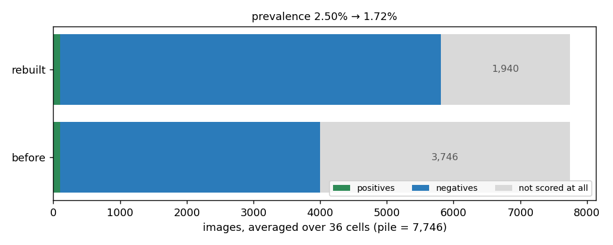
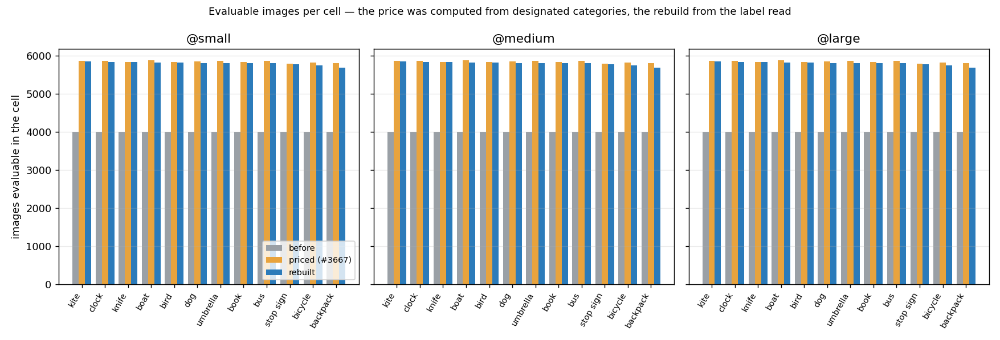
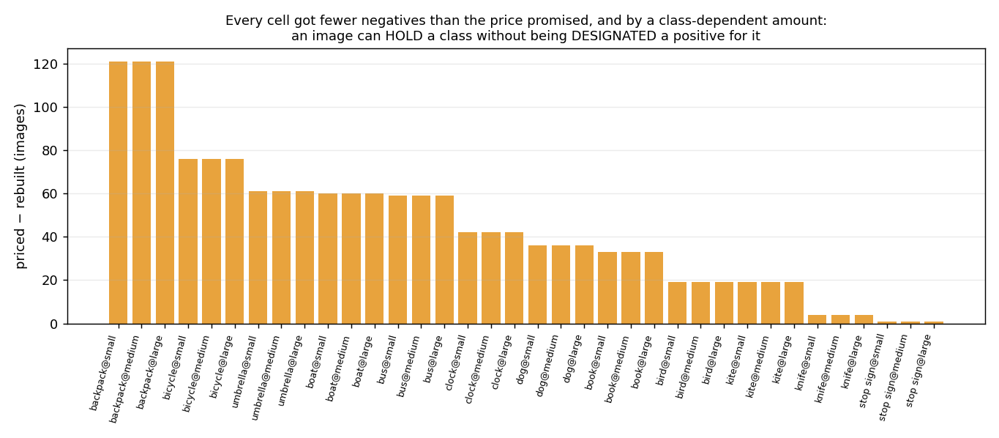
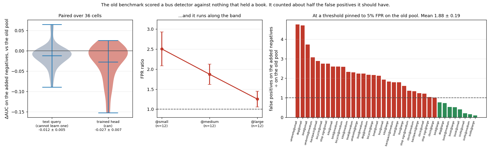

# `vg_scale` rebuilt so a class is scored against images holding a different class (#3667)

**The rebuild is done, the price was nearly right, and the claim it was made on
is true — but only at one end of the axis.** A head trained the way the old
benchmark posed the problem fires on the newly-admitted negatives **1.88 ± 0.19
times** as often as on the negatives it was trained against. Split by band, that
is **2.50 ± 0.42** at `@small` and **1.25 ± 0.20** at `@large`, which is not
resolvable from 1. So the contamination #3667 describes was real, it was
concentrated at the small end, and the small end is the axis this dataset exists
to measure (#3156).

Eleven cells over three build jobs — three datasets, five embedders — plus two
diagnostic builds that answer a question the rebuild raised (§7). Every
invariant holds on all 7,746 built medias. On the way, the merged fix turned out
to be a no-op on `vg_scale_deep` and to be writing 36 junk cell names per image
into it.

| | |
|---|---|
| Cells rebuilt | 11 (`vg_scale` ×5, `vg_scale_any` ×5, `vg_scale_deep` ×1) |
| Evaluable per cell | **4,000 → 5,806** (+45.2%), priced at +46.3% |
| Not scored at all, per cell | **3,746 → 1,940** (48.4% → 25.0% of the pile) |
| Prevalence | `vg_scale` 2.50% → **1.72%**; `_any` 7.14% → **4.99%**; `_deep` 7.14% → **5.09%** |
| Shortcut removed (FPR ratio) | **1.88 ± 0.19** overall; **2.50 ± 0.42** at `@small`, **1.25 ± 0.20** at `@large` |
| Vectors, on images in both builds | 3 of 5 embedders reproduce (3e-08 to 3e-07); **`siglip2_l` and `dinov3_patch` do not** (3e-04), on the same node — §7 |

Scripts: [`cross_class_negatives_rebuilt.py`](../../../scripts/experiments/pile/cross_class_negatives_rebuilt.py)
(what moved, the invariants, the price),
[`cross_class_negatives_difficulty.py`](../../../scripts/experiments/pile/cross_class_negatives_difficulty.py)
(the text-sort probe),
[`cross_class_negatives_shortcut.py`](../../../scripts/experiments/pile/cross_class_negatives_shortcut.py)
(the trained-head probe). Figures from
[`figures.py`](figures.py) over [`measurements/`](measurements).

---

## 1. What the rebuild changed

`build_pile.py --datasets vg_scale --force` on `rack4n01` (the node the cells
were built on in August), with `vg_scale_any` pulled in automatically as a
derived dataset, plus a second job for the CLIP pair and a third for
`vg_scale_deep`.



*Averaged over the 36 `vg_scale` cells. The grey band is the part of the pile a
given cell could not score at all: an image holding some **other** class. The
issue quotes 41.9% for this; that is the figure per **class** (3,247 of 7,747).
Per **cell** it is 48.4%, because a class's own other two bands are excluded too.
Both are the same fact counted at different granularity.*

`evaluable_categories` changed on **2,106 of the 7,618 images present in both
builds (27.6%)**. That is the intended change. Two other things moved with it,
and they are worth separating.

### The membership moved, and not because of #3667

**129 medias left the pile and 128 joined.** A rebuild runs against `dev`, not
against the commit that built the cell it replaces, and `dev` had gained **five
merged rulings** over `pile_config` since 2026-08-27: #3605 (stop building a
class from one VG spelling), #3618's name tables, #3635, #3637 (the fold mode)
and #3671's vehicle and vessel rulings. Each changes which images are *clean* or
which spellings count, so both the positives and the pool moved:

| | before | after |
|---|---|---|
| positives | 3,547 | 3,546 |
| shared negative pool | 3,900 | 3,900 |
| spares | 300 | 300 |
| **designation slots filled** | **3,600 / 3,600** | **3,600 / 3,600** |

| churn | |
|---|---|
| positives dropped / added | **41 / 40** |
| positives that changed cell in place | 3 |
| pool images dropped, backfilled from spares | 82 |
| human-**reviewed** positives still designated | **314 of 360 (87.2%)** |

So **81 of 3,547 positive images (2.3%) are not the images the old cell had**,
and the roster held the rest. The last row is the one to watch: `--verify`'s
review-coverage gate passes at ≥85% and this is 87.2%, so a rebuild has quietly
spent **46 human judgements** and stayed inside its tolerance. Every cell is
still exactly full at `SCALE_N_POS`.

None of that is #3667. All of it is the shipped `vg_scale__*.pkl` having been
**ten days and five merged rulings stale**, with nothing in the pile able to say
so: `--verify` asks whether the cells on disk are usable and `--rebuildable`
asks whether they could be produced again. Neither asks whether a rebuild would
produce *this*. `vg_box_*` has exactly that check (`_band_vocab_drift`, #3299);
`vg_scale` has none. Filed as **#3678**.

### The vectors mostly reproduced, and where they did not is not the node

The provenance sidecar's `vectors_sha256` changed for every cell — which says
nothing on its own, because that digest covers the whole cell and the membership
moved. The question that separates "the pile changed" from "the machine changed"
is whether images present in *both* builds got the same vectors. Measured
elementwise over the 7,618 shared images:

| embedder | old node → new node | max abs difference |
|---|---|---|
| `siglip` | `rack4n01` → `rack4n01` (same L40S) | **2.98e-08** |
| `clip` | `rack7n06` → `rack7n04` (**different device**) | 2.53e-07 |
| `clip_l` | `rack7n06` → `rack7n04` (**different device**) | 3.16e-07 |
| `siglip2_l` | `rack4n01` → `rack4n01` (same L40S) | **3.21e-04** |
| `dinov3_patch` | `rack4n01` → `rack4n01` (same L40S) | **3.03e-04** |

**That splits the wrong way.** The two cells rebuilt on a *different* GPU model —
the two devices #3143 warned hide behind one `gres/gpu:v100` — agree to 3e-07,
which is #3160's `ATEN_CPU_CAPABILITY=avx2` pin working across hosts and
across devices, down from the 1.3e-04 that issue measured before it. The two
that diverge by **3e-04** were rebuilt on the *same node, in the same job*, and
their provenance sidecars are identical to the originals' in every recorded
field: host, GPU, CPU capability, requested capability, torch 2.6.0+cu124,
transformers 5.12.1, fp32/fp32, `matmul_allow_tf32` false.

3e-04 is twice the 1.5e-04 that #3160 called significant, and **nothing the
provenance records explains it**. See §7.

## 2. The price was nearly right, and where it was wrong is interesting

`cross_class_negatives_effect.py` priced this change before the GPU hours were
spent, off the shipped pickle. It had to read each image's **designated
categories**, because that is all a cell pickle carries. `_evaluable` reads the
**label read** — every class the image holds, designated or not. Those are
different sets, so the two numbers were never going to agree.



*One panel per band, one triple per class. The price (orange) sits just above
the outcome (blue) everywhere.*

| | mean per cell |
|---|---|
| before | 4,000 |
| priced | 5,851 (+46.3%) |
| **rebuilt** | **5,806 (+45.2%)** |

The gap is **45 images per cell, 0.8%** — the price was good. But it is not
uniform, and what it tracks is co-occurrence:



`backpack@medium` loses 121 of its priced negatives and `stop sign@medium` loses
1. **589 of the 2,037 COCO-exhaustive positives (28.9%) hold at least one class
they were never designated for** — its box fell outside every band, or its cell
was already full at `SCALE_N_POS`, or its spelling was withheld as ambiguous.
Literally:

```
 61571: designated ['knife@small']     -- also holds ['dog']
107906: designated ['stop sign@small'] -- also holds ['bus']
150303: designated ['book@small']      -- also holds ['clock']
150311: designated ['bus@small']       -- also holds ['bicycle']
285748: designated ['backpack@medium'] -- also holds ['knife']
285780: designated ['umbrella@large']  -- also holds ['backpack']
```

Each of those is an image the price expected to hand some class as a free
negative and the rebuild correctly refused, because it is a *positive* there in
everything but the designation. A backpack photo is a photo of a person carrying
things, so it holds a knife or a bicycle far more often than a stop-sign photo
does — hence 121 against 1.

**One correction to the shipped pricing script, and to the table in PR #3672.**
It counted the 300 **spares** as evaluable in every cell, so it reported a
`before` of 4,300 for a cell holding 4,000, and every absolute number in that
table is 300 high. Spares are drawn into the pickle and designated into no cell
on purpose — that is what makes retiring a contaminated negative a relabel
instead of a re-embedding pass. Fixed here; the *relative* claim (+43%) was
barely affected, and is +45.2% measured.

## 3. Was the old contrast really "a scene with stuff in it"?

This is #3667's actual argument, and neither counting images nor the rebuild
itself can test it. Two probes can, and the difference between them is the
whole answer.



**The text probe** ranks each cell by the free text sort a user gets for typing
the class name. A text query has no shortcut available to it — it cannot learn
"this image has stuff in it" — so what it loses on the added negatives is
only how much *nearer the class* they sit semantically. It loses
**−0.012 ± 0.005** AUC.

**The trained probe** fits a linear head exactly as the old benchmark posed the
problem: positives against the **old shared pool only**, 5-fold, and then scores
the added negatives it never saw. It loses **−0.027 ± 0.007** — more than twice
as much. A trained head *can* learn the shortcut, and it did.

*The head is a balanced logistic regression on the unit-normalised vectors,
standing in for the shipped linear SVM (#2683). The claim here is about the
**dataset**, not the head — but a different head would give a different
magnitude, and nothing below should be read as a number the app would produce.*

Read as false positives, which is the unit that matters: at a threshold pinned
to **5.0%** FPR on held-out old-pool negatives, the same head fires on the added
negatives at **9.4%**.

> **The shipped benchmark counted about half the false positives it should
> have, on the images it declined to score.**

**And the effect runs the length of the band axis:**

| band | FPR ratio | ΔAUC, trained head | ΔAUC, text query |
|---|---|---|---|
| `@small` | **2.50 ± 0.42** | **−0.062 ± 0.017** | −0.028 ± 0.011 |
| `@medium` | 1.87 ± 0.25 | −0.019 ± 0.008 | −0.008 ± 0.007 |
| `@large` | 1.25 ± 0.20 | −0.001 ± 0.002 | +0.000 ± 0.003 |

At `@large` there is no shortcut to speak of — the target fills the frame, so
"is there a bus" and "what does this scene look like" are the same question. At
`@small` the target is under one DINOv3 patch and the image is almost entirely
context, so a head trained against a pool of context-free images learns the
context.

**That is the axis `vg_scale` was built to measure.** #3156 asks whether cost
rises as the target shrinks. The old construction inflated small-band scores and
left large-band scores alone, which *understates* the very gap the study
reports. #3156's band effect should therefore be read as a **lower bound**, and
re-running it on the rebuilt cell is filed as **#3679**. This report does not
re-run it and makes no claim about how much the number moves.

**Two classes go the other way, and they are the same kind of class.** `knife`
(ratio **0.15**) and `book` (**0.49**) find the added negatives *easier* than
the shared pool. Both are small indoor objects on tables and shelves; the shared
pool is "images holding none of the twelve", which on VG is full of rooms,
desks and counters — the exact contexts a knife or a book lives in. Their hard
negatives were already in the pool, and what #3667 adds them is buses, boats and
kites. For those two the old pool was the *better* negative set. Filed as
**#3680**, because it suggests the shared pool is doing different work for
different classes and nobody has looked.

## 4. The invariants, checked on the data rather than the function

The unit tests in `tests_lib/meta/test_vg_scale_cross_class_negatives.py` pin
`_evaluable`. They cannot say that 7,746 real images came out obeying it. All
three properties are checked on **every** media of every rebuilt cell, not
sampled:

| property | why it matters | result |
|---|---|---|
| No name outside the dataset's own cells | the defect in §5 | **pass** |
| No image evaluable in another band of a class it holds | #3156's guarantee, the one thing #3667 could not undo | **pass** |
| Within a class, the three bands share one negative set | the paired band contrast, which is what the shared pool was *for* | **pass** |

The third is the trade #3667 made, stated precisely. **Across** classes the
negatives are no longer identical — each class now also gets the other eleven's
COCO-exhaustive positives, and how many that is depends on the class (§2). But
**within** a class the paired small-vs-large contrast is untouched, which is the
comparison the construction exists to support. The issue's stated design goal
survives; the stronger property it was implemented as does not.

## 5. The merged fix was a no-op on `vg_scale_deep`, and was corrupting it

#3672's `_evaluable` spelled the cross-class rule as `scale_cell(c, band)`.
`vg_scale_deep` shares `_emit_medias` and keys its cells on the **bare class**
(`cells = list(pc.SCALE_CLASSES)`), and it called that function without
`labels`, whose default was `None`.

Both halves fail together and neither raises:

- `labels or {}` makes the held set empty, so the rule fires for **every**
  class — including the image's own. A `bus` positive came out marked evaluable
  in `bus@small`, `bus@medium` and `bus@large`: **the #3156 guarantee, stated
  backwards, in a shipped pickle.**
- Nothing failed, because those names are not cells of `vg_scale_deep`. **36
  band-suffixed strings per COCO-exhaustive positive** matched nothing, so the
  deep sibling received #3667's benefit of exactly **zero** while looking fixed.

Repaired two ways, because one alone would leave the trap: `_evaluable` now
derives `{class: cells}` from the caller's own cell list, so it cannot name a
cell the dataset does not have under either keying; and `labels` loses its
default, because **a missing measurement must not be spellable as a measurement
of zero** — the same shape that made `pick_gpu` report every GPU on the cluster
as free (#3299). Four tests added; three fail on the previous commit.

Worth noting where it hid: eleven tests covered `_evaluable` and every one of
them used the banded keying. The keying assumption was not under-tested, it was
**uniformly** tested, which is a different and harder failure to see. The
verifier written to catch this bug contained the same bug — `cells_of` gave
`vg_scale_any` the banded keying — and was caught only because the counts came
out zero.

Rebuilt, `vg_scale_deep` gets what the shallow cell gets: **12,600 → 17,693**
evaluable per cell (+40.4%), 5,709 of 22,355 medias relabelled.

## 6. A consequence nobody has priced: the realised prevalence moved

`SCALE_PREVALENCE = 7.143%` is load-bearing. `vg_scale_deep` *derives*
`SCALE_DEEP_N_NEG` from it rather than setting it beside the positive count, on
the explicit grounds that a deeper haystack at a different prevalence would move
the answer this family of studies is trying to locate:
`k* = -log2((1-π)/π)`.

The build-time assertion compares **designed constants** and passes — it
printed `prevalence 0.07143 vs vg_scale's designed 0.07143` during this very
rebuild. But the harness scores the **evaluable pool**, and that pool grew:

| cell | designed π | realised π | designed k\* | realised k\* |
|---|---|---|---|---|
| `vg_scale_any` | 7.143% | **4.99%** | −3.70 | **−4.25** |
| `vg_scale_deep` | 7.143% | **5.09%** | −3.70 | **−4.22** |
| `vg_scale` (per band-cell) | 2.50% | **1.72%** | −5.29 | **−5.84** |

Two readings, and they point opposite ways:

- **The comparability the deep sibling exists for survives.** `_any` and
  `_deep` land 0.03 bits apart — they moved together, because the mechanism
  adding negatives is the same on both.
- **Both moved away from the constant every study quotes.** `k* = -3.71`
  appears in `pile_config`, in the deep loader's docstring, and in the
  acq-offset studies' reasoning. It is now the *designed* number, and the
  dataset's own optimum has shifted about **half a bit** deeper. Whether that
  changes a ship decision is not answerable from here; filed as **#3681**.

Note the shipped acquisition offset is −4, chosen empirically. It is closer to
the realised −4.25 than to the designed −3.70. That is an observation, not a
result: nothing here re-derives an offset.

## 7. The vectors are bit-exact on a repeat, and not across a membership change

§1 left this open: on the *same node in the same job*, `siglip` reproduced to
2.98e-08 while `siglip2_l` and `dinov3_patch` moved by **3e-04** — twice what
#3160 called significant — with identical provenance in every recorded field.
Two further builds settle what it is not, and name what it is.

**It is not the machine, and it is not run-to-run noise.** Both cells were built
a *second* time, same node, same code, same membership, nothing changed:

| | max abs difference |
|---|---|
| `siglip2_l`, consecutive rebuilds | **0** (0 of 7,746 images differ) |
| `dinov3_patch`, consecutive rebuilds | **0** (0 of 7,746 images differ) |

Bit-identical. So the embed pass is deterministic, and the August→September
divergence has to come from something that differed between those two builds.
The only thing that did is the **membership**: 7,747 images then, 7,746 now.

**Batch composition reproduces the signature.** One image leaving the pile
shifts every later image's position in the batch stream. Rebuilding `siglip2_l`
at batch **31** instead of its configured 32 — same images, same node, same
everything else — perturbs it the same way:

| | |
|---|---|
| images whose vector changed | **27 of 7,746** |
| median difference | 0 |
| **max difference** | **1.6e-04** |

That is the mechanism *in kind*, not a quantitative match: the observed
August→September maximum is 3.2e-04, twice this, and a one-image membership
change is a different perturbation from a batch-size change, so the two were
never going to agree exactly. What it establishes is that **a per-image
embedding is not independent of what it was batched with** — it is supposed to
be, and for 7,719 of 7,746 images it is, but the batched GEMM's reduction order
is not, and a few images land on the wrong side of it. Everything else that
could explain the divergence has been ruled out by measurement rather than by
argument.

**What this costs.** The pile's premise is that scratch is purgeable because
every cell rebuilds from source. That holds for the labels, and it holds for the
vectors to 3e-07 — as long as *nothing else moved*. When a merged ruling
changes the pile by one image, some embedders' cells shift by 1e-4 on a few
images, which is 400× the same-node floor and larger than the fp16 difference
#3143 rejected. Nothing records the batch size in the provenance, and nothing
warns. Filed as **#3683**.

*One thing to know if you reproduce this: the diagnostic build was pointed at a
scratch `VTSEARCH_DATA_DIR` so it could not touch the pile, and it wrote to the
pile anyway — `pc.EMBEDDINGS` follows `VTS_PILE`, not `VTSEARCH_DATA_DIR`. The
cell was rebuilt at its configured batch size afterwards and checked
bit-identical against a copy taken beforehand. Isolate by pointing `VTS_PILE`
somewhere else, or do not isolate at all and keep a copy.*

## 8. Documentation that described the construction it used to have

#3672 rewrote `_evaluable` and left the two most-read docstrings describing the
rule it replaced. Corrected here:

- **`vg_scale.py`** opened with "a **negative** when it holds no instance of any
  class in *C*, and **excluded** otherwise" and closed with "every cell
  therefore has identical prevalence and identical negatives". The second is
  precisely the property #3667 traded away — and it is the sentence the issue
  quoted as the design goal it was preserving.
- **`vg_scale_any.py`** asserted "a media positive for one class stays evaluable
  **only** for that class", giving as the reason that VG's labels are not
  exhaustive. True off COCO, false on it. That gate *is* the change.
- **`analyze_scale.py`**, the #3156 analyzer, states "identical negatives at
  identical prevalence (0.0250 by construction)". Its own comparisons are
  within-class and survive; the prevalence and the scope of "identical" did not.
- **`pile_config.SCALE_PREVALENCE`** now says it is the designed prevalence.

## 9. What this means for work holding results off the old cell

Nothing published is invalidated by this rebuild — but nothing published is
directly comparable to a number computed on the new cell either, and there are
two separate reasons, which should not be conflated:

1. **#3667 itself**, which changed 27.6% of the medias' `evaluable_categories`
   and moved every cell's prevalence. Any absolute cost/AP/FPR from before
   2026-09-06 was measured against a pool that is now 45% larger.
2. **The five merged rulings** the rebuild also picked up (§1): 41 positives out
   and 40 in, 3 more moved between cells, and 82 pool images replaced. Small,
   but it is a second reason, it is not #3667's, and it was already owed before
   this work started.
3. **The vectors of `siglip2_l` and `dinov3_patch`** (§7), which moved by 3e-04
   on a few images because the membership moved. Smaller than either of the
   above and mentioned only so it is not later mistaken for one of them.

`analyze_calfrac.py`'s report line — "one dataset (`vg_scale_any`), 12 classes
at identical prevalence" — was true of the cell that study ran on and has been
left alone; falsifying a finished study's record to match a later dataset would
be worse than the staleness.

The pre-rebuild cells are archived at
`/expscratch/sgreenberg/archive/pre-3667-vg_scale` (4.7 GB, `vg_scale` and
`vg_scale_any`, all five embedders). **`vg_scale_deep` was not archived** — the
backup glob was `vg_scale__*`, which does not match `vg_scale_deep__*`. Its
pre-#3667 labels are exactly reconstructable from the old rule and the rebuilt
pickle, which is how §5's deep numbers were produced, and that reconstruction is
marked as such wherever it appears. What is unrecoverable is its membership and
its vectors — and §7 is the reason that is not quite free: a rebuild reproduces
vectors bit-for-bit only at *fixed* membership, and the membership is exactly
what was lost. It was an avoidable mistake; the glob is named in the script's
docstring and in `scripts/experiments/lessons/` so the next person does not
repeat it.

## 10. Follow-ups

| | |
|---|---|
| **#3678** | The pile cannot tell you a cell is stale. `--verify` asks if it loads, `--rebuildable` if it could be built; neither asks whether a rebuild would produce *this*. `vg_box_*` has that check, `vg_scale` does not — and its cell was ten days and five rulings stale with nothing saying so. |
| **#3679** | Re-run #3156's scale study on the rebuilt cell. The shortcut is 2.50 at `@small` and 1.25 at `@large`, so the published band effect is a lower bound by construction. |
| **#3680** | `knife` and `book` find the cross-class negatives *easier* than the shared pool (ratio 0.15 and 0.49). The shared pool is doing different work for different classes, and nobody has looked. |
| **#3681** | Realised prevalence moved 7.14% → ~5.0% on `_any` and `_deep`, so the dataset's `k*` moved about half a bit. `SCALE_PREVALENCE` is now the designed number; every `k* = -3.71` in the tree is quoting it. |
| **#3683** | A cell's vectors reproduce bit-for-bit at fixed membership and to 3e-07 across hosts and devices — but not across a membership change, where batch composition moves a few images by 1e-4. `VTSEARCH_EMBED_BATCH_SIZE` changes the output and is absent from the provenance. |
