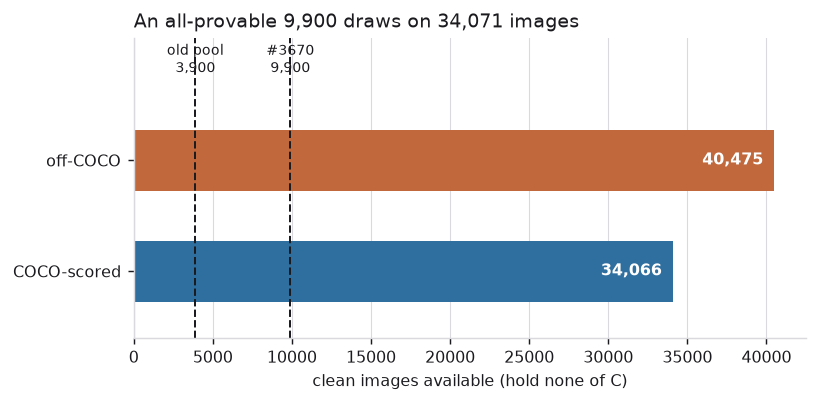
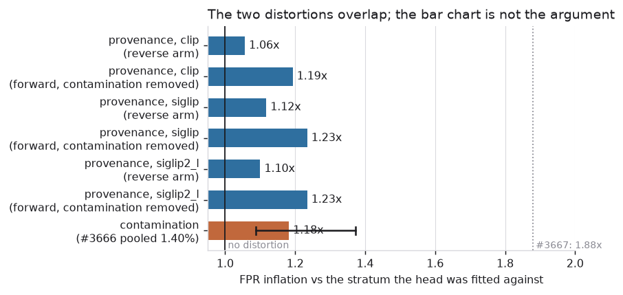
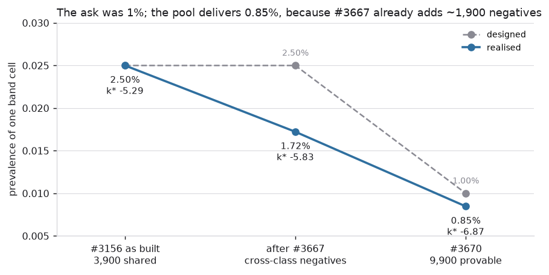
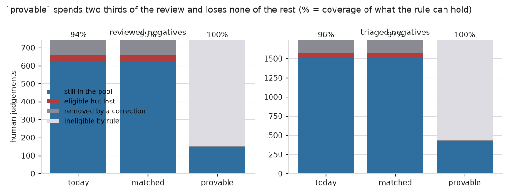

# 1% prevalence from a provable negative pool (#3670)

**The negatives exist, they are free, and the pool is now made of the half of
Visual Genome where "holds no bus" is a fact rather than a silence.**
`SCALE_N_NEG` goes from 3,900 to 9,900 and every one of them is COCO-scored, so
a band cell's *designed* prevalence falls from 2.50% to **1.00%**.

**Three things a reader should take away before the detail.**

**The realised prevalence is 0.85%, not 1%.** A cell has scored its shared
negatives *plus* the other eleven classes' COCO-scored positives since #3667, so
the pool a detector actually faces is ~1,900 images larger than `SCALE_N_NEG`.
Setting the constant to 9,900 and asking for "1% prevalence" are two different
requests, and this delivers the first (§5). It overshoots the reviewer's ask in
the direction the ask was pointing — more negatives, not fewer — but the number
to quote is 0.85%.

**The composition was chosen on the spread, not the magnitude, and an earlier
reading of this trade was wrong.** Both candidate pools distort. On #3667's
FPR-inflation scale an all-provable pool's provenance shortcut is **1.1×** and a
mixed pool's contamination is **1.18×** [1.09, 1.37] — the second interval
contains the first, so the taller bar decides nothing. What decides it is that
the shortcut is *uniform across classes* while contamination is not (1.04× to
1.37×, class by class), and this dataset exists to compare classes and bands
(§3).

**The pile is not rebuilt in this PR.** The rebuild is deferred so it happens
once, with #3588's class expansion, rather than twice. That leaves a live hazard
— code saying 1% over a pile holding 2.5% — so `--verify` gains two checks that
make the gap impossible to miss (§7).

| | |
|---|---|
| Shared negatives | 3,900 → **9,900**, drawn from 34,071 COCO-scored candidates (21,121 once #3588's classes land — §5) |
| Designed cell prevalence | 2.50% → **1.00%** (k\* −5.29 → **−6.63**) |
| **Realised** cell prevalence | 1.72% → **0.85%** (0.844–0.856 across 36 cells); **0.73%** once #3588's classes land — §5 |
| Contamination from VG's silence | 1.40% [0.68, 2.86] → **0 by construction** |
| Negative review still eligible | 743 → **147**; coverage of those, **100.0%** |
| New images to embed | **6,000** (7,746 → 13,746 medias; 15.5 min for all five embedders, measured) |
| `vg_scale_deep` | pinned at 11,700 negatives, deliberately (#3690) |

Scripts:
[`negpool_supply.py`](../../../scripts/experiments/pile/negpool_supply.py) (what
the pool can be made of),
[`provenance_probe.py`](../../../scripts/experiments/pile/provenance_probe.py)
(is provenance readable at all),
[`provenance_shortcut.py`](../../../scripts/experiments/pile/provenance_shortcut.py)
(would a head use it),
[`negpool_coverage.py`](../../../scripts/experiments/pile/negpool_coverage.py)
(what it costs the review, and the realised prevalence).
Figures from
[`figures_3670.py`](../../../scripts/experiments/pile/figures_3670.py) over
[`measurements/`](measurements).

---

## 1. The supply, and why it is free

An image is a candidate negative when it holds none of the twelve classes. The
build reads the whole VG source, so the candidate pool is far larger than
anything drawn from it:

| | images |
|---|---:|
| clean (holds none of C) | 74,541 |
| …COCO-scored, so provably clean | **34,071** |
| …off-COCO, clean only by VG's silence | 40,470 |
| designated today | 3,900 (45.0% COCO-scored) |

*The dashed lines are the old pool and #3670's. An all-provable 9,900 is not
merely feasible, it draws on 3.4× what it needs — which is what makes the
strictness in §4 free rather than a compromise.*

No human labelling is involved. COCO annotates all eighty of its classes on any
image it annotates, so on that half "holds none of the twelve" is a fact about
the annotation rather than an inference from its absence. The issue's own
estimate (18,986 provable negatives outside the pile) was conservative: it was
computed against a 25-class list, and the shipped twelve leave more images
clean.

## 2. Is provenance readable?

VG's images come from COCO **and** from YFCC100M, and those look different. If
the negatives were all COCO-sourced while the positives are 57.4%, an image's
provenance would correlate with its label — so before asking whether that is
exploitable, ask whether it is even visible.

A logistic head on frozen embeddings, COCO-anchored against off-COCO, balanced,
5-fold:

| embedder | AUC |
|---|---|
| `clip` | 0.56 ± 0.01 |
| `clip_l` | 0.55 ± 0.01 |
| `siglip` | 0.54 ± 0.02 |
| `siglip2_l` | 0.54 ± 0.01 |
| `dinov3_patch` | 0.53 ± 0.01 |

Readable, weakly, in every column — never at chance, never close to useful. That
is enough to rule out "provenance is invisible, so the composition cannot
matter" and not enough to settle anything else, which is what §3 is for. `clip`
reads it most strongly, so `clip` is carried through as the adversarial case.

## 3. The decision: two distortions, and they overlap

Both candidate compositions distort, and the honest comparison puts them on one
scale. #3667's is the natural one: fit a head the way the benchmark poses the
problem, pin a threshold at 5% FPR on held-out negatives of the stratum it was
fitted against, and score the *other* stratum at that threshold unchanged. A
ratio of 1 means the composition buys nothing; #3667's cross-class shortcut
measured 1.88 ± 0.19 on this scale and justified rebuilding eleven cells.

*Blue is the provenance shortcut an all-provable pool creates, read two ways
per embedder; orange is the contamination a mixed pool keeps, with #3666's 95%
interval on the measured rate. The dotted line is the effect that justified the
last rebuild, for scale. Read the reverse-arm bars as the estimate — the residual
bars inherit the uncertainty of the contamination rate they subtract, which is
the orange interval. Do not read this figure as ranking the two compositions:
the orange interval spans every blue bar, which is the finding.*

**The forward arm alone cannot answer it, and that is the trap.** Fitting
against provable negatives and scoring the silent ones gives 1.46 ± 0.10
(`siglip`) — but the silent negatives are also genuinely contaminated, and a
head *should* score a hidden positive highly. At #3666's measured 1.40% pool
error and a TPR near 0.70 at this threshold, contamination alone predicts

> 1 + 0.0140 × (0.70/0.05 − 1) = **1.18**

which is most of what the forward arm measured. Two further arms separate the
two causes, and neither needs new labelling:

- **reverse** — fit against the *silent* negatives, pin the threshold there, and
  score the provable ones. Provable negatives are contamination-free, so
  contamination cannot move this number; a ratio below 1 is the shortcut with
  its sign flipped.
- **forward, contamination removed** — the forward ratio divided by the
  predicted contamination penalty above.

| embedder | forward | reverse | shortcut, reverse | shortcut, residual |
|---|---:|---:|---:|---:|
| `siglip` | 1.46 ± 0.10 | 0.90 ± 0.05 | **1.12** | 1.24 |
| `clip` | 1.41 ± 0.11 | 0.95 ± 0.05 | **1.06** | 1.20 |
| `siglip2_l` | 1.46 ± 0.11 | 0.91 ± 0.05 | **1.10** | 1.24 |

**Quote the reverse arm: 1.06–1.12×, call it 1.1×.** The two routes are not
equally good and the difference is instructive. The residual route subtracts a
*predicted* contamination penalty, so it inherits every bit of that prediction's
uncertainty; the reverse arm depends on no such estimate. They agree only if
contamination is near **2.5%** — the top of #3666's [0.68, 2.86] interval — and
disagree by ~0.13 at its 1.40% point estimate. That is a statement about how
poorly the contamination rate is pinned down, not about the shortcut.

Which is the point. Against contamination's **1.18× [1.09, 1.37]**, a 1.1×
shortcut is not a difference this evidence establishes, by either route. **An
earlier reading of this trade quoted 1.32× for contamination and called the
comparison decisive; that figure took the top of #3635's *predicted* per-class
range, and #3666 has since measured the shipped twelve at 1.40% pooled.** With
the measured rate the numbers overlap, and the magnitude argument is gone.

### What actually decides it

**The provenance shortcut is uniform across classes; contamination is not.**
Every class's negatives are drawn from the same two provenance strata in the
same proportion, so a provenance shortcut shifts every cell together. Pool
error does not behave that way — #3635's per-class predictions run from 0.28%
(`kite`) to 2.87% (`backpack`), which is 1.04× to 1.37× on this scale.

`vg_scale` exists to compare **one class against another and one band against
another** (#3156). A distortion that varies per class lands directly on that
contrast; a uniform one cancels in it. That is the argument, and it survives the
magnitudes being tied.

It also means the choice is not permanent in the way the numbers alone suggest:
`SCALE_NEG_COMPOSITION = "matched"` restores the provenance-matched pool, and
its docstring says what switching costs (a rebuild, because the off-COCO stratum
is not embedded under `provable`).

## 4. What "provable" had to be made to mean

Writing the composition down exposed that the flag it was going to be defined
on does not mean what the name suggests.

`labels_exhaustive` was set by two different things: an image anchored to a COCO
annotation, **and** any image a human had looked at. Those are not the same
claim. A reviewer asked "does this hold a `car`?" established a fact about
`car`; the pool's claim is about all twelve classes at once. Admitting
review-promoted images to an "all-provable" pool would have put images in it
whose absence claim is still VG's silence for eleven of the twelve.

So the draw stratifies on a new `coco_scored` set, captured *before* corrections
widen `exhaustive`, and each media carries the flag so `--verify` can check the
strict claim rather than the weak one. The strictness is free — 34,071 candidates
against 9,900 needed (§1) — which is the only reason it was worth doing rather
than noting.

The same investigation turned up a live defect on `dev`, unrelated to
prevalence but fatal to any build: `apply_corrections` folded a verdict for
**any** class into the labels, and `corrections.json` is shared across every
build of this family. #3588's negative pass added thirteen classes to that file
at 19:26 on 2026-09-06, and from that moment a twelve-class build — the shipped
construction — died three passes later with `KeyError: 'car'`. A shared file
made the shipped dataset unbuildable, and reported it as a dict lookup.

## 5. Designed 1.00%, realised 0.85%

`SCALE_PREVALENCE` describes the *designated* pool. Since #3667 a cell also
scores every other class's COCO-scored positives, so the negatives a detector
faces are ~1,900 more than `SCALE_N_NEG`:

*Counted off `_evaluable` itself rather than a formula, over all 36 cells. k\*
— the quantity the acquisition studies in this family actually read — is
annotated on each measured point rather than given a second axis: it is not
linear in prevalence, so a twin axis drawn between two transformed endpoints
puts every gridline between them in the wrong place while reading as a scale.
The two lines were the same until #3667; #3681 is the issue that names the
split.*

| | designed | realised |
|---|---|---|
| #3156 as built | 2.50% | 2.50% |
| after #3667 | 2.50% | 1.72% |
| **#3670** | **1.00%** | **0.85%** (0.844–0.856) |
| **#3670 + #3588's twenty-five classes** | **1.00%** | **0.73%** (0.720–0.753) |

**The last row is what the pile actually holds.** Every number above it is
computed over twelve classes, and the class expansion this rebuild is shared
with lands before the cells exist — so `0.85%` is the realised prevalence of a
dataset that was never built. The cause is the one this section already names,
applied to a longer list: a cell scores its shared negatives *plus* every other
class's COCO-scored positives, and there are now **twenty-four** other classes
rather than eleven. Re-measured with `negpool_coverage.py` against
`SCALE_CLASSES` at twenty-five (k\* **−7.09**, against −6.87 at twelve).

The composition survives the expansion, which is the load-bearing check: a
25-class list leaves **21,121** provably-clean images against the 9,900 the pool
needs — 2.1× headroom where twelve classes gave 3.4×. `SCALE_N_NEG` does not
have to move. See
[`../2026-09-06-vg-scale-promotion-3588/REPORT.md`](../2026-09-06-vg-scale-promotion-3588/REPORT.md) §6.

The spread across cells is small — 1.4% relative — because the cross-class
contribution depends on the class list, which every cell shares. So one constant
does land every cell within a hair of the same prevalence; it just lands them at
0.85% rather than at 1%.

Reaching a *realised* 1.00% would mean ≈8,000 shared negatives, not 9,900. This
report does not make that change: #3670 and #3690 both specify 9,900, and
overshooting gives the reviewer more negatives than they asked for, which is the
direction the request pointed. But **quote 0.85%**, and see #3681.

## 6. The price: two thirds of the negative review

This is the real cost of `provable`, and it is large.

*Stacked by fate. The percentage above each bar is coverage of what that
composition can hold — not of the whole review, which is what the `ineligible by
rule` band shows.*

| composition | reviewed | ineligible by rule | removed by a fix | eligible | still in | coverage |
|---|---:|---:|---:|---:|---:|---:|
| today (3,900 mixed) | 743 | 0 | 84 | 659 | 622 | 94.4% |
| `matched` (9,900) | 743 | 0 | 84 | 659 | 627 | 95.1% |
| **`provable` (9,900)** | 743 | **513** | 83 | **147** | 147 | **100.0%** |

and the same shape on the 1,742 triaged negatives (1,162 ineligible, 419
eligible, 419 kept).

Two readings, and both are true:

- **`provable` retires 69% of the negative review.** The review deliberately
  over-sampled the off-COCO half — only 24.9% of it is COCO-scored against 45.0%
  of the pool — because that is where VG's silence lives, which is exactly
  #3675's recommendation. Those judgements measured a contamination the new pool
  cannot have, so their *purpose* is spent rather than their validity; but the
  dataset no longer contains a stratum where that contamination can be measured
  at all (**#3696**).
- **It loses nothing it is allowed to keep.** Of the 147 reviewed negatives the
  composition can hold, it holds 147. That is the number the coverage gate exists
  to protect, and it is the one a rebuild has broken before (three rebuilds
  retired 577 of 743 reviewed images).

Telling those apart is a change to the gate itself. `check_review_coverage.py`
now separates *ineligible by rule* from *lost*, prints the first in its own
column above the verdict, and keeps the second in the denominator — so a real
reshuffle cannot hide behind a declared composition, and a declared composition
does not read as a catastrophe. It also refuses to quote a confident coverage
off fewer than 50 eligible images.

## 7. The rebuild is deferred, on purpose

#3670's build ran on 2026-09-06 at 19:15 — 12 classes, 9,900 provable negatives,
3,600 positives over 36 cells, all five embedders, **15.5 minutes**. A parallel
study's 25-class rebuild overwrote those cells 37 minutes later, which is a fair
description of what a shared pile is: purgeable, rebuildable, and owned by
whoever built it last.

The rebuild therefore waits for #3588's class expansion, so the pile is built
once for both rather than twice. **Nothing in this report needed those cells**:
`draw_negatives` is hash-ranked and roster-pinned, so `negpool_coverage.py`
redraws the exact pool off the loader's own passes with no pixels read — and its
counts reproduce the 19:15 build's `--verify` output exactly (147 and 419 still
in).

What the deferral creates is a window in which the code says 1.00% and the pile
holds 2.50%, which is #3678's complaint made concrete. Two checks close it, and
both live in `--verify` where a rebuild is trusted:

- the **pool size** must equal `SCALE_N_NEG`, and the failure message quotes the
  prevalence the cell actually has;
- under `provable` every designated negative must carry `coco_scored` — and a
  cell built before that stamp existed is told to rebuild rather than passed on
  the weaker flag.

Spares are excluded from both, because they are drawn from the same strata but
designated into no cell; counting them would put the size check 300 images off
and fire it on a healthy pile.

## 8. `vg_scale_deep` does not follow

`SCALE_DEEP_N_NEG` was *derived* from `SCALE_PREVALENCE`, so this change would
have taken the deep sibling from 11,700 negatives to 29,700 as a side effect of
a change to a different dataset — a 2.5× rebuild nobody asked for. Deep exists
for one comparison, the #3319/#3547 acquisition horizon, and moving its
prevalence mid-stream would confound that axis with a prevalence axis.

It is pinned through `SCALE_DEEP_PIN_N_NEG`, and still *derived* from it, so the
"never write a negative pool as a literal beside a positive count" rule holds.
Whether deep should follow is #3690.

The pin had a loose end: deep's build asserted its own prevalence against
`SCALE_PREVALENCE`, which is now `vg_scale`'s 1%. A correct deep rebuild would
have run its GPU hours and then aborted, naming the wrong constant. It now
asserts against the pinned value.

## 9. What this leaves open

- **#3681** — `SCALE_PREVALENCE` is the designed number and the realised one is
  0.85%. This report gives the second measurement of that gap and the first at
  1% scale.
- **#3690** — should `vg_scale_deep` follow? Note it now differs from `vg_scale`
  in *composition* as well as size: deep's pool is still mixed, so it keeps the
  per-class contamination spread §3 rejects.
- **#3698** — the rebuild itself, owed jointly with #3588 and to be run once.
- **#3696** — an all-provable pool has no stratum in which VG's silence can be
  measured, so the rate that justified the composition can only be re-measured
  against an archived cell on purgeable disk.
- **`exhaustive` is still widened by a one-class review** where #3667's
  cross-class rule reads it, so the same over-promotion §4 removed from the pool
  draw survives in the negatives a class inherits from its siblings. Measured
  here and small: **197 images** of 51,645 are exhaustive only because someone
  looked (0.4%), of which **64 are designated positives** — 1.8% of them. Filed
  as **#3697** rather than fixed, because tightening it changes which images
  #3667 admits and that is a rebuild of its own.
