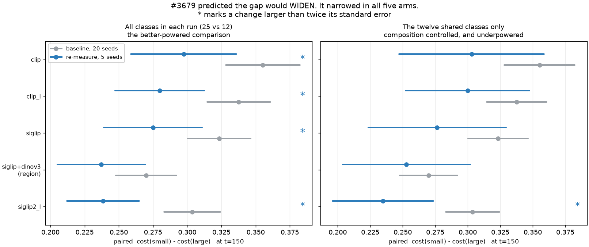
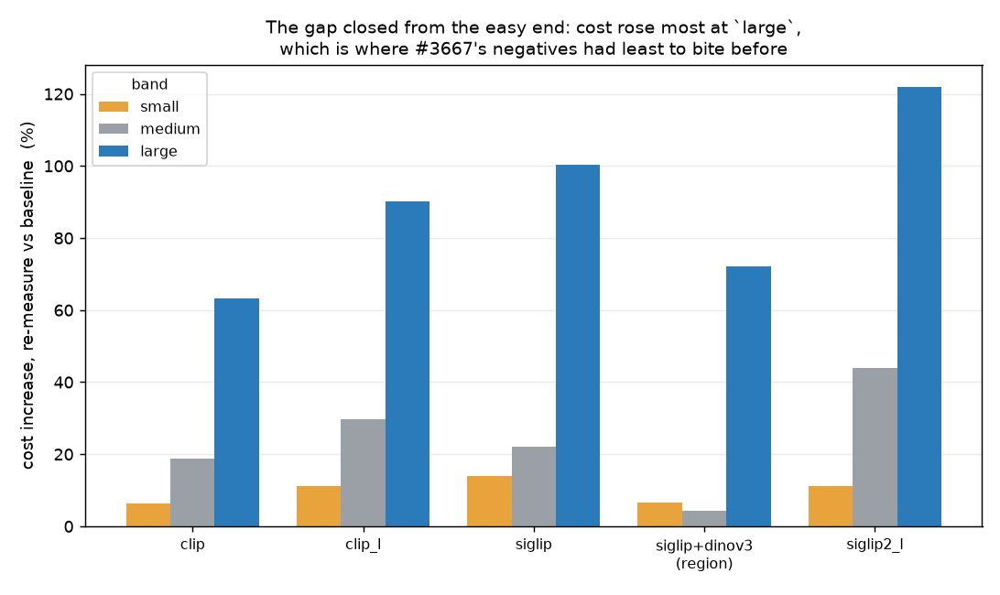

# Re-measuring #3156's band effect on the rebuilt construction (#3679)

**BLUF.** #3679 asked whether the published band effect is a **lower bound** —
whether the small-vs-large gap would **widen** once measured on a construction
whose negatives are harder. It narrowed, in all five arms, by `0.033` to `0.065`
of paired cost. Four of the five changes are larger than twice their standard
error on the better-powered comparison; on the strictly composition-controlled
one, only `siglip2_l` is.

The reason is visible in the levels rather than the gap: cost rose *everywhere*
on the rebuilt pile, but by **6-14% at `small` against 63-122% at `large`**.
#3667's negatives cost most where detection used to be easy, so part of the
published band effect was `large` being too easy. Read the published gap as an
**over**-estimate of the size effect, not a lower bound.

**The issue's own framing anticipated this**: it says a result that does not
widen is "equally publishable and more interesting". This is that result.

Measured on `vg_scale` **as built 2026-09-07**, before the 2026-09-08 rebuild —
see [Provenance](#provenance). Numbers are from
[`measurements/band_effect.json`](measurements/band_effect.json), emitted by
`scripts/experiments/calibration/measure_bands_3679.py`; regenerate the figures
with `python figures.py`.

---

## The result

Paired `cost(small) - cost(large)` within `(class, seed)` at `t=150`, every arm
reported separately because the encoder is a blocking factor and not a contrast.

| arm | baseline (12 cls, 20 seeds) | re-measure (25 cls, 5 seeds) | change | ~SE |
|---|---|---|---|---|
| `clip` | `0.355 ± 0.014` | `0.297 ± 0.020` | **`-0.058`** | `0.024` |
| `clip_l` | `0.338 ± 0.012` | `0.280 ± 0.017` | **`-0.058`** | `0.020` |
| `siglip` | `0.323 ± 0.012` | `0.275 ± 0.018` | **`-0.048`** | `0.022` |
| `siglip2_l` | `0.304 ± 0.010` | `0.238 ± 0.014` | **`-0.065`** | `0.017` |
| `siglip+dinov3_patch` (region) | `0.270 ± 0.011` | `0.237 ± 0.016` | `-0.033` | `0.020` |

Baseline is `/expscratch/$USER/scale-3156-map`, job 582417 — 3,600 cells, 20
seeds, the same five columns.

## Why it narrowed: the gap closed from the easy end

Cost at `t=150` rose in every band of every arm, and monotonically in band size:

| arm | `small` | `medium` | `large` |
|---|---|---|---|
| `clip` | `+6%` | `+19%` | `+63%` |
| `clip_l` | `+11%` | `+30%` | `+90%` |
| `siglip` | `+14%` | `+22%` | `+100%` |
| `siglip2_l` | `+11%` | `+44%` | `+121%` |
| `siglip+dinov3_patch` | `+7%` | `+5%` | `+73%` |

`clip`'s `large` cell went `0.150 → 0.245`; its `small` cell went
`0.505 → 0.537`. A gap between two numbers narrows when the smaller one nearly
doubles, and that is all that happened here.

This is the same shape #3667 measured directly on its own axis: the negatives it
admitted are **2.5x harder at `@small` and 1.25x at `@large`**. The construction
that produced the published gap was scoring `large` against a negative set with
very little in it to confuse a large, centred object. Hardening the negatives
takes that away, and the size effect shrinks accordingly.

**So #3679's premise is answered in the negative, and its direction reversed.**
The published effect is not a floor that harder negatives would raise; it was
partly an artifact of an easy ceiling at the far end.

## Composition is not the confound — power is

The obvious objection is that the baseline has twelve classes and the re-measure
twenty-five, so any change mixes *the construction moved* with *thirteen
different classes were added*. `analyze_scale.py` has no class filter, so both
runs were re-analysed restricted to the twelve shared classes, using that
module's own endpoint rule, pairing and mean/SE rather than a second statistic.

| arm | re-measure, all 25 | re-measure, twelve only | difference |
|---|---|---|---|
| `clip` | `0.297` | `0.303` | `0.006` |
| `clip_l` | `0.280` | `0.300` | `0.020` |
| `siglip` | `0.275` | `0.276` | `0.001` |
| `siglip2_l` | `0.238` | `0.235` | `0.003` |
| `siglip+dinov3_patch` | `0.237` | `0.253` | `0.016` |

**Every arm agrees within `0.020`.** The thirteen added classes behave like the
twelve, so the pooled comparison is not measuring a composition change.

What the restriction *does* cost is power. It drops the re-measure from 125
paired observations to 59-60, and with it four of the five resolutions:

| arm | change, all 25 (SE) | change, twelve only (SE) |
|---|---|---|
| `clip` | `-0.058` (`0.024`) **resolvable** | `-0.052` (`0.032`) |
| `clip_l` | `-0.058` (`0.020`) **resolvable** | `-0.038` (`0.027`) |
| `siglip` | `-0.048` (`0.022`) **resolvable** | `-0.047` (`0.029`) |
| `siglip2_l` | `-0.065` (`0.017`) **resolvable** | `-0.069` (`0.022`) **resolvable** |
| `siglip+dinov3_patch` | `-0.033` (`0.020`) | `-0.017` (`0.027`) |

**Four of five against one of five, and the estimates barely move between them.**
That is a power difference, not a disagreement: the point estimates change by at
most `0.020` while the standard errors grow by half.

## This study is five seeds, by decision, and that is the limit worth stating

It was launched for ten and cut to five. The reason is measured: per-cell cost
on the rebuilt 25-class pile is **19.1 min against the published run's 4.4**
(job 582417), because that pile puts 18,050 medias in every cell. The original
~3h estimate had been extrapolated from the published run on the *old twelve-class*
pile and was wrong by 5x. **A per-cell cost estimate does not survive a pile
rebuild; re-derive it.**

`CALIB_CELL_ORDER=seed` places seed *k* at array indices `k*375 .. k*375+374`,
so cutting the tail drops **seeds uniformly rather than whole categories**: the
design stays intact at 375 environments x 5 seeds and only the standard errors
widen. The run completed 1,875 of 1,875 cells with zero failures.

Ten seeds would have shrunk `SE(diff)` from about `0.03` to about `0.02` and
would most likely have resolved `clip`, `siglip` and `clip_l` on the controlled
comparison. That was put to the owner with the cost (~9.5h, and only valid before
the pending rebuild) and **five seeds was chosen as final**. The one-of-five
resolution above is therefore a stated limit of this study, not an oversight, and
it is recoverable only by re-running the whole grid against a pile that no longer
exists.

## Limits

* **`clip` and `clip_l` lost pairs.** 118 and 120 against every other arm's 125.
  Preflight names the mechanism: `vg_scale x clip`'s thinnest category has ~50
  positives in the simulation half against a 150-step horizon, so an aggressive
  arm can exhaust its positives. Preflight's own guidance is that a win survives
  this but a null or loss past that point is not interpretable — which matters
  here, because the two arms that lost pairs are two of the four that resolved.
  Their direction agrees with the three arms that lost nothing.
* **One construction, one grid.** Every number is `t=150`, shipped defaults, five
  columns. Nothing here says how the band effect moves with the horizon.
* **The region arm is the least certain.** `-0.033` with `SE 0.020` pooled and
  `-0.017` with `SE 0.027` controlled: consistent in direction with the other
  four, resolvable in neither. It is also the arm most exposed to the 2026-09-08
  rebuild, which added 270 region boxes.
* **The freshness warning on this run is a false positive.** `analyze_scale.py`
  reports cells more than 6h older than the newest as suspect. This run took
  9h24m, so its own first 713 cells tripped it. Verified by mtime rather than
  assumed: `task_0712.csv` at 20:48 and `task_0713.csv` at 21:12 against a newest
  of 02:57. All 1,875 cells are from one run.

## Provenance

Measured on `vg_scale` **as built 2026-09-07** (18,050 medias, 25 classes,
9,900-image shared negative pool). The pile was rebuilt on **2026-09-08**, after
these cells were computed, landing three rulings (#3727, #3726, #3662).

That rebuild is a comparability boundary, recorded as such in the `vg_scale`
datasheet's use register. Measured against the pile these numbers were taken on,
it moved **30 positives in and 30 out across 12 cells** (net zero) and added
**270 region boxes**; the negative pool did not move at all.

**These results were not re-measured on the new pile, deliberately.** The churn
is 0.4% of 7,500 positives and it is *symmetric across the ends of the paired
contrast* — 18 images churned at `small` against 16 at `large` — which is what
makes it harmless to a paired difference specifically. Re-running costs another
9.5h to move a gap of `0.24-0.30` by less than its own standard error.

The pre-rebuild pile is preserved at
`/expscratch/$USER/vts-cache/stash/pre-rebuild-20260908/` with all five cells,
their provenance, the roster and `corrections.json`, so anything here can be
re-measured against the pile it was taken on.

## Follow-ups

* **#3679 is answered and should close on this report.** The published band
  effect is an over-estimate, not a lower bound; any document describing it as a
  floor needs correcting.
* The region arm deserves a resolution it does not have. It is the arm the study
  most exists to serve, and the only one whose direction is unconfirmed at this
  seed count.
* **#3743** asks whether the pool's difficulty tracks the exclusion filter. If it
  does, band-effect numbers are conditioned on *C* as well as on the negatives,
  and this comparison would need re-stating each time *C* grows.
