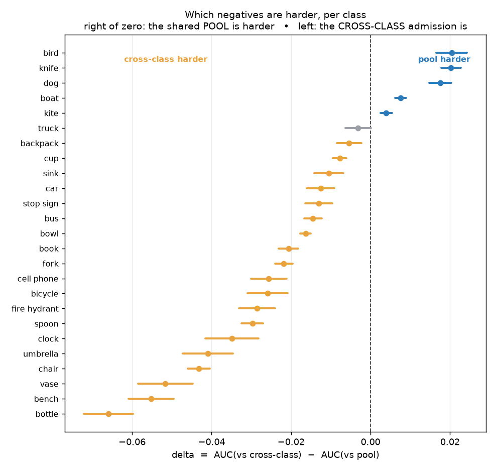
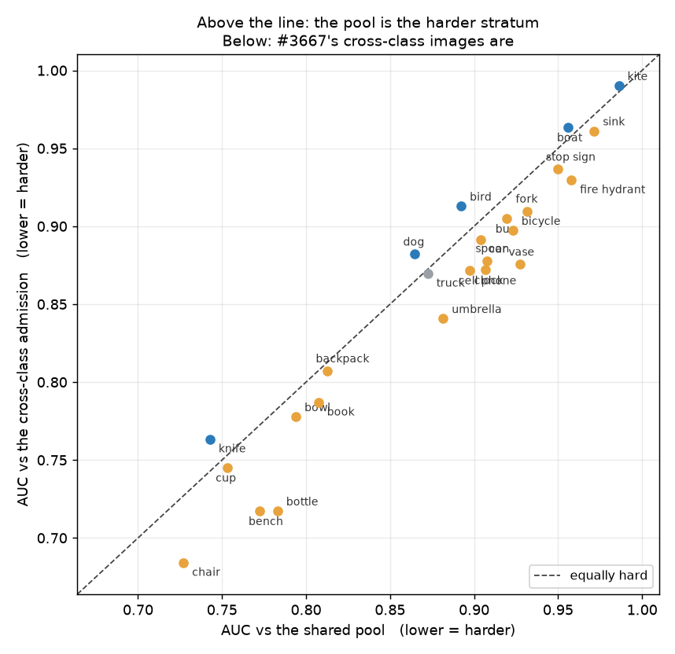

# Is the shared negative pool doing the same work for every class? (#3680)

**BLUF.** Yes — and no. #3680's *premise* holds: the shared pool's difficulty is
not uniform across the class list, it spans `-0.066` to `+0.020` in AUC and the
**sign flips**, so one pool really is asking twenty-five different questions.
#3680's *proposed mechanism* is refuted, and with the opposite sign to the one
it predicted. It expected indoor tabletop classes to find the pool harder;
every indoor tabletop class finds it **easier**, `book` — which the hypothesis
named — included. The five classes that still find the pool harder are
`bird`, `knife`, `dog`, `boat`, `kite`: outdoor and animal.

**Recommendation: keep the single shared pool, and stop calling it the
hard-negative set.** For 19 of 25 classes #3667's cross-class admission is
already the harder stratum, so per-class hard-negative mining would buy the most
for exactly the five classes with the *smallest* margins (`kite` at `+0.004`).
What does need to change is documentation, not construction — see §5.

Measured on `vg_scale__siglip.pkl` as built 2026-09-07 (18,050 medias, 25
classes). Numbers below are from
[`measurements/pool_hardness.json`](measurements/pool_hardness.json); regenerate
the figures with `python figures.py`.

---

## What was measured

For each class the cell's medias split three ways:

* **positives** — the 300 images designated for any of its bands;
* **pool** — the 9,900 shared negatives, images holding *none* of *C*;
* **cross-class** — the 3,025–3,567 images that are some *other* class's
  positive and are evaluable in this class's cells (#3667's admission).

Ranked by the class's own typed query, `AUC(positives, pool)` and
`AUC(positives, cross-class)` say which stratum is harder **for that class**.
AUC falls as a stratum gets harder, so

```
delta = AUC(vs cross-class) − AUC(vs pool)
```

is **positive** where the pool is the harder set and negative where #3667's
images are. No training and no GPU beyond one text-tower call per class.

Deliberately prevalence-free: AUC does not move when a stratum merely gets
bigger, which is what separates "these negatives are harder" from "there are
more of them".

## The result



**19 of 25 classes find the cross-class admission harder** (interval excluding
zero), **5 find the pool harder**, and `truck` is the single null at `-0.003`
`[-0.006, +0.000]`.

| | classes | delta |
|---|---|---|
| pool harder | `bird` `knife` `dog` `boat` `kite` | `+0.020` … `+0.004` |
| null | `truck` | `-0.003` |
| cross-class harder | the other 19, led by `bottle` `bench` `vase` `chair` `umbrella` | `-0.066` … `-0.005` |

The scatter shows why the spread matters: it is not a small wobble around one
difficulty, it is a systematic tilt with classes on both sides of the diagonal.



### The intervals needed pairing, not more data

Both AUCs a class reports are means over the **same** positives, so `delta` is
the mean of a per-positive quantity and its standard error follows directly —
no bootstrap. This is load-bearing. An *unpaired* standard error for a single
AUC at `n_pos=300` is `0.01`–`0.02`, which would have put the whole
pool-harder tail inside the noise and reduced the finding to "one or two
classes, maybe". The paired standard errors are `0.001`–`0.003`, and all five
clear zero comfortably. The pairing, not the sample size, is what made the
tail readable.

## 1. The premise holds: one pool, not one question

#3680 asked whether the construction is "choosing a different difficulty for
each class without saying so". It is. `bottle`'s pool is `0.066` AUC easier
than its cross-class negatives; `bird`'s is `0.020` harder. Those are different
experiments wearing the same name.

## 2. The proposed mechanism is refuted, with the sign reversed

The hypothesis was that the pool is "largely rooms, desks, counters and
kitchens — the exact contexts a knife or a book lives in", so indoor tabletop
classes would already have the pool as their hard-negative set. Measured:

| class named by the hypothesis | predicted | measured |
|---|---|---|
| `knife` | pool harder | `+0.020` ✓ |
| `book` | pool harder | `-0.021` ✗ |

and against #3667's four reference classes, two of four **reversed** on the
rebuilt pile — `knife` and `umbrella` held, `book` and `dog` flipped. That
divergence is precisely what this re-measure existed to detect: #3667's numbers
describe cells that no longer exist.

`knife` is the only class that fits the hypothesis, and it fits in company —
`bird`, `dog`, `boat`, `kite` — that the hypothesis cannot explain at all.

## 3. The script reported its own answer backwards

Worth recording because the numbers were never wrong. `pool_hardness.py`
computed `auc_vs_pool` and `auc_vs_cross` correctly and then asserted, in its
docstring, its inline comment, its table header and its summary line, that
*negative* means the pool is harder. It is positive: a harder stratum drives
AUC **down**, so the pool being harder makes `auc_vs_pool` the lower value.

The first run therefore printed

```
classes where the POOL is the harder set: 20 of 25
```

when its own numbers said **5 of 25** — an inverted headline, not a rounding
difference, and one that would have been read as *confirming* the indoor
hypothesis it in fact refutes. Fixed in `4bfb9798c`; the summary now counts
intervals excluding zero rather than point estimates.

## 4. What the split actually tracks

The five pool-harder classes are outdoor and animal; the nineteen are indoor
and manufactured. A mechanism that fits — **untested, offered as the next
question and not as a finding** — is that the pool is defined by exclusion.
It is "images holding none of *C*", and *C* went from 12 to 25 classes in
#3704. With twenty-five common indoor and street objects excluded, the pool is
now heavily depleted of indoor scenes, which makes it easy for a class whose
habitat was filtered out of it. Sky-without-a-kite and water-without-a-boat
survive that filter intact, and stay confusable.

If that is right, the pool's difficulty for a class is a function of *how much
of that class's habitat survives the exclusion*, and it will keep moving every
time *C* grows. That is a more uncomfortable property than the one #3680
proposed, because it means the control drifts with the class list.

## 5. Recommendation

**Keep one shared pool.** The measured spread does not justify per-class
hard-negative mining:

* for 19 of 25 classes the pool is not what sets difficulty — #3667's
  cross-class admission already is, by up to `0.066` AUC;
* the five classes where the pool still dominates have the **smallest**
  margins in the study (`+0.020` down to `+0.004`), so mining for them buys
  least where it would cost most;
* the pool is cheap, it is prevalence-free by construction, and nothing here
  shows it is *wrong* — only that it is not uniform.

**Change the documentation instead.** This measurement is direct evidence for
the restriction the `vg_scale` use register (#3687) already states: a
**cross-class ranking is not supported**. Now there is a number behind it — two
classes' costs are scored against negative sets that differ by up to `0.066`
AUC in difficulty, so comparing `bottle`'s cost to `kite`'s silently compares
two different problems. The register should cite this study, and
`pool_hardness.py` should be the thing anyone re-runs after *C* changes.

## 6. Limits

* **One cell, one embedder.** Measured on `siglip` whole-image only. The
  ordering could differ under the region arm, which sees patches rather than a
  single vector.
* **Scene qualifiers are a partial confound.** Two of the five pool-harder
  classes carry a scene term in their query — `boat` is `'a boat on the water'`
  and `kite` is `'a kite in the sky'` — which targets exactly the scenes the
  pool retains. It does not explain the result: `car` is `'a car on the
  street'` and sits on the cross-harder side at `-0.013`, and `bird`, `knife`
  and `dog` are bare nouns. But the two largest scene-qualified queries landing
  in the five-class group is not nothing, and a query-ablation would settle it.
* **The pile is a moving target.** These numbers describe the pile as built
  2026-09-07. A `vg_scale` rebuild changes membership, and a peer session
  reports the pile is already stale by 30 positives against `corrections.json`
  at 872 rows. Re-run after any rebuild rather than citing these.
* **Absolute magnitudes are small.** The largest effect is `0.066` AUC. The
  spread is real and tightly bounded, but this is a statement about the shape
  of the negative sets, not a claim that any class is badly measured.

## 7. Follow-ups

* **#3743** — does the exclusion filter explain the split? The §4 mechanism is
  testable directly: rebuild the pool at *C* = 12 and at *C* = 25 and check
  whether a class's delta tracks how much of its habitat the filter removes.
* **#3736** — a truncated array keeps logging the launched cell count. Found
  during this study's sibling run, not this measurement.
* Re-run `pool_hardness.py` after the next `vg_scale` rebuild, and again
  whenever *C* grows, since §4 predicts the deltas move with the class list.
